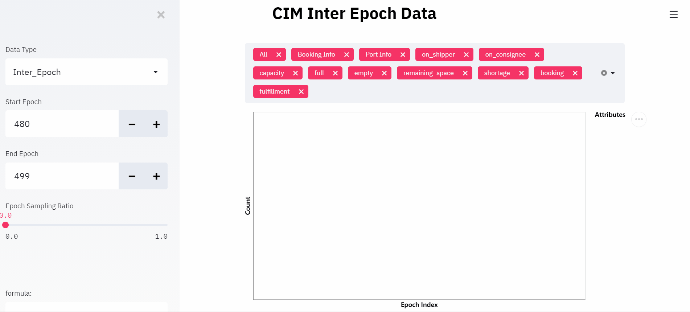

[](https://github.com/microsoft/maro/blob/master/LICENSE)
[](https://pypi.org/project/pymaro/)
[](https://pypi.org/project/pymaro/#files)
[](https://github.com/microsoft/maro)
[](https://hub.docker.com/repository/docker/maro2020/maro/tags?page=1)
[](https://github.com/microsoft/maro/issues)
[](https://github.com/microsoft/maro/pulls)
[](https://libraries.io/pypi/pymaro)
[](https://github.com/microsoft/maro/actions?query=workflow%3Atest)
[](https://github.com/microsoft/maro/actions?query=workflow%3Abuild)
[](https://hub.docker.com/repository/docker/maro2020/maro)
[](https://maro.readthedocs.io/)
[](https://pypi.org/project/pymaro/#files)
[](https://pypi.org/project/pymaro/#files)
[](https://maro.readthedocs.io/en/latest/scenarios/citi_bike.html)
[](https://maro.readthedocs.io/en/latest/scenarios/container_inventory_management.html)
[](https://maro.readthedocs.io/en/latest/scenarios/vm_scheduling.html)
[](https://gitter.im/Microsoft/MARO#)
[](https://stackoverflow.com/questions/ask?tags=maro)
[](https://github.com/microsoft/maro/releases)
[](https://github.com/microsoft/maro/commits/master)
[](https://github.com/microsoft/maro/actions?query=workflow%3A%22vulnerability+scan%22)
[](https://github.com/microsoft/maro/actions?query=workflow%3Alint)
[](https://codecov.io/gh/microsoft/maro)
[](https://pypi.org/project/pymaro/#files)
[](https://hub.docker.com/repository/docker/maro2020/maro)
[](https://hub.docker.com/r/maro2020/maro)

# [](https://maro.readthedocs.io/en/latest/)

Multi-Agent Resource Optimization (MARO) platform is an instance of Reinforcement
learning as a Service (RaaS) for real-world resource optimization. It can be
applied to many important industrial domains, such as [container inventory
management](https://maro.readthedocs.io/en/latest/scenarios/container_inventory_management.html)
in logistics, [bike repositioning](https://maro.readthedocs.io/en/latest/scenarios/citi_bike.html)
in transportation, [virtual machine](https://maro.readthedocs.io/en/latest/scenarios/vm_scheduling.html) provisioning in data centers, and asset management in finance. Besides
[Reinforcement Learning](https://www.andrew.cmu.edu/course/10-703/textbook/BartoSutton.pdf) (RL),
it also supports other planning/decision mechanisms, such as
[Operations Research](https://en.wikipedia.org/wiki/Operations_research).

Key Components of MARO:

- Simulation toolkit: it provides some predefined scenarios, and the reusable
wheels for building new scenarios.
- RL toolkit: it provides a full-stack abstraction for RL, such as agent manager,
agent, RL algorithms, learner, actor, and various shapers.
- Distributed toolkit: it provides distributed communication components, interface
of user-defined functions for message auto-handling, cluster provision, and job orchestration.


## Contents

| File/folder | Description                                                                                       |
| ----------- | ------------------------------------------------------------------------------------------------- |
| `maro`      | MARO source code.                                                                                 |
| `docs`      | MARO docs, it is host on [readthedocs](https://maro.readthedocs.io/en/latest/).                   |
| `examples`  | Showcase of MARO.                                                                                 |
| `notebooks` | MARO quick-start notebooks.                                                                       |

*Try [MARO playground](#run-playground) to have a quick experience.*

## Install MARO from [PyPI](https://pypi.org/project/pymaro/#files)

*Notes: The CLI commands (including the visualization tool) are not included in pymaro package. To enable these support, you need to install from source.*

- Mac OS / Linux

  ```sh
  pip install pymaro
  ```

- Windows

  ```powershell
  # Install torch first, if you don't have one.
  pip install torch===1.6.0 torchvision===0.7.0 -f https://download.pytorch.org/whl/torch_stable.html

  pip install pymaro
  ```

## Install MARO from Source

*Notes: Install from source if you want to use the CLI commands (including the visualization tool).*

- Prerequisites
  - C++ Compiler
    - Linux or Mac OS X: `gcc`
    - Windows: [Build Tools for Visual Studio 2017](https://visualstudio.microsoft.com/thank-you-downloading-visual-studio/?sku=BuildTools&rel=15)

- Enable Virtual Environment
  - Mac OS / Linux

    ```sh
    # If your environment is not clean, create a virtual environment firstly.
    python -m venv maro_venv
    source ./maro_venv/bin/activate
    ```

  - Windows

    ```powershell
    # If your environment is not clean, create a virtual environment firstly.
    python -m venv maro_venv

    # You may need this for SecurityError in PowerShell.
    Set-ExecutionPolicy -Scope CurrentUser -ExecutionPolicy Unrestricted

    # Activate the virtual environment.
    .\maro_venv\Scripts\activate
    ```

- Install MARO

  ```sh
  # Git Clone the whole source code.
  git clone https://github.com/microsoft/maro.git
  ```

  - Mac OS / Linux

    ```sh
    # Install MARO from source.
    bash scripts/install_maro.sh;
    pip install -r ./requirements.dev.txt;
    ```

  - Windows

    ```powershell
    # Install MARO from source.
    .\scripts\install_maro.bat;
    pip install -r ./requirements.dev.txt;
    ```

- *Notes: If your package is not found, remember to set your PYTHONPATH*

  - Mac OS / Linux

  ```sh
  export PYTHONPATH=PATH-TO-MARO
  ```

  - Windows

  ```powershell
  $Env:PYTHONPATH=PATH-TO-MARO
  ```

## Use MARO in [VSCode DevContainer](https://code.visualstudio.com/docs/devcontainers/containers)

- Prerequisites
  - Install Docker on your local machine.
  - Make sure your Docker daemon is running.
- Open MARO folder with VSCode.
- Open command palette by pressing `Ctrl/Cmd` + `Shift` + `P`.
- Type `Dev Containers: Rebuild and Reopen in Container` in the command palette and then prese `Enter` to start building dev container.
- The building process might takes a few minutes. After it is done, you are all set!


## Quick Example

```python
from maro.simulator import Env

env = Env(scenario="cim", topology="toy.5p_ssddd_l0.0", start_tick=0, durations=100)

metrics, decision_event, is_done = env.step(None)

while not is_done:
    metrics, decision_event, is_done = env.step(None)

print(f"environment metrics: {env.metrics}")

```

## [Environment Visualization](https://maro.readthedocs.io/en/latest/)

```sh
# Enable environment dump feature, when initializing the environment instance
env = Env(scenario="cim",
          topology="toy.5p_ssddd_l0.0",
          start_tick=0,
          durations=100,
          options={"enable-dump-snapshot": "./dump_data"})

# Inspect environment with the dump data
maro inspector dashboard --source_path ./dump_data/YOUR_SNAPSHOT_DUMP_FOLDER
```

### Show Cases

- Case I - Container Inventory Management



- Case II - Citi Bike


## Run Playground

- Pull from [Docker Hub](https://hub.docker.com/r/maro2020/playground)

  ```sh
  # Pull the docker image from docker hub
  docker pull maro2020/playground

  # Run playground container.
  # Redis commander (GUI for redis) -> http://127.0.0.1:40009
  # Jupyter lab with maro -> http://127.0.0.1:40010
  docker run -p 40009:40009 -p 40010:40010 maro2020/playground
  ```

- Build from source
  - Mac OS / Linux

    ```sh
    # Build playground image.
    bash ./scripts/build_playground.sh

    # Run playground container.
    # Redis commander (GUI for redis) -> http://127.0.0.1:40009
    # Jupyter lab with maro -> http://127.0.0.1:40010
    docker run -p 40009:40009 -p 40010:40010 maro2020/playground
    ```

  - Windows

    ```powershell
    # Build playground image.
    .\scripts\build_playground.bat

    # Run playground container.
    # Redis commander (GUI for redis) -> http://127.0.0.1:40009
    # Jupyter lab with maro -> http://127.0.0.1:40010
    docker run -p 40009:40009 -p 40010:40010 maro2020/playground
    ```

## Contributing

This project welcomes contributions and suggestions. Most contributions require
you to agree to a Contributor License Agreement (CLA) declaring that you have
the right to, and actually do, grant us the rights to use your contribution. For
details, visit https://cla.opensource.microsoft.com.

When you submit a pull request, a CLA bot will automatically determine whether
you need to provide a CLA and decorate the PR appropriately (e.g., status check,
comment). Simply follow the instructions provided by the bot. You will only need
to do this once across all repos using our CLA.

This project has adopted the
[Microsoft Open Source Code of Conduct](https://opensource.microsoft.com/codeofconduct/).
For more information see the
[Code of Conduct FAQ](https://opensource.microsoft.com/codeofconduct/faq/)
or contact [opencode@microsoft.com](mailto:opencode@microsoft.com)
with any additional questions or comments.

## Related Papers

### [Container Inventory Management](https://maro.readthedocs.io/en/latest/scenarios/container_inventory_management.html)


Wenlei Shi, Xinran Wei, Jia Zhang, Xiaoyuan Ni, Arthur Jiang, Jiang Bian, Tie-Yan Liu. "[Cooperative Policy Learning with Pre-trained Heterogeneous Observation Representations](https://arxiv.org/abs/2012.13099)". AAMAS 2021

Xihan Li, Jia Zhang, Jiang Bian, Yunhai Tong, Tie-Yan Liu. "[A Cooperative Multi-Agent Reinforcement Learning Framework for Resource Balancing in Complex Logistics Network](https://arxiv.org/abs/1903.00714)". AAMAS 2019

## Related News

[MSRA Top-10 Hack-Techs in 2021](https://mp.weixin.qq.com/s/Y4kjQq8gKcsEsVadjdwnEQ)

[Open Source Platform MARO: Anywhere Door for Resource Optimization](https://mp.weixin.qq.com/s/zXIpgzomLhDWS_YUFmRlEQ)

[AI from "Point" to "Surface"](https://mp.weixin.qq.com/s/PggO49wwmS7grTO0nEMgVQ)

## [Cite Us](./CITATION)

## License

Copyright (c) Microsoft Corporation. All rights reserved.

Licensed under the [MIT](./LICENSE) License.
