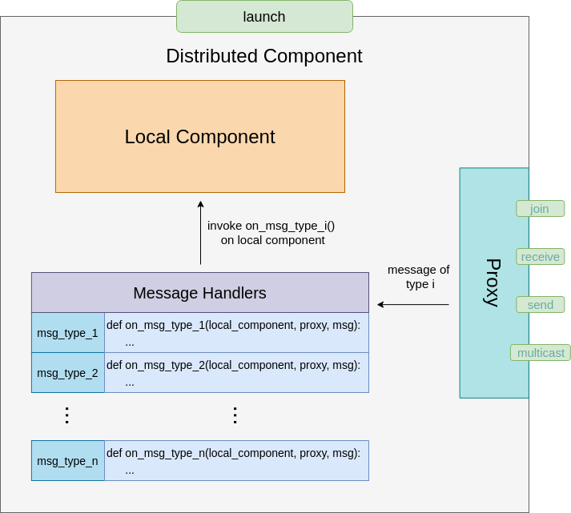

=========================
From Local To Distributed
=========================

Distributed Decorator
=====================

The distributed decorator is a Python decorator that endows instances of any user-defined class with
distributed capabilities with a single line of code. All you have to do is create an instance of the
:ref:`Proxy` class, define a set of :ref:`message handlers` and pass them to the decorator. Under the hood,
the decorator defines a wrapper class containing references to an original(local) class instance, the proxy
instance and the message handlers. The wrapper class also defines a universal entry point for running a
component in distributed mode. All attributes of the original class are untouched and can be accessed as
usual through the dot notation. The overall structure of the wrapper is shown below:

.. _proxy:

Proxy
======

A proxy is responsible for communicating with other distributed components. It exposes 4 methods: join(),
receive(), send() and multicast(). The join() method should always be called first to connect the component
to its remote peers and also allow its peers to connect to it. Once it has successfully joined the network,
it can start receiving and sending messages. In the current version, all messages are transferred through
ZeroMQ using its built-in PUSH and PULL patterns. In the future, we expect to migrate to more powerful
messaging tools such as InfiniBand.

.. _message handlers:

Message Handlers
================

Handlers are functions that describe how a certain type of messages should be processed by a local instance.
The local instance usually belongs to a user-defined class that has its own set of methods. For example, it
could be an experience pool with push() and get() methods, or it could be a learner with a train() method.
A handler must be defined outside the original class and takes a reference to a local instance, a reference
to a proxy instance and the message to be processed as parameters. All handlers must correspond to a certain
message type and passed to the distributed decorator as a dictionary.
