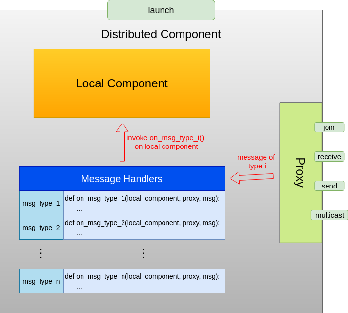

=================
General Framework
=================

Architecture
============

A distributed MARO system has 4 key components:

- :ref:`distributed-decorator`, a Python decorator that transforms a local instance to a distributed one
- :ref:`Proxy`, responsible for communication
- :ref:`message-handlers`, which define how incoming messages should be handled
- :ref:`resource-manager`, responsible for allocating hardware resources to distributed components

These components are elegantly encapsulated in a single line of code:
.. code-block:: python

    @dist(proxy, handler_dict)

As a simple example, consider the following local class:
.. code-block:: python

    class LocalWorker:
        def __init__(self):
            pass

Let's create a proxy and define a message handler:
.. code-block:: python

    proxy = Proxy(group_name='hello_world', component_name='worker',
                  peer_name_list=['runner'], redis_address=('localhost', 6379))

    def on_hello(local_instance, proxy, message):
        print(f'received a {msg.type} message from {msg.src}')
        proxy.send(message.source, Messsage(type_='hello_back', body=None))

    handler_dict = {'hello': on_hello}

Applying the distributed decorator with *proxy* and *handler_dict* as parameters to LocalWorker
converts a LocalWorker instance to a distributed component which receives and handles a "hello"
message from its peer (in this case by sending a "hello_back" message). A slightly more involved
example can be found in :ref:`mock-rl`. The overall structure of the framework is shown below,
with details explained in the individual sections that follow:

.. _distributed-decorator:

Distributed Decorator
=====================

The distributed decorator is a Python decorator that endows instances of any user-defined class with
distributed capabilities with a single line of code. All you have to do is create an instance of the
:ref:`Proxy` class, define a set of :ref:`message-handlers` and pass them to the decorator. Under the hood,
the decorator defines a wrapper class containing references to an original(local) class instance, the proxy
instance and the message handlers. The wrapper class also defines a universal entry point for running a
component in distributed mode. All attributes of the original class are untouched and can be accessed as
usual through the dot notation. The overall structure of the wrapper is shown below:

.. _proxy:

Proxy
======

A proxy is responsible for communicating with other distributed components on behalf of the component
it is embedded in. It provides 4 methods:

- *join*, for setting up connections
- *receive*, for continually receiving messages
- *receive_once*, for receiving a single message
- *send*, for sending a single message to a peer

In the current version, all messages are transferred through ZeroMQ using its built-in PUSH and
PULL patterns.

.. _message-handlers:

Message Handler Register Table
==============================

Handlers are functions that describe how a certain type of messages should be processed by a local instance.
The local instance usually belongs to a user-defined class that has its own set of methods. For example, it
could be an experience pool with push() and get() methods, or it could be a learner with a train() method.
A handler must be defined outside the original class and takes as parameters a reference to a local instance,
a reference to a proxy instance and the message to be processed. All handlers must correspond to a certain
message type and be passed to the distributed decorator as a dictionary.

.. _resource-manager:

Resource Manager
================

The resource manager is responsible for allocating hardware resources to distributed components.
For the current version, it suffices to use manual (e.g., configuration-file-based) allocation
schemes. For example, you may specify the number of cpu cores for each component in a configuration
file. However, as a distributed system involves more and more machines, manual allocation becomes
tedious and error prone and it may be necessary to use a more powerful resource manager such as NOMAD.
