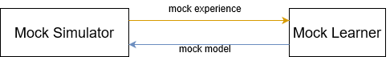

Distributed Hello World!
============================

A simple example of distributed mode hello world.

Architecture 
----------------------------

components
----------------------------
Simulator
^^^^^^^^^^^^^^^
It contains the *Proxy* which used to communicate with the learners. The *launch* function sends the dummy experience to the learner and 
the *await_model_from_learner* function waits for the reply from the learner.

.. literalinclude:: ../../../examples/hello_world/distributed_mode/environment_runner.py
    :language: python

Learner
^^^^^^^^^^^^^^^^
To become a distributed learner, the local learner uses the decorator *dist* with the proxy and handler functions. We use the *on_new_experience* function to handle
the incoming experience and the *on_checkout* function to handle the checkout command from the environment.

.. literalinclude:: ../../../examples/hello_world/distributed_mode/learner.py
    :language: python

