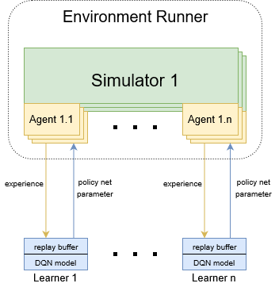

Parallel Environment Samplers and Parallel Learners
===================================================

The Environments-Learners Architecture which shown in below is designed for distributed reinforcement learning. For each environment, it may 
contain multi-agents which interact with environments and generate experiences. The agent communicates batches of experience(sequence of states, 
actions, and rewards) to the paired learner. Once the learner receives enough experience, the training process is triggered and sends the updated 
policy parameters back to the agent. 

Architecture 
------------

Components
----------

Environment Runner
^^^^^^^^^^^^^^^^^^

The distributed environments runner is inherited from the single host environment runner and add proxy and handler functions to achieve 
communication with remote learners. The environment runners not only interact with simulators but also trigger the training process in a learner.
To accomplish the control of the environment and learners, we enhance the local environment runner by adding some send-msg functions and handler 
functions. If you want to achieve some algorithms (i.e. A2C, etc) that the environment runner may only be responsible for collecting experiences, 
you can simply use the decorator *dist* to establish communication between components.

.. code-block:: python

    from examples.ecr.q_learning.single_host_mode.runner import Runner
    class EnvRunner(Runner):
        def __init__(self, scenario: str, topology: str, max_tick: int, max_train_ep: int, max_test_ep: int, eps_list: [float]):
            super().__init__(scenario, topology, max_tick, max_train_ep, max_test_ep, eps_list)
            self._proxy = get_proxy(COMPONENT, config, logger=logger)

        def start(self, episode):
            """
            Interaction with the environment, and send experiences get from the current episode to learner.
            """

    ############################### start of distributed functions' definitions  ###############################

        def launch(self, group_name, component_name):
            """
            setup the communication and trigger the training process.
            """

        def force_sync(self):
            """
            Waiting for all agents have the updated policy net parameters, and message may 
            contain the policy net parameters.
            """

    ############################### start of send message functions ###############################

        def send_net_parameters_to_learner(self):
            """
            Send initial net parameters to learners.
            """

        def send_experience(self, agent_id, episode):
            """
            Send experiences from current episode to learner
            """

        def send_env_checkout(self):
            """
            Send checkout message to learner
            """

    ############################### end of send message functions ###############################

        def on_updated_parameters(self, msg):
            """
            Handles policy net parameters from learner. This message should contain the agent id and policy net parameters.
            """

    ############################### end of distributed functions' definitions ###############################            

*launch* function
"""""""""""""""""

The *launch* function is exclusive to the distributed system. It setups the communication between environments and learners; meanwhile, 
it initiates the environment samplers.

.. code-block:: python

    def launch(self, group_name, component_name):
        """
        setup the communication and trigger the training process.

        Args:
            group_name (str): identifier for the group of all distributed components
            component_name (str): unique identifier in the current group
        """
        self._proxy.join(group_name, component_name)
        self.send_net_parameters_to_learner()
        pbar = tqdm(range(MAX_TRAIN_EP))
        for ep in pbar:
            pbar.set_description('train episode')
            self.start(ep)
            self.force_sync()

        self.send_env_checkout()
        self._test()

*start* function
""""""""""""""""

Unlike the single host environment runners, we overwrite the *start* function to support transfer experiences to the paired 
learner. 

.. code-block:: python
    :emphasize-lines: 17

    def start(self, episode):
        self._set_seed(TRAIN_SEED + episode)

        _, decision_event, is_done = self._env.step(None)

        while not is_done:
            action = self._agent_dict[decision_event.port_idx].choose_action(
                decision_event=decision_event, eps=self._eps_list[episode], current_ep=episode)
            _, decision_event, is_done = self._env.step(action)

        self._print_summary(ep=episode, is_train=True)

        for id_, agent in self._agent_dict.items():
            agent.fulfill_cache(
                self._env.agent_idx_list, self._env.snapshot_list, current_ep=episode)
            # send experience to the remote learner
            self.push_experience(id_, episode)
            agent.clear_cache()

        self._env.reset()

handler functions
"""""""""""""""""

The handler functions are used to deal with the received messages. Depending on the different message types, the purpose of the handler functions are diverse. 
In this example, the *on_updated_parameters* handle the latest net parameters and update the target agent's model. 

.. code-block:: python

    def on_updated_parameters(self, msg):
        """
        Handles policy net parameters from learner. This message should contain the agent id and policy net parameters.
        """
        if msg.body[MsgKey.POLICY_NET_PARAMETERS] != None:
            self._agent_dict[msg.body[MsgKey.AGENT_ID]].load_policy_net_parameters(msg.body[MsgKey.POLICY_NET_PARAMETERS])

Learner
^^^^^^^

The learner contains the experience pool and DQN model. Unlike the distributed environment runner, we use decorator *dist* to make a local learner 
become distributed. The learner is simple and only working about model learning; therefore, it could use 
the decorator *dist* to combine the handler functions, proxy and local learner. 

.. code-block:: python

    @dist(proxy=proxy, handler_dict=handler_dict)
    class Learner:
        def __init__(self):
            self.experience_pool = SimpleExperiencePool()
            self.algorithm = DQN(...)

handler functions
"""""""""""""""""

For this example, we have three kinds of handler functions which are used to handle initial net parameters, experience and checkout msg from environments.

.. code-block:: python

    def on_new_experience(local_instance, proxy, msg):
        """
        Handles incoming experience from environment runner. The message must contain agent_id and experience.
        """
        # put experience into experience pool
        local_instance.experience_pool.put(category_data_batches=msg.body[MsgKey.EXPERIENCE])
        policy_net_parameters = None

        # trigger trining process if got enough experience
        if local_instance.experience_pool.size['info'] > MIN_TRAIN_EXP_NUM:
            local_instance.train(msg.body[MsgKey.EPISODE])
            policy_net_parameters = local_instance.algorithm.policy_net.state_dict()

        # send updated policy net parameters to the target environment runner
        proxy.send(peer_name=msg.src, msg_type=MsgType.UPDATED_PARAMETERS,
                msg_body={MsgKey.AGENT_ID: msg.body[MsgKey.AGENT_ID],
                            MsgKey.POLICY_NET_PARAMETERS: policy_net_parameters})

    def on_initial_net_parameters(local_instance, proxy, msg):
        """
        Handles initial net parameters from environment runner. The message must contain policy net parameters 
        and target net parameters
        """
        local_instance.init_network(msg.body[MsgKey.POLICY_NET_PARAMETERS], msg.body[MsgKey.TARGET_NET_PARAMETERS])

    def on_env_checkout(local_instance, proxy, msg):
        """
        Handle environment runner checkout message.
        """
        local_instance.env_checkout(msg.src)