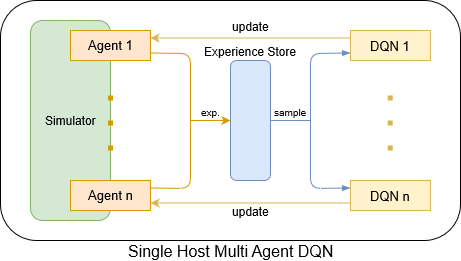

Single Host Environment Runner
==============================

An example of multi-agent reinforcement learning solves the dispatch of empty containers between ports. 

Architecture
------------

Components
----------

simulator
"""""""""

It is used to simulate the real environment and drive by events.

agent
"""""

It is equivalently as the port in the real world. It is used to interact with the simulator.

DQN model
"""""""""

A model that used to choose action and learn from the given experiences.

Training Process
----------------

*start* function
""""""""""""""""

It includes interacting with environment and collecting experiences.

.. code-block:: python

    def start(self):
        pbar = tqdm(range(self._max_train_ep))
        for ep in pbar:
            self._set_seed(TRAIN_SEED + ep)
            pbar.set_description('train episode')

    ############################### start of interaction with environment ###############################
            
            _, decision_event, is_done = self._env.step(None)

            while not is_done:
                action = self._agent_dict[decision_event.port_idx].choose_action(
                    decision_event=decision_event, eps=self._eps_list[ep], current_ep=ep)
                _, decision_event, is_done = self._env.step(action)

    ############################### end of interaction with environment ###############################

            self._print_summary(ep=ep, is_train=True)

    ############################### start of collecting experience ###############################

            need_train = True
            for agent in self._agent_dict.values():
                agent.fulfill_cache(
                    agent_idx_list=self._env.agent_idx_list, snapshot_list=self._env.snapshot_list, current_ep=ep)
                agent.put_experience()
                agent.clear_cache()
                if agent.experience_pool.size['info'] < MIN_TRAIN_EXP_NUM:
                    need_train = False

    ############################### end of collecting experience ###############################

    ############################### start of model learning ###############################

            if need_train:
                for agent in self._agent_dict.values():
                    agent.train(current_ep=ep)

    ############################### end of model learning ###############################

            self._env.reset()

        self._test()

*agent.train* function
""""""""""""""""""""""

It includes getting samples from experience pool and calculating loss by the DQN algorithm.

.. code-block:: python

    def train(self, current_ep:int):
        '''
        Args:
            current_ep (int): Current episode, which is used for logging.
        '''
        if self._experience_pool.size['info'] < self._min_train_experience_num:
            return 0

    ############################### start of sampling ###############################

        pbar = tqdm(range(self._batch_num))
        for i in pbar:
            pbar.set_description(f'Agent {self._agent_name} batch training')
            idx_list = self._experience_pool.apply_multi_samplers(
                category_samplers=[('info', [(lambda i, o: (i, o['td_error']), self._batch_size)])])['info']
            sample_dict = self._experience_pool.get(category_idx_batches=[
                ('state', idx_list),
                ('reward', idx_list),
                ('action', idx_list),
                ('next_state', idx_list),
                ('info', idx_list)
            ])

    ############################### end of sampling ###############################

            state_batch = torch.from_numpy(
                np.array(sample_dict['state'])).view(-1, self._algorithm.policy_net.input_dim)
            action_batch = torch.from_numpy(
                np.array(sample_dict['action'])).view(-1, 1)
            reward_batch = torch.from_numpy(
                np.array(sample_dict['reward'])).view(-1, 1)
            next_state_batch = torch.from_numpy(
                np.array(sample_dict['next_state'])).view(-1, self._algorithm.policy_net.input_dim)
            loss = self._algorithm.learn(state_batch=state_batch, action_batch=action_batch,
                                  reward_batch=reward_batch, next_state_batch=next_state_batch, current_ep=current_ep)

            # update td-error
            new_info_list = []
            for i in range(len(idx_list)):
                new_info_list.append({'td_error': loss})

            self._experience_pool.update([('info', idx_list, new_info_list)])

            if self._log_enable:
                self._logger.info(f'{self._agent_name} learn loss: {loss}')
