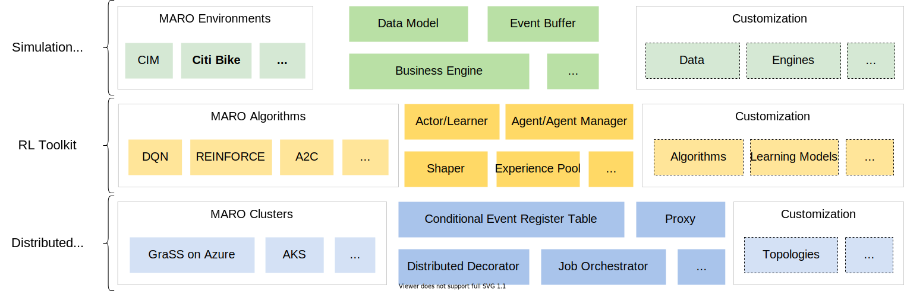

What is MARO?
===============

Multi-Agent Resource Optimization (MARO) platform is an instance of Reinforcement
learning as a Service (RaaS) for real-world resource optimization. It can be
applied to many important industrial domains, such as container inventory
management in logistics, bike repositioning in transportation, virtual machine
provisioning in data centers, and asset management in finance. Besides
`Reinforcement Learning <https://www.andrew.cmu.edu/course/10-703/textbook/BartoSutton.pdf>`_ (RL), it
also supports other planning/decision mechanisms, such as
`Operations Research <https://en.wikipedia.org/wiki/Operations_research>`_.

Key Components
---------------

- Simulation toolkit: it provides some predefined scenarios, and the reusable wheels for building new scenarios.
- RL toolkit: it provides a full-stack abstraction for RL, such as agent manager, agent, RL algorithms, learner, actor, and various shapers.
- Distributed toolkit: it provides distributed communication components, interface of user-defined functions for message auto-handling, cluster provision, and job orchestration.

Quick Start
-------------

.. code-block:: python

    from maro.simulator import Env
    from maro.simulator.scenarios.cim.common import Action

    # Initialize an environment with a specific scenario, related topology.
    # In Container Inventory Management, 1 tick means 1 day, here durations=100 means a length of 100 days
    env = Env(scenario="cim", topology="toy.5p_ssddd_l0.0", start_tick=0, durations=100)

    # Query environment summary, which includes business instances, intra-instance attributes, etc.
    print(env.summary)

    for ep in range(2):
        # Gym-like step function.
        metrics, decision_event, is_done = env.step(None)

        while not is_done:
            past_week_ticks = [
                x for x in range(decision_event.tick - 7, decision_event.tick)
            ]
            decision_port_idx = decision_event.port_idx
            intr_port_infos = ["booking", "empty", "shortage"]

            # Query the snapshot list of the environment to get the information of
            # the booking, empty container inventory, shortage of the decision port in the past week.
            past_week_info = env.snapshot_list["ports"][
                past_week_ticks : decision_port_idx : intr_port_infos
            ]

            dummy_action = Action(
                vessel_idx=decision_event.vessel_idx,
                port_idx=decision_event.port_idx,
                quantity=0
            )

            # Drive environment with dummy action (no repositioning).
            metrics, decision_event, is_done = env.step(dummy_action)

        # Query environment business metrics at the end of an episode,
        # it is your optimized object (usually includes multi-target).
        print(f"ep: {ep}, environment metrics: {env.metrics}")
        env.reset()

Contents
----------

.. toctree::
    :maxdepth: 2
    :caption: Installation

    installation/pip_install.rst
    installation/playground.rst
    installation/grass_azure_cluster_provisioning.rst
    installation/grass_on_premises_cluster_provisioning.rst
    installation/k8s_aks_cluster_provisioning.rst
    installation/multi_processes_localhost_provisioning.rst

.. toctree::
    :maxdepth: 2
    :caption: Scenarios

    scenarios/container_inventory_management.rst
    scenarios/citi_bike.rst
    scenarios/vm_scheduling.rst
    scenarios/supply_chain.rst
    scenarios/command_line.rst

.. toctree::
    :maxdepth: 2
    :caption: Examples

    examples/multi_agent_dqn_cim.rst
    examples/greedy_policy_citi_bike.rst

.. toctree::
    :maxdepth: 2
    :caption: Key Components

    key_components/simulation_toolkit.rst
    key_components/data_model.rst
    key_components/event_buffer.rst
    key_components/business_engine.rst
    key_components/rl_toolkit.rst
    key_components/distributed_toolkit.rst
    key_components/communication.rst
    key_components/orchestration.rst
    key_components/dashboard_visualization.rst
    key_components/geographic_visualization.rst

.. toctree::
    :maxdepth: 2
    :caption: API Documents

    apidoc/maro.rst
