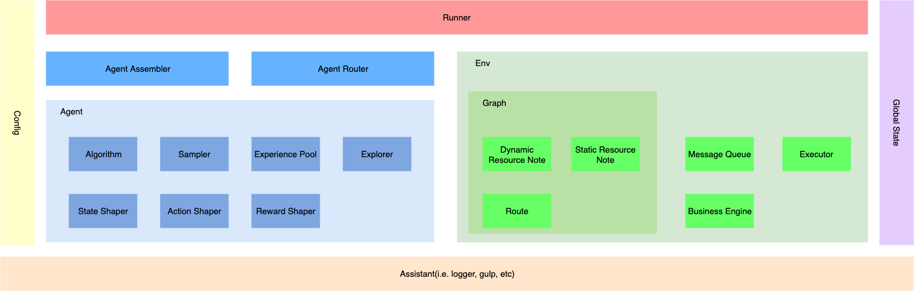

MARO
====

.. figure:: ./images/logo.svg
    :width: 250px
    :align: center
    :alt: MARO

**MARO (Multi-Agent Resource Optimization) is an open-source platform, which focused on multi-agent reinforcement learning applying on the resource optimization domain.**

Quick Start
------------

.. code-block:: bash

    # install python libs
    pip install -r requirements.dev.txt
    # run sample scenario
    python runner.py -u maro -e base_line

.. toctree::
    :maxdepth: -1
    :caption: Installation

    installation/docker_on_ubuntu.rst
    installation/windows.rst
    installation/os_x.rst
    installation/cluster_on_azure.rst

.. toctree::
    :maxdepth: -1
    :caption: Simulator

    simulator/architecture.rst
    simulator/data_model.rst
    simulator/event_buffer.rst
    simulator/business_engine.rst

.. toctree::
    :maxdepth: -1
    :caption: Distributed System

    distributed_system/architecture.rst
    distributed_system/general_framework.rst

.. toctree::
    :maxdepth: -1
    :caption: Scenario

    scenario/ecr.rst

.. toctree::
    :maxdepth: -1
    :caption: Customization

    customization/ecr_topology.rst
    customization/new_scenario.rst

.. toctree::
    :maxdepth: -1
    :caption: MARO-CLI

    maro_cli/maro_cli.rst
    maro_cli/dashboard.rst

.. toctree::
    :maxdepth: -1
    :caption: Example

    example/single_host_hello_world.rst
    example/single_host_multi_agent_dqn.rst
    example/distributed_hello_world.rst
    example/distributed_multi_agent_dqn.rst

.. toctree::
    :maxdepth: -1
    :caption: Experiment
    
    experiment/single_agent.rst
    experiment/vanilla_marl.rst
    experiment/monkey.rst
    experiment/or.rst
    experiment/market_based_marl.rst
    experiment/summary.rst

.. toctree::
    :maxdepth: -1
    :caption: API Documents

    apidoc/maro.rst
