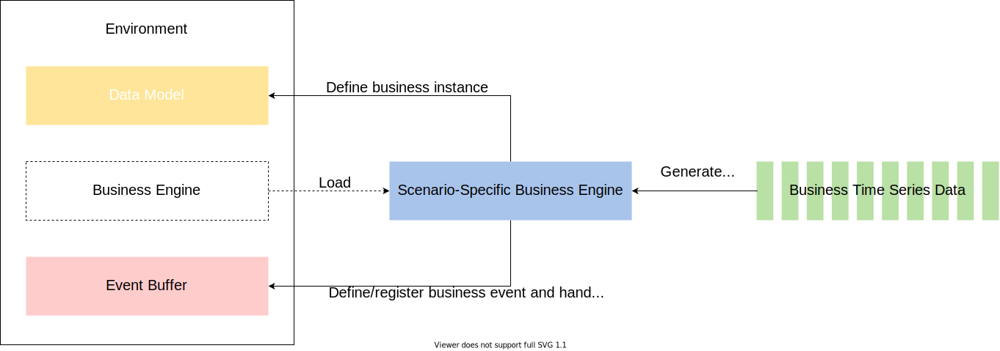

Business Engine
===============

MARO provides a pluggable mechanism to isolate the business logic and the
simulation kernel parts. For different business scenarios, specific business
engines should be bind to it.

The business engine is responsible for defining:

* **Business instance**. Generally, the business instances are the resource
  holders in the business logic. For example:

  * The ports and vessels in the `CIM <../scenarios/container_inventory_management.html>`_
    scenario;
  * The stations in the `Citi Bike <../scenarios/citi_bike.html>`_ scenario;

* **Business event**. Since it is closely related to the actual business logic,
  the business events are reproduced based on the existing business log data or
  generated according to the predefined business rules. For example:

  * The receiving of customers' orders, the vessel departure, etc in the CIM scenario;
  * The receiving of the customers' trip requirements, the finishing of a trip,
    etc in the Citi Bike scenario;

* **Decision event**. It is the external interactive interface for the resource
  optimization. The environment returns the decision events to the decision agent
  to trigger the agent's actions. For example:

  * The empty container repositioning operations that triggered by a vessel arrival
    event in the CIM scenario;
  * The bike repositioning operations that triggered when there are too many or
    too few bikes remained in the station in Citi Bike scenario;

* **Optimize metrics**. There are often multiple goals in real business scenarios,
  these metrics should be defined so as to be recorded to evaluate the repositioning.
  For example:

  * The shortage that used to measure the number of un-satisfied requirements;
  * The cost of the repositioning operations;

As shown in the figure below, the simulator will load the scenario-specific
business engine and convert the filled business time series data into the
corresponding business events. After that, the entire simulation system would be
driven by these business events. In short, with the uniformed business engine
interface, the simulation of different business scenarios is only based on the
pluggable business engine (scenario-specific).

Generally, the business time series data is read from the historical log or
generated by a data generation model. Currently, for topologies in Citi Bike
scenario, data processing is needed before starting the simulation. You can find
the brief introduction of the data processing command in
`Data Processing <../scenarios/citi_bike.html#data-preparation>`_.
