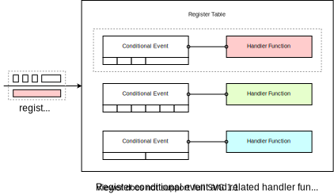
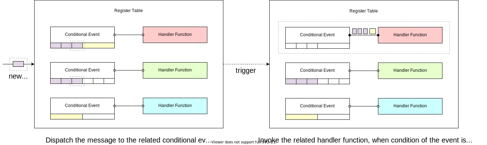

Distributed Communication
=========================

The distributed communication component provides a general message passing mechanism,
which is used to build various communication topologies in the distributed environment.
Besides the essential communication primitive supporting, it also provides the functions of
peer discovering, fault recovering (partially), conditional event auto-dispatching, etc.

Proxy
-----

Providing an implementation of the communication primitives, proxy is the primary entity
of the communication component. Proxy provides a uniformed communication interface,
the underlying driver is pluggable based on the real requirements.
Currently, we use `ZeroMQ <https://zeromq.org/>`_ as the default choice.
Proxy also provides support for peer discovering based on `Redis <https://redis.io/>`_.

.. image:: ../images/distributed/proxy.svg
   :target: ../images/distributed/proxy.svg
   :alt: Proxy

Message
^^^^^^^

Message is designed for general purpose,
it is used to package the communication content between components.
The main attributes of a message instance include:

* ``tag``\ : A customized attribute, it can be used to implement the auto-dispatching logic
  with a `conditional event register table <#conditional-event-register-table>`_.
* ``source``\ : The alias of the message sender.
* ``destination``\ : The alias of the message receiver.
* ``payload``\ : A Python object for remote function call.
* ``session_id`` (auto-generated): UUID of a specific session,
  one session may include multiple messages.
* ``message_id`` (auto-generated): UUID of a specific message.

.. code-block:: python

   from maro.communication import Message

   message = Message(tag="check_in",
                     source="worker_001",
                     destination="master",
                     body="")

Session Message
^^^^^^^^^^^^^^^

We provide two kinds of predefined session types for common distributed scenarios:

* **Task Session**\ : It is used to describe a computing task sent from master to worker.
  Three stages are included:

  #. The master sends the task request(s) to the worker(s);
  #. Once the worker(s) receiving the task(s), the worker(s) start to finish the task(s);
  #. The worker(s) return the computing result(s) to the master.

* **Notification Session**\ : It is used for information syncing and only includes two stages:

  #. The sender sends out the notification message;
  #. The receiver(s) receive the notification message.

The stages of each session are maintained internally by the proxy.

.. code-block:: python

   from maro.communication import SessionMessage, SessionType

   task_message = SessionMessage(tag="sum",
                                 source="master",
                                 destination="worker_001",
                                 body=[0, 1, 2, ...],
                                 session_type=SessionType.TASK)

   notification_message = SessionMessage(tag="check_out",
                                         source="worker_001",
                                         destination="master",
                                         body="",
                                         session_type=SessionType.NOTIFICATION)

Communication Primitives
^^^^^^^^^^^^^^^^^^^^^^^^

Proxy provides a set of general-purpose communication primitives that support
both blocking and non-blocking cases. These primitives are decoupled from
the underlying implementation of the communication driver (protocol).
The main primitives are listed below:

* ``send``\ : Unicast. It is a blocking, one-to-one sending mode.
  It will watch and collect the reply message from the remote peer.
* ``isend``\ : The non-blocking version of the ``send``.
  A message session ID will be immediately returned, which can be used by ``receive_by_id``.
* ``scatter``\ : An advanced version of ``send``. Is is used to send message(s) to peer(s)
  and watch and collect reply message(s) from the peer(s).
  ``scatter`` is not a real multi-cast, each message will go through the full TCP/IP
  stack (ZeroMQ driver). If the message you want to send is completely same and
  you want better performance, use the ``broadcast`` interface instead.
* ``iscatter``\ : The non-blocking version of the ``scatter``. The related messages
  session ID(s) will be returned immediately, which can be used by ``receive_by_id``.
* ``broadcast``\ : A blocking function call which is used to broadcast the message
  to all subscribers, it will watch and collect all subscribers' reply messages.
* ``ibroadcast``\ : The non-blocking version of the ``broadcast``. The related messages
  session IDs will be returned immediately, which can be used by ``receive_by_id``.
* ``receive``\ : It is used to continually receive the message.
* ``receive_by_id``\ : It only receives the message(s) with the given session ID(s).

Conditional Event Register Table
--------------------------------

The conditional event register table provides a message auto-despatching mechanism.
By registering the ``conditional event`` and related ``handler function`` to
the register table, the handler function will be automatically executed
with the received messages when the event conditions are met.

``Conditional event`` is used to declare the required message group for
auto-triggering the related handler function.
The unit event is the minimal component in the conditional event,
it follows a three-stage format: `source`:`tag`:\ ``amount``.

* ``source``\ : It is used to declare the required message source.
  The longest-prefix matching is supported.

  * ``*`` is used to present any sources.

* ``tag``\ : The ``tag`` attribute of the message instance.

  * ``*`` is used to present any tags.

* ``amount``\ : The required message instance amount.
  Both a absolute integer and a relative percentage are valid for this field.

  * ``%`` is used to represent the relative percentages, such as 60%, 10%, etc.

  .. code-block:: python

    unit_event_abs = "worker:update:10"

    unit_event_rel = "worker:update:60%"

To support more complex business logic,
we provide two operations: ``AND`` and ``OR`` to combine unit events up:

* ``AND``\ : Valid for multiple unit events and combined unit events.
  The combined event condition is met if all the conditions of the sub-events are met.
* ``OR``\ : Valid for multiple unit events and combined unit events.
  The combined event condition is met if any sub-event meets the condition.

  .. code-block:: python

    combined_event_and = ("worker_01:update:2",
                          "worker_02:update:3",
                          "AND")

    combined_event_or = ("worker_03:update:1",
                          "worker_04:update:5",
                          "OR")

    combined_event_mix = (("worker_01:update:2", "worker_02:update:3", "AND"),
                          "worker_03:update:1",
                          "OR")

``Handler function`` is a user-defined callback function that is bind to
a specific conditional event. When the condition of the event is met,
the related messages will be sent to the handler function for its execution.

.. code-block:: python

   # A common handler function signature
   def handler(that, proxy, messages):
       """
           Conditional event handler function.

           Args:
               that: local instance reference, which needs to be operated.
               proxy: the proxy reference for remote communication.
               messages: received messages.
       """
       pass

Distributed Decorator
---------------------

Distributed decorator is a helper for generating a distributed worker class
from a local functional class.

.. code-block:: python

   from maro.communication import dist, Proxy

   # Initialize proxy instance for remote communication.
   proxy = Proxy(group_name="master-worker",
                 component_type="worker",
                 expected_peers=[("master", 1)])

   # Declare the trigger condition of rollout event.
   rollout_event = "master:rollout:1"

   # Implement rollout event handler logic.
   def on_rollout(that, proxy, messages):
       pass

   # Assemble event-handler directory.
   handler_dict = {rollout_event: on_rollout}

   # Convert a local functional class to a distributed one.
   @dist(proxy, handler_dict)
   class Worker:
       def __init__(self):
           pass
