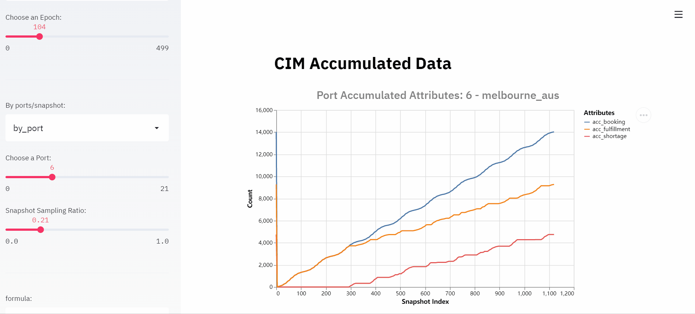
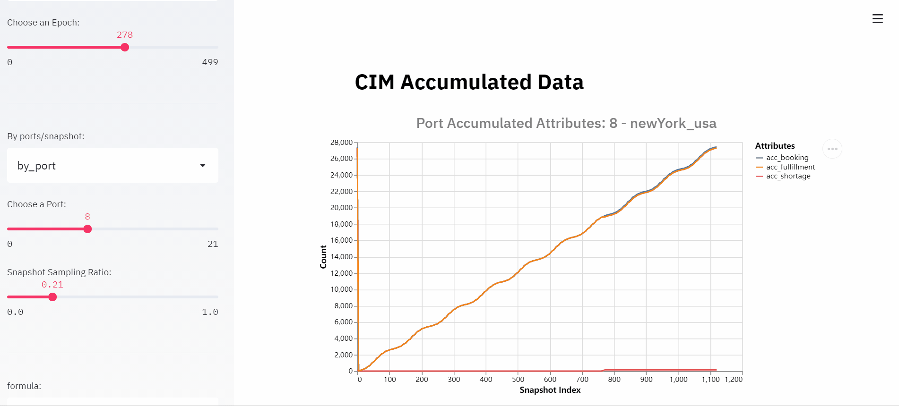
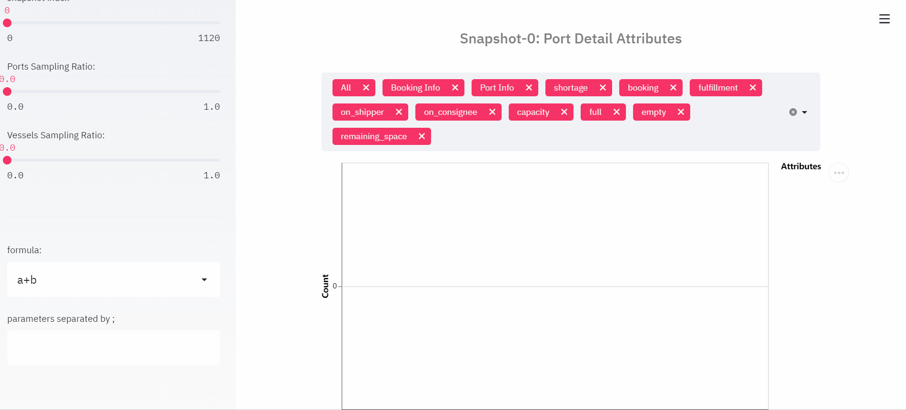
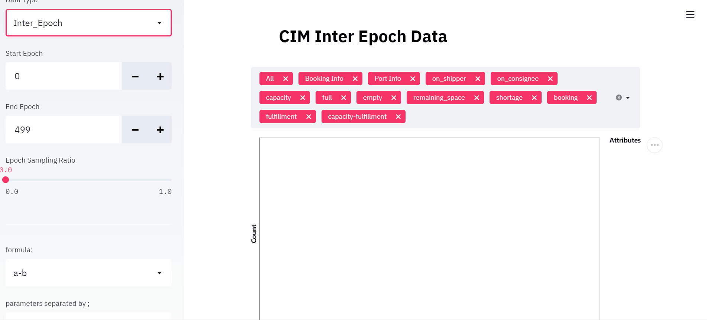

Dashboard Visualization
=======================

Env-dashboard is a post-experimental visualization tool, aims to provide
more intuitive environment information, which will guide the design of
the algorithm and continually fine-tuning.

Currently, the visualization of senario **Container Inventory Management**
and **Citi Bike** are supported.

Dependency
----------

Module **streamlit** and **altair** should be pre-installed.

* `streamlit <https://www.streamlit.io/>`_

* `altair <https://altair-viz.github.io/>`_

Install them with:

.. code-block:: sh

    pip install streamlit altair

----

How to Use?
-----------

Generate dumped data
~~~~~~~~~~~~~~~~~~~~

The dumped data from environment is the data source of visualization.
To generate data, user needs to specify the parameter **options** when creating Env object.
Type of value of this parameter should be Dictionary.

If user does not need to dump data, then there is no need to pass value to
this parameter. 
If the value for key "enable-dump-snapshot" of this parameter is an empty string,
data would be dumped to the folder which start the command.
If user specifies the value for key "enable-dump-snapshot" of this parameter with the
path of a local file folder, and the dir_path of the local file folder does exist, 
data would be dumped to this folder. To be specific, each dump request would generate
a data folder with a timestamp as the suffix in the local file folder. 

.. code-block:: sh

    opts_have_path = {"enable-dump-snapshot": "./dump_data"}

    opts_have_no_path = {"enable-dump-snapshot": ""}

    # dump data to folder ./dump_data.
    env = Env(scenario="cim", topology="toy.5p_ssddd_l0.0",
          start_tick=0, durations=100, options=opts_have_path)

    # dump data to the folder which run the command.
    env = Env(scenario="cim", topology="toy.5p_ssddd_l0.0",
          start_tick=0, durations=100, options=opts_have_no_path)

----

Data would be dumped automatically when the Env object is initialized.
To get the complete reference, please view the file maro/examples/hello_world/cim/hello_streamlit.py.

For more details about Environment, please refer to
`Environment <simulation_toolkit.html>`_.

Launch Visualization Tool
~~~~~~~~~~~~~~~~~~~~~~~~~

To start this visualization tool, user need to input command following the format:

.. code-block:: sh

    maro inspector dashboard --source_path SNAPSHOT_DUMP_DATA_FOLDER --force {true/false}

----

Parameter **force** refers to regenerate cross-epoch summary data or not, default value is 'true'.
Parameter **source_path** refers to the path of dumped snapshot files. Every experiment would
generate a data folder with a timestamp as the suffix, which we refer as SNAPSHOT_DUMP_DATA_FOLDER.
The input of the parameter **source_path** should be the path of SNAPSHOT_DUMP_DATA_FOLDER.

Make sure that your SNAPSHOT_DUMP_DATA_FOLDER's structure is similar as following:

Folder Structure

.. code-block:: sh

    ./SNAPSHOT_DUMP_DATA_FOLDER
        epoch_#                         # folders to restore data of each epoch.
            {resource_holder}.csv       # attributes of current epoch.
       manifest.yml                     # basic info like scenario name, number of epoches.
       index_name_mapping file        # relationship between an index and its name of resource holders.
       {resource_holder}_summary.csv    # cross-epoch summary information. 

----

If any file is missed compared with the expected folder structure
displayed above, the command line would prompt users with an error message.
The visualization tool looks for the free port to launch page in sequence, starting with port 8501.
The command line would print out the selected port.

Feature List
------------

Basically, each scenario has 2 parts of visualization: intra-epoch view
and inter-epoch view. User could switch between them freely.

Intra-epoch view
~~~~~~~~~~~~~~~~

User could view detailed information of selected resource holder or tick
under this mode. In order for users to better understand the data, we
separate the data into time dimension and space dimension. Users could view
both the value of a resource holder's property over time and the state of
all resource holders at a selected time (e.g. tick).

Content of intra-epoch view is varied between senarios. For example, in senario
container_inventory_management, the attributes of resource holders are relatively
complex. Thus, this view is divided into two parts: Accumulated Attributes and Detail Attributes.
The former one includes the heat map of transfer volume, top-k attributes summary,
accumulated attributes summary. The latter one includes the chart of two resource holders:
Port and Vessel attributes in the scenario container_inventory_management. 
Detailed introduction please refer to 
`Container Inventory Management Visualization <../scenarios/container_inventory_management.html#Visualization>`_.

The content of senario citi_Bike is much simpler,
mainly including top-k attributes summary and the chart of resource holder:
Station in senario citi_bike.
Detailed introduction please refer to 
`Citi Bike Visualization <../scenarios/citi_bike.html#Visualization>`_.

Epoch/Snapshot/Resource Holder Index Selection
^^^^^^^^^^^^^^^^^^^^^^^^^^^^^^^^^^^^^^^^^^^^^^

To view the details of a resource holder or a tick, user could select
the specific index of epoch/snapshot/resource holder by sliding the slider
on the left side of page.

Snapshot/Resource Holder Sampling Ratio Selection
^^^^^^^^^^^^^^^^^^^^^^^^^^^^^^^^^^^^^^^^^^^^^^^^^

To view trends in the data, or to weed out excess information, user could
select the sampling ratio of snapshot/resource holder by sliding to
change the number of data to be displayed.

Formula Calculation
^^^^^^^^^^^^^^^^^^^

User could generate their own attributes by using pre-defined formulas.
The results of the formula calculation could be reused as the input
parameter of formula.

Inter-epoch view
~~~~~~~~~~~~~~~~

User could view cross-epoch information in this view.
In order to make users intuitively observe the results of the iterative
algorithm, such as whether the results converge as expected, we extracted
important attributes of resource holder from each epoch as a summary of
the current epoch and display them centrally in this view.
Users are free to choose the interval they care about and the sampling
rate within the selected interval. Line chart and bar chart can
effectively help users to know the results of the experiment.

Epoch Sampling Ratio Selection
^^^^^^^^^^^^^^^^^^^^^^^^^^^^^^

To view trends in the data, or to weed out excess information, user could
select the sampling ratio of epoch by sliding to
change the number of data to be displayed.

Formula Calculation
^^^^^^^^^^^^^^^^^^^

Please refer to `Formula Calculation <#Feature List#Intra_epoch View#Formula Calculation>`_.

Examples
--------
Examples of each scenarios please refer to docs of each scenarios:

* `Container Inventory Management <../scenarios/container_inventory_management.html#Visualization>`_.

* `Citi Bike <../scenarios/citi_bike.html#Visualization>`_.
