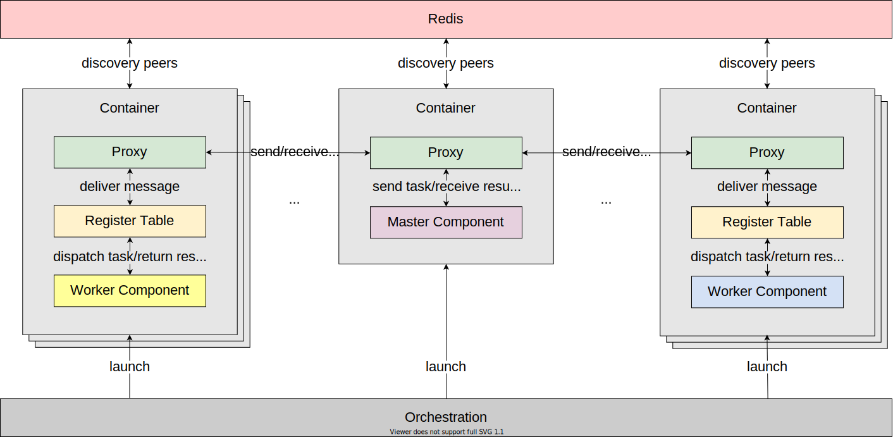
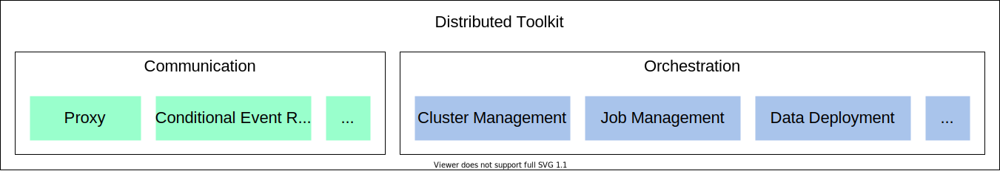

Distributed Toolkit
===================

MARO distributed toolkit provides a unified, fast, and infrastructure-independent
interface to support RL distributed training.

As shown in the overall architecture diagram above, MARO distributed toolkit
follows a message-passing pattern that the cooperation between different components
is based on the messages sending and receiving. A typical master/worker distributed
program usually contains the following steps:

#. The master component will send tasks(w/ or w/o data) to the worker components;
#. The worker components will finish the tasks in their local computing environments
   or the local devices;
#. The worker components return the computed results to the master component.

According to the actual needs, the communication mode between master and worker
components can be synchronous or asynchronous.

Key Components
--------------

There are two key components in the distributed toolkit:

* **Communication**\ : It provides the general message passing interfaces, such as
  ``(i)send``\ , ``receive``\ , ``(i)broadcast``\ , ``(i)scatter``\ , etc. The communication
  component use a replaceable communication protocol driver to adopt different
  communication protocol stack (e.g. `TCP/IP <https://en.wikipedia.org/wiki/Internet_protocol_suite>`_\ ,
  `InfiniBand <https://en.wikipedia.org/wiki/InfiniBand>`_). Check the
  `distributed communication <./communication.html>`_ to get more details.

* **Orchestration**\ : It primarily provides a unified interface for cluster
  management and job management on different infrastructures. Check the
  `distributed orchestration <./orchestration.html>`_ to get more details.