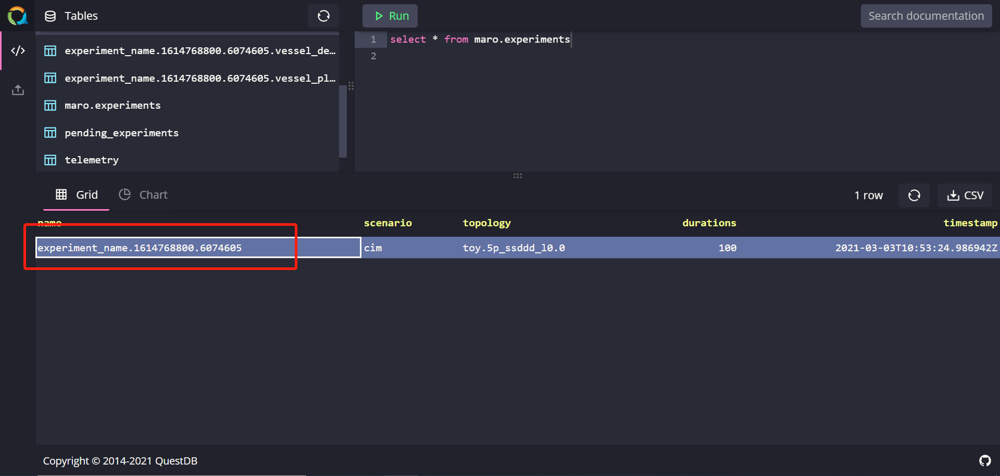
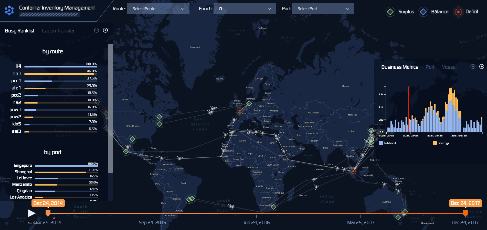
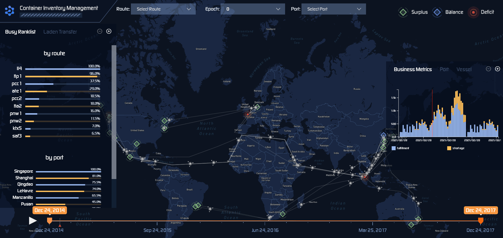
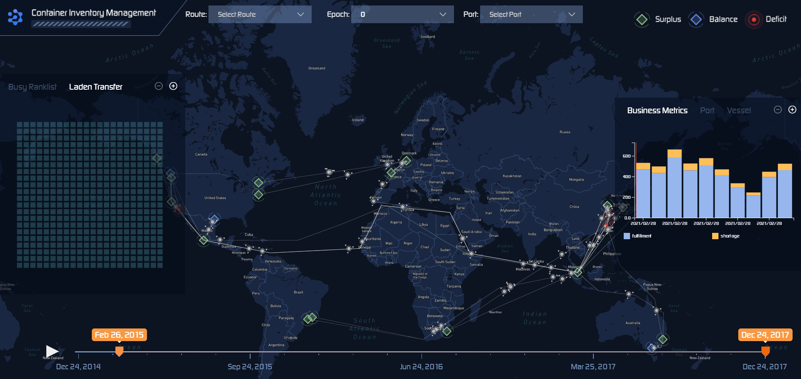
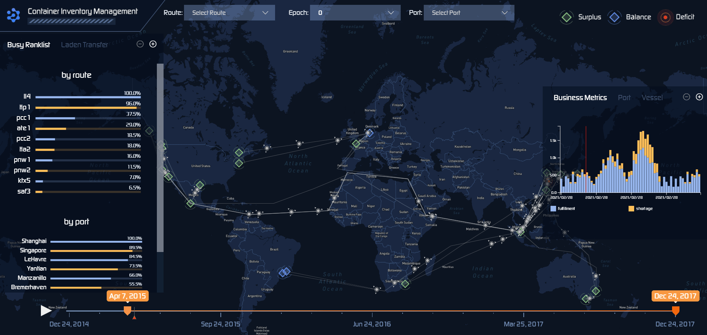
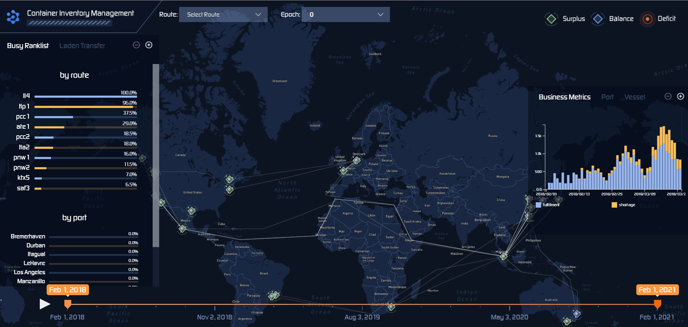

Geographic Visualization
=======================

We can use Env-geographic for both finished experiments and running experiments.
For finished experiments, the local mode is enabled for users to view experimental data
in order to help users to make subsequent decisions. If a running experiment is selected,
the real-time mode will be launched by default, it is used to view real-time experimental
data  and judge the effectiveness of the model. You can also freely change to
local mode for the finished epoch under real-time mode.

Dependency
----------

Env-geographic's startup depends on **docker** and **docker-compose**.
Therefore, users need to install docker on the machine and ensure that it can run normally.
User could get docker through `Docker installation <https://docs.docker.com/get-docker/>`_.

We suggest that the version of docker should >= 1.20 and the version of docker-compose
should >= 1.27.

For windows users, make sure to switch on your **Hyper-V** service to ensure docker could start successfully.
Besides, users should make sure that their machine could execute **shell commands** in any directory. We suggest
that windows users could install git bash to meet this requirement.

How to Use?
-----------

Env-geographic has 3 parts: front-end, back-end and database. Users need 2 steps
to start this tool:

1. Start the database and choose an experiment to be displayed.
2. Start the front-end and back-end service with specified experiment name.

Start database
~~~~~~~~~~~~~~
Firstly, user need to start the local database with command:

.. code-block:: sh

    maro inspector geo --start database

----

After the command is executed successfully, user
could view the local data with localhost:9000 by default.
If the default port is occupied, user could obtain the access port of each container
through the following command:

.. code-block:: sh

    docker container ls

----

User could view all experiment information by SQL statement:

.. code-block:: SQL

    SELECT * FROM maro.experiments

----

Data is stored locally at the folder maro/maro/streamit/server/data.

Choose an existing experiment
^^^^^^^^^^^^^^^^^^^^^^^^^^^^^

To view the visualization of experimental data, user need to
specify the name of experiment. User could choose an existing
experiment or start an experiment either.

User could select a name from local database.

Create a new experiment
^^^^^^^^^^^^^^^^^^^^^^^

Currently, users need to manually start the experiment to obtain
the data required by the service.

To send data to database, there are 2 compulsory steps:

1. Set the environmental variable to enable data transmission.
2. Import relevant package and modify the code of environmental initialization to send data.

User needs to set the value of the environment variable
"MARO_STREAMIT_ENABLED" to "true". If user wants to specify the experiment name,
set the environment variable "MARO_STREAMIT_EXPERIMENT_NAME". If user does not
set this value, a unique experiment name would be processed automatically. User
could check the experiment name through database. It should be noted that when
selecting a topology, user must select a topology with specific geographic
information. The experimental data obtained by using topology files without
geographic information cannot be used in the Env-geographic tool.

User could set the environmental variable as following example:

.. code-block:: python

    os.environ["MARO_STREAMIT_ENABLED"] = "true"

    os.environ["MARO_STREAMIT_EXPERIMENT_NAME"] = "my_maro_experiment"

----

To send the experimental data by episode while the experiment is running, user needs to import the
package **streamit** with following code before environment initialization:

.. code-block:: python

      # Import package streamit
      from maro.streamit import streamit
      # Initialize environment and send basic information of experiment to database.
      env = Env(scenario="cim", topology="global_trade.22p_l0.1",
               start_tick=0, durations=100)

      for ep in range(EPISODE_NUMBER):
            # Send experimental data to database by episode.
            streamit.episode(ep)

----

To get the complete reference, please view the file maro/examples/hello_world/cim/hello_geo_vis.py.

After starting the experiment, user needs to query its name in local database to make sure
the experimental data is sent successfully.

Start service
~~~~~~~~~~~~~

To start the front-end and back-end service, user need to specify the experiment name.
User could specify the port by adding the parameter "front_end_port" as following
command:

.. code-block:: sh

    maro inspector geo --start service --experiment_name YOUR_EXPERIMENT_NAME --front_end_port 8080

----

Generally, the backend service runs on a local machine, occupying port 5000.
If port 5000 is already occupied, the program would find another free port starting from 5000.

To be specific, if user would like to run the backend service in docker rather on a local machine, please
run the shell script run_docker.sh under the folder maro\maro\cli\maro_real_time_vis. It should be noted that
if user run backend service with docker, data processing may be slower than local.

The program will automatically determine whether to use real-time mode
or local mode according to the data status of the current experiment.

Feature List
------------

For the convenience of users, Env-geographic tool implemented some features
so that users can freely view experimental data.

Real-time mode and local mode
~~~~~~~~~~~~~~~~~~~~~~~~~~~~~

Local mode
^^^^^^^^^^

In this mode, user could comprehend the experimental data through the geographic
information and the charts on both sides. By clicking the play button in the lower
left corner of the page, user could view the dynamic changes of the data in the
selected time window. By hovering on geographic items and charts, more detailed information
could be displayed.

The chart on the right side of the page shows the changes in the data over
a period of time from the perspectives of overall, port, and vessel.

.. image:: ../images/visualization/geographic/local_mode_right_chart.gif
   :alt: local_mode_right_chart

The chart on the left side of the page shows the ranking of the carrying
capacity of each port and the change in carrying capacity between ports
in the entire time window.

Real-time mode
^^^^^^^^^^^^^^

The feature of real-time mode is not much different from that of local mode.
The particularity of real-time mode lies in the data. The automatic playback
speed of the progress bar in the front-end page is often close to the speed
of the experimental data. So user could not select the time window freely in
this mode.

Besides, user could change the mode by clicking. If user choose to view the
local data under real-time mode, the experimental data generated so far could
be displayed.

.. image:: ../images/visualization/geographic/real_time_mode.gif
   :alt: real_time_mode

Geographic data display
~~~~~~~~~~~~~~~~~~~~~~~

In the map on the page, user can view the specific status of different resource
holders at various times. Users can further understand a specific area by zooming the map.
Among them, the three different status of the port:
Surplus, Deficit and Balance represent the quantitative relationship between the
empty container volume and the received order volume of the corresponding port
at that time.

Data chart display
~~~~~~~~~~~~~~~~~~
The ranking table on the right side of the page shows the throughput of routes and
ports over a period of time. While the heat-map shows the throughput between ports
over a period of time. User can hover to specific elements to view data information.

The chart on the left shows the order volume and empty container information of each
port and each vessel. User can view the data of different resource holders by switching options.

In addition, user can zoom the chart to display information more clearly.

Time window selection
~~~~~~~~~~~~~~~~~~~~~

This feature is only valid in local mode. User can select the starting point position by
sliding to select the left starting point of the time window, and view the specific data at
different time.

In addition, the user can freely choose the end of the time window. When the user plays this tool,
it will loop in the time window selected by the user.

