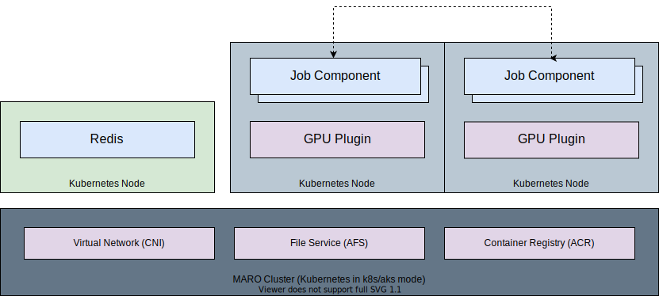

# Distributed Orchestration

MARO provides easy-to-use CLI commands to provision and manage training clusters
on cloud computing service like [Azure](https://azure.microsoft.com/en-us/).
These CLI commands can also be used to schedule the training jobs with the
specified resource requirements. In MARO, all training job related components
are dockerized for easy deployment and resource allocation. It provides a unified
abstraction/interface for different orchestration framework
(e.g. [Grass](#grass), [Kubernetes](#kubernetes)).

## Grass

Grass is a self-designed, development purpose orchestration framework. It can be
confidently applied to small/middle size cluster (< 200 nodes). The design goal
of Grass is to speed up the distributed algorithm prototype development.
It has the following advantages:

- Fast deployment in a small cluster.
- Fine-grained resource management.
- Lightweight, no other dependencies are required.

In the Grass mode:

- All VMs will be deployed in the same virtual network for a faster, more stable
connection and larger bandwidth. Please note that the maximum number of VMs is
limited by the [available dedicated IP addresses](https://docs.microsoft.com/en-us/azure/virtual-network/virtual-networks-faq#what-address-ranges-can-i-use-in-my-vnets).
- It is a centralized topology, the master node will host Redis service for peer
discovering, Fluentd service for log collecting, SMB service for file sharing.
- On each VM, the probe (worker) agent is used to track the computing resources
and detect abnormal events.

Check [Grass Cluster Provisioning on Azure](../installation/grass_cluster_provisioning_on_azure.html)
to get how to use it.

## Kubernetes

MARO also supports Kubernetes (k8s) as an orchestration option.
With this widely used framework, you can easily build up your training cluster
with hundreds and thousands of nodes. It has the following advantages:

- Higher durability.
- Better scalability.

In the Kubernetes mode:

- The dockerized job component runs in Kubernetes pod, and each pod only hosts
one component.
- All Kubernetes pods are registered into the same virtual network using
[Container Network Interface(CNI)](https://github.com/containernetworking/cni).

Check [K8S Cluster Provisioning on Azure](../installation/k8s_cluster_provisioning_on_azure.html)
to get how to use it.

