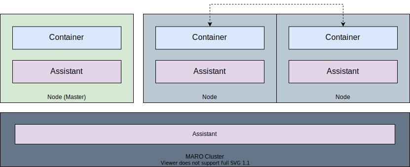

Distributed Orchestration
=========================

MARO provides easy-to-use CLI commands to provision and manage training clusters
on cloud computing service like `Azure <https://azure.microsoft.com/en-us/>`_.
These CLI commands can also be used to schedule the training jobs with the
specified resource requirements. In MARO, all training job related components
are dockerized for easy deployment and resource allocation. It provides a unified
abstraction/interface for different orchestration framework see
(e.g. :ref:`Grass`, :ref:`K8s` ).

Process
-------

The process mode is part of the `MARO CLI`, which uses multi-processes to start the 
training jobs in the localhost environment. To align with :ref:`Grass` and :ref:`K8s`,
the process mode also uses Redis for job management. The process mode tries
to simulate the operation of the real distributed cluster in localhost so that users can smoothly
deploy their code to the distributed cluster. Meanwhile, through the training in the process mode, 
it is a cheaper way to find bugs that will happens during the real distributed training. 
It has the following advantages:

* Behavior is consistent with the real distributed CLI.
* Friendly to operate.
* Lightweight, no other dependencies are required.

In the Process mode:

* All jobs will be started by multi-processes and managed by `MARO Process CLI`.
* Customized settings support, such as Redis, the number of parallel running jobs,
  and agents check interval.
* For each job's start/stop, a ticket will be pushed into job queues. The agents monitor those 
  job queues and start/stop job components.

Check `Localhost Provisioning <../installation/multi_processes_localhost_provisioning.html>`_
to get how to use it.

.. image:: ../images/distributed/orch_process.svg
   :target: ../images/distributed/orch_process.svg
   :alt: Orchestration Process Mode on Local
   :width: 250

.. _grass:

Grass
-----

Grass is an orchestration framework developed by the MARO team. It can be
confidently applied to small/middle size cluster (< 200 nodes). The design goal
of Grass is to speed up the development of distributed algorithm prototypes.
It has the following advantages:

* Fast deployment in a small cluster.
* Fine-grained resource management.
* Lightweight, no complex dependencies required.

Check :ref:`Grass Cluster Provisioning on Azure <grass-azure-cluster-provisioning>` and
:ref:`Grass Cluster Provisioning in On-Premises Environment <grass-on-premises-cluster-provisioning>`
to get how to use it.

Modes
^^^^^

We currently have two modes in Grass, and you can choose whichever you want to create a Grass cluster.

**grass/azure**

* Create a Grass cluster with Azure.
* With a valid Azure subscription, you can create a cluster with one command from ground zero.
* You can easily scale up/down nodes as needed,
  and start/stop nodes to save costs without messing up the current environment.
* Please note that the maximum number of VMs in grass/azure is limited by the
  `available dedicated IP addresses <https://docs.microsoft.com/en-us/azure/virtual-network/virtual-networks-faq#what-address-ranges-can-i-use-in-my-vnets>`_.

**grass/on-premises**

* Create a Grass cluster with machines on hand.
* You can join a machine to the cluster if the machine is in the same private network as the Master.

Components
^^^^^^^^^^
Here's the diagram of a Grass cluster with all the components tied together.

|

Master Components

* redis: A centralized DB for runtime data storage.
* fluentd: A centralized data collector for log collecting.
* samba-server: For file sharing within the whole cluster.
* master-agent: A daemon service for status monitoring and job scheduling.
* master-api-server: A RESTFul server for cluster management.
  The MARO CLI can access this server to control cluster and get cluster information in an encryption session.

Node Components

* samba-client: For file sharing.
* node-agent: A daemon service for tracking the computing resources and container statues of the node.
* node-api-server: An internal RESTFul server for node management.

Communications
^^^^^^^^^^^^^^

Outer Environment to the Master

* The communications from outer environment to the Master is encrypted.
* Grass will use the following paths in the OuterEnv-Master communications:

  * SSH tunnel: For file transfer and script execution.
  * HTTP connection: For connection with master-api-server, use RSA+AES hybrid encryption.

Communications within the Cluster

* The communications within the cluster is not encrypted.
* Therefore, user has the responsibility to make sure all Nodes are connected within a private network and
  restrict external connections in the cluster.

.. _k8s:

K8s
---

MARO also supports Kubernetes (k8s) as an orchestration option.
With this widely adopted framework, you can easily build up your MARO Cluster
with hundreds and thousands of nodes. It has the following advantages:

* Higher durability.
* Better scalability.

We currently support the k8s/aks mode in Kubernetes, and it has the following features:

.. image:: ../images/distributed/orch_k8s.svg
   :target: ../images/distributed/orch_k8s.svg
   :alt: Orchestration K8S Mode in Azure
   :width: 650

|

* The dockerized job component runs in Kubernetes Pod, and each Pod only hosts one component.
* All Kubernetes Pods are registered into the same virtual network using
  `Container Network Interface(CNI) <https://github.com/containernetworking/cni>`_.
* Azure File Service is used for file sharing in all Pods.
* Azure Container Registry is included for image management.

Check :ref:`K8S Cluster Provisioning on Azure <k8s-aks-cluster-provisioning>`
to see how to use it.
