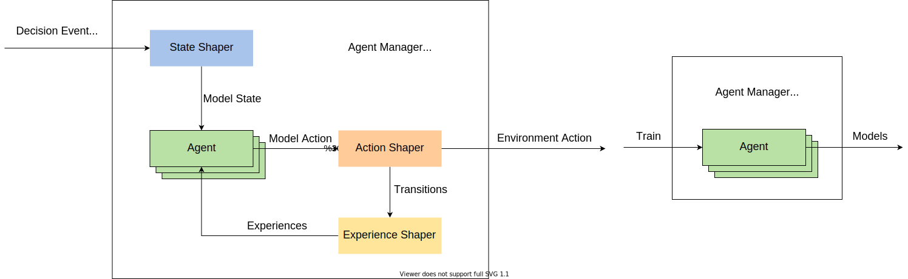
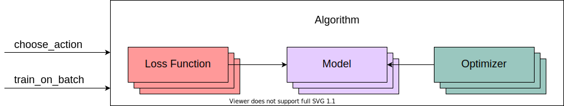

RL Toolkit
==========

MARO provides a full-stack abstraction for reinforcement learning (RL), which
empowers users to easily apply predefined and customized components to different
scenarios in a scalable way. The main abstractions include
`Learner, Actor <#learner-and-actor>`_\ , `Agent Manager <#agent-manager>`_\ ,
`Agent <#agent>`_\ , `Algorithm <#algorithm>`_\ ,
`State Shaper, Action Shaper, Experience Shaper <#shapers>`_\ , etc.

Learner and Actor
-----------------

.. image:: ../images/rl/overview.svg
   :target: ../images/rl/overview.svg
   :alt: RL Overview

* **Learner** is the abstraction of the learnable policy. It is responsible for
  learning a qualified policy to improve the business optimized object.

.. code-block:: python

   # Train function of learner.
   def train(self, total_episodes):
       for current_ep in range(total_episodes):
           models = self._trainable_agents.get_models()
           performance, experiences = self._actor.roll_out(models=models,
                                                           epsilons=self._trainable_agents.explorer.epsilons,
                                                           seed=self._seed)

           self._trainable_agents.store_experiences(experiences)
           self._trainable_agents.train()
           self._trainable_agents.update_epsilon(performance)

* **Actor** is the abstraction of experience collection. It is responsible for
  interacting with the environment and collecting experience. The experiences
  collected during interaction will be used for the training of the learners.

.. code-block:: python

   # Rollout function of actor.
   def roll_out(self, models=None, epsilons=None, seed: int = None):
       self._env.set_seed(seed)

       # Assign epsilon
       if epsilons is not None:
           self._inference_agents.explorer.epsilons = epsilons

       # Load models
       if models is not None:
           self._inference_agents.load_models(models)

       metrics, decision_event, is_done = self._env.step(None)

       while not is_done:
           action = self._inference_agents.choose_action(decision_event, self._env.snapshot_list)
           metrics, decision_event, is_done = self._env.step(action)
           self._inference_agents.on_env_feedback(metrics)

       experiences = self._inference_agents.post_process(self._env.snapshot_list)
       performance = self._env.metrics
       self._env.reset()

       return {'local': performance}, experiences

Agent Manager
-------------

The agent manager provides a unified interactive interface with the environment
for RL agent(s). From the actor's perspective, it isolates the complex dependencies
of the various homogeneous/heterogeneous agents, so that the whole agent manager
will behave just like a single agent. Besides that, the agent manager also plays
the role of an agent assembler. It can assemble different RL agents according to
the actual requirements, such as whether to share the underlying model, whether
to share the experience pool, etc.

.. code-block:: python

   def assemble_agents(self, config):
       # Initialize experience pool instance.
       ...
       # Construct underlying learning model and related RL algorithm.
       ...
       for agent_id in self._agent_id_list:
           # Assemble your agent here, load experience pool, RL algorithms, etc.
           # You can control the experience pool and learning model sharing pattern, based on different assembling strategy.
           self._agent_dict[agent_id] = Agent(...)

Furthermore, to well serve the distributed algorithm (scalable), the agent
manager provides two kinds of working modes, which can be applied in different
distributed components, such as inference mode in actor, training mode in learner.

* In **inference mode**\ , the agent manager is responsible to access and shape
  the environment state for the related agent, convert the model action to an
  executable environment action, and finally generate experiences from the
  interaction trajectory.
* In **training mode**\ , the agent manager will optimize the underlying model of
  the related agent(s), based on the collected experiences from in the inference mode.

Agent
-----

An agent is a combination of (RL) algorithm, experience pool, and a set of
non-algorithm-specific parameters (algorithm-specific parameters are managed by
the algorithm module). Non-algorithm-specific parameters are used to manage
experience storage, sampling strategies, and training strategies. Since all kinds
of scenario-specific stuff will be handled by the agent manager, the agent is
scenario agnostic.

.. image:: ../images/rl/agent.svg
   :target: ../images/rl/agent.svg
   :alt: Agent

.. code-block:: python

   class Agent(object):
       def __init__(self, name: str, algorithm: Algorithm, experience_pool: SimpleStore, params: AgentParameters):
           """
               RL agent class. It's a sandbox for the RL algorithm, scenarios specific details will be excluded out.
               We focus on the abstraction algorithm development here.
               Environment observation and decision events will be converted to a uniformed format before calling in.
               And the output will be converted to an environment executable format before return back to the environment.
               Its key responsibility is optimizing policy based on interaction with the environment.

               Args:
                   name (str): The name of Agent.
                   algorithm: A concrete algorithm instance that inherits from AbstractAlgorithm. This is the centerpiece
                              of the Agent class and is responsible for the most important tasks of an agent: choosing
                              actions and optimizing models.
                   experience_pool (SimpleStore): A data store that stores experiences generated by the experience shaper.
                   params: A collection of hyper-parameters associated with the model training loop.
           """
           ...

Under the management of the agent manager:

* In **inference mode**\ , given the shaped model state as input, the agent will
  output a model action (then the agent manager will shape it into an executable
  environment action). Also, at the end of each episode, the agent will fill the
  shaped experiences into the experience pool.
* In **training mode**\ , the agent will train and update its model with the
  experiences sampled from its experience pool.

Algorithm
---------

The algorithm is the kernel abstraction of the RL formulation for a real-world
problem. The model architecture, loss function, optimizer, and internal model
update strategy are designed and parameterized here. In this module, two
predefined interfaces must be implemented:

* ``choose_action`` is used to make a decision based on a provided model state.
* ``train_on_batch`` is used to trigger training and the policy update from external.

.. code-block:: python

   class Algorithm(object):
       def __init__(self, model_dict: dict, optimizer_opt: Union[dict, tuple], loss_func_dict: dict, hyper_params):
           """
               It's the abstraction of RL algorithm, which provides a uniformed policy interface, such choose_action, train_on_batch.
               We also provide some predefined RL algorithm based on it, such DQN, A2C, etc. User can inherit form it to customized their own algorithms.

               Args:
                   model_dict (dict): underlying models for the algorithm (e.g., for A2C,
                                      model_dict = {"actor": ..., "critic": ...})
                   optimizer_opt (tuple or dict): tuple or dict of tuples of (optimizer_class, optimizer_params) associated
                                                  with the models in model_dict. If it is a tuple, the optimizer to be
                                                  instantiated applies to all trainable parameters from model_dict. If it
                                                  is a dict, the optimizer will be applied to the related model with the same key.
                   loss_func_dict (dict): loss function types associated with the models in model_dict.
                   hyper_params: algorithm-specific hyper-parameter set.
           """
           ...

Shapers
-------

MARO uses shapers to isolate business-related details and the algorithm modelings.
It provides a clean interactive surface for RL agent(s). The followings are the
three usually used shapers in RL formulations:

* **State shaper**\ : Given a decision event, the state shaper will extract relevant
  temporal-spatial information from the environment (snapshot list) for the decision
  agent. The output usually follows a format that can be directly inputted to the
  underlying algorithm.
* **Action shaper**\ : Once the agent outputs a decision action, the agent manager
  will call the action shaper to convert it into an executable environment action.
  Then, the executable environment action will be sent to the environment's ``step``
  function to wake the sleeping environment.
* **Experience shaper**\ : At the end of each episode, the experience shaper will
  convert the agent's interaction trajectory to formatted learnable experiences,
  which usually contain the fields of ``state``\ , ``action``\ , and ``reward``. For the
  storage of experiences, MARO use in-memory KV store. It can not only provide an
  extensible experience interface but also give the full control of constructing
  the algorithm-specific experience to users. As for the reward, since there are
  multiple optimized business metrics in a real-world business scenario, and the
  key performance index varies for different needs, how to calculate a simple
  scalar reward is not reasonable for a fixed pattern. So we left the reward
  definition to the end-user, and we only provide the raw business metrics in MARO.
  You can pass a reward function (e.g., a lambda) that directly calculates a reward
  based on these business metrics, or implement a helper method within the class.
  We recommend the latter one for complicated reward computations that require
  information from the environment trajectory and longer historical information
  (from the environment snapshot list). The actual shaping logic is encapsulated
  in the ``_shape()`` method, which converts the entire transition trajectory to
  experiences. By default, we provide a ``k-step return`` experience shaper for
  general usage, but for better performance, you need to carefully design this part
  according to your scenario and needs.

.. raw:: html

   <!-- At the end of each episode, the experience shaper will
   shape the runtime transitions the agent collected to formatted learnable experiences.
   The runtime transitions record the agent's interaction with the environment and
   contain scenario-specific information (e.g. event information, business metrics)
   that should be isolated from the RL algorithm. Therefore, the experience shaper
   transforms it into *RL-friendly* `experiences` with `state`, `action`, and `reward`, etc. -->

.. raw:: html

   <!-- At the end of each episode, the experience shaper will
   convert the agent's interaction trajectory to formatted learnable experiences.
   The interaction trajectory is constructed by a continuous runtime transitions
   which usually record the agent's interaction with the environment and contain
   extra scenario-specific information (e.g. event information, business metrics).
   A formatted learnable experience usually contains the field of `state`, `action`,
   and `reward`, etc. -->

