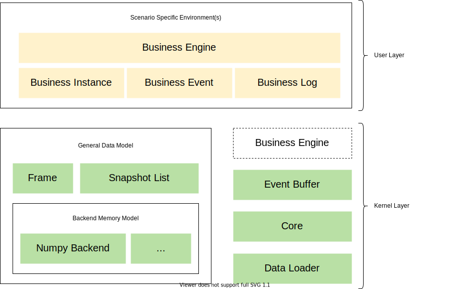
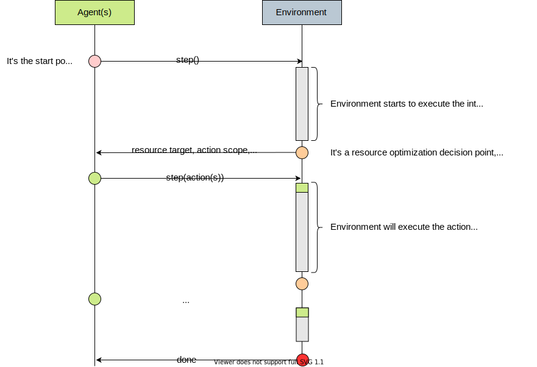

Simulation Toolkit
==================

MARO simulation toolkit provides some predefined environments, such as
`CIM <../scenarios/container_inventory_management.html>`_\ ,
`Citi Bike <../scenarios/citi_bike.html>`_\ , etc.
It also provides some critical and reusable wheels for easily building new scenarios,
with a high-performance guarantee and uniformed programming paradigm, including
`Data Model <./data_model.html>`_\ , `Event Buffer <./event_buffer.html>`_\ , and
`Business Engine <./business_engine.html>`_.

Overview
--------

The key features of MARO simulation toolkit:

* Event-driven, which is friendly to business logging data, and more in line
  with real-world scenarios;
* High execution performance;
* Low development cost for new environments;
* Convenient interface for spatial-temporal data accessing, which is friendly to
  decision-related information querying.

In order to achieve the key features listed above, we choose Python as the
frontend language. In the meantime, to avoid Python
`GIL <https://wiki.python.org/moin/GlobalInterpreterLock>`_ problem and to achieve
the better performance of memory allocation and cache hitting, we choose
`Cython <https://cython.org/>`_ as the backend language. Furthermore, we provide a
declarative `Data Model <./data_model.html>`_ to auto-generate the related data
class wrapper for easy underlying memory access, a
`Snapshot List <./data_model.html#advanced-features>`_ slicing interface to quickly
accessing data from the spatial-temporal and intra-node perspective. Considering
the variously complex scenarios, we decide to build up an event-oriented simulation
system, which is not only suitable to feed existing business logging data but also
convenient to inject random events. New scenarios can be implemented in the
pluggable `Business Engine <./business_engine.html>`_ based on the
`Event Buffer <./event_buffer.html>`_ supporting. The following figure illustrates
the overall architecture of the MARO simulation system.

Environment
-----------

Well-designed topologies are provided in each predefined scenario
(i.e. `CIM <../scenarios/container_inventory_management.html>`_\ ,
`Citi Bike <../scenarios/citi_bike.html>`_\ ).
You can specify both the scenario and the topology when initializing an environment.
To distinguish the complicated problems in the real world, we provide various
topologies with different difficulties for the user to do a step-by-step exploration.
In general, the interface of environments is `Gym <https://gym.openai.com/>`_\ -like,
which use ``step`` to trigger the environment to apply ``actions`` from ``agent(s)``.
Furthermore, we concern more about the decision mode of multi-agent/hierarchical-agent
and how to conveniently query data on the levels of spatial, temporal, and
intra-node (resource holder). The following shows a typical environment interaction
workflow and code snippet.

.. code-block:: python

   from maro.simulator import Env
   from maro.simulator.scenarios.cim.common import Action

   # Initialize an environment with a specific scenario, related topology.
   # In Container Inventory Management, 1 tick means 1 day, here durations=100 means a length of 100 days
   env = Env(scenario="cim", topology="toy.5p_ssddd_l0.0", start_tick=0, durations=100)

   # Query environment summary, which includes business instances, intra-instance attributes, etc.
   print(env.summary)

   for ep in range(2):
       # Gym-like step function.
       metrics, decision_event, is_done = env.step(None)

       while not is_done:
           past_week_ticks = [
               x for x in range(decision_event.tick - 7, decision_event.tick)
           ]
           decision_port_idx = decision_event.port_idx
           intr_port_infos = ["booking", "empty", "shortage"]

           # Query the snapshot list of the environment to get the information of
           # the booking, empty container inventory, shortage of the decision port in the past week.
           past_week_info = env.snapshot_list["ports"][
               past_week_ticks : decision_port_idx : intr_port_infos
           ]

           dummy_action = Action(
               vessel_idx=decision_event.vessel_idx,
               port_idx=decision_event.port_idx,
               quantity=0
           )

           # Drive environment with dummy action (no repositioning).
           metrics, decision_event, is_done = env.step(dummy_action)

       # Query environment business metrics at the end of an episode,
       # it is your optimized object (usually includes multi-target).
       print(f"ep: {ep}, environment metrics: {env.metrics}")
       env.reset()

Critical Components
-------------------

These components are the foundation of the whole MARO simulation system and can
be easily reused to build up various real-world business scenarios with good
performance and uniformed pattern. You can find more details in
`Data Model <./data_model.html>`_\ , `Event Buffer <./event_buffer.html>`_\ , and
`Business Engine <./business_engine.html>`_.
