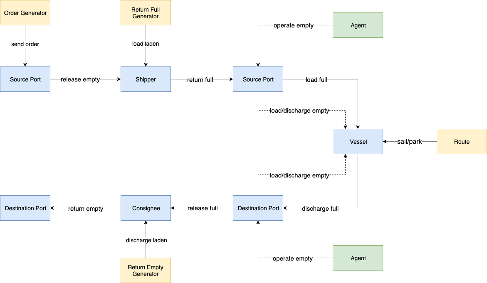

ECR
===

The Empty-Container-Reallocation (ECR) scenario simulates common problems in marine transportation.
Imagine an international market: The goods are packed in containers and shipped by vessels from the exporting country to the importing country.
However, the volume of imported and exported cargo at each port is not always balanced, that means,
some ports will have excess containers that are lacking in other ports.
Therefore, We can use the excess capacity on vessels to transport empty containers to alleviate this imbalance.

In order to simulate a real market, we assume that a certain number of orders are generated every day from some ports to other ports.
Total number of orders generated per day globally can follow a specific time pattern.
These orders are distributed to each export port in a relatively fixed proportion, and each export port will have a relatively fixed number of import ports as customers.

As shown in the figure above, the state machine of each container is defined as following: Once an order generated, an empty container at the export port will be stuffed into the filling queue of shipper.
It will be filled with laden several ticks later and ready to be load.
At the arrival tick of a vessel at the port, the container will be load onto the vessel.
Then the vessel departs the export port and arrives the import port someday in the future.
After discharging, the cargo in the container will be taken out by a consignee, and then it becomes an empty container again.
