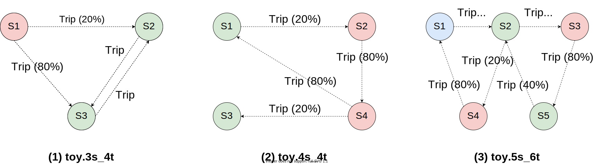
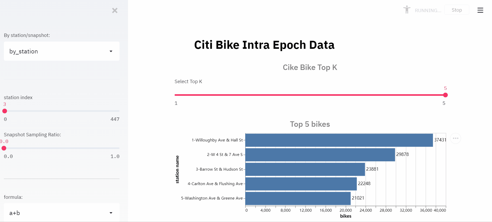
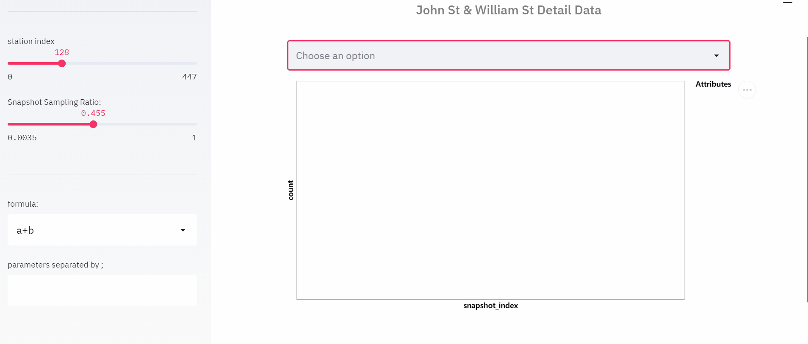
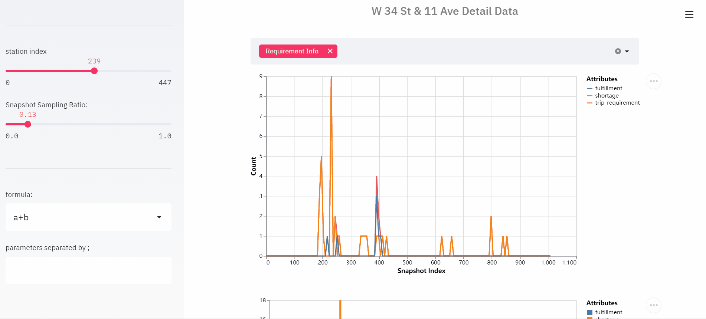
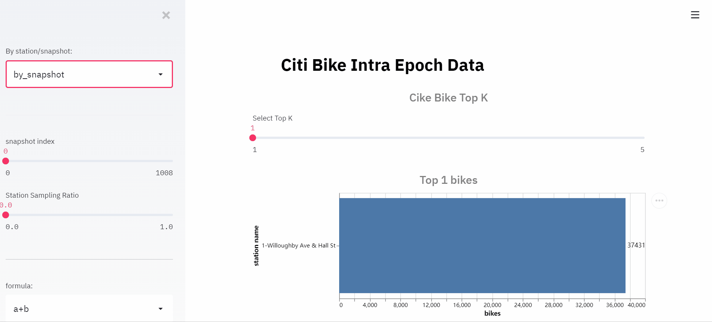

Bike Repositioning (Citi Bike)
==============================

The Citi Bike scenario simulates the bike repositioning problem triggered by the
one-way bike trips based on the public trip data from
`Citi Bike <https://www.citibikenyc.com/>`_.

..

   Citi Bike is New York City’s bike share system, which consists of a fleet of
   bikes that are locked into a network of docking stations throughout the city.
   The bikes can be unlocked from one station and returned to any other station in
   the system, making them ideal for one-way trips. People use bike share to commute
   to work or school, run errands, get to appointments or social engagements, and
   more.

Since the demand for bikes and empty docks is dynamically changed during a day,
and the bike flow between two stations are not equal in a same period, some
stations suffer from severe bike shortages, while some have too much bikes and
too few empty docks. In such a situation, the bike repositioning is essential to
balance the bike's supply and demand. A good bike repositioning can not only meet
the needs in the stations with heavy ride demand but also free the stations that
do not have enough empty docks. Also, in the long run, a good bike repositioning
can improve the bike usability, empower citizens' daily life, and reduce the
carbon emission.

Resource Flow
-------------

In this scenario, the **bike** is the central resource. Two events will trigger
the movement of the bike:

* The first one is the trip requirement, which may cause the bike transfer from
  the source station to the destination station;
* The second one is the repositioning operation. It is used to rebalance the bike
  distribution among stations.

Bike Trip
^^^^^^^^^

In the citi bike scenario in MARO, the trip generation and the corresponding bike
flow is defined as follows:

* Given a fixed time interval, for each specific source-destination station pair,
  a trip requirement will arise according to a predefined distribution or the real
  trip data. It depends on the chosen topology.
* If there are enough available bikes in the source station of the trip requirement,
  the required bike(s) will be unlocked and assigned to this trip. Otherwise, a
  shortage will be recorded in the source station.
* The trip duration is read from the trip log if real trip data is used. Otherwise,
  the duration will be sampled from a specific random distribution.
* At the end of the trip, the bike will be returned to the destination station.
  But if the destination does not have enough available docks, the bike will be
  returned to the nearest station with available docks.

Bike Repositioning
^^^^^^^^^^^^^^^^^^

As for the repositioning operation, the simulator in MARO will regularly check
the remaining bikes in each station and compare it with a predefined low watermark
and high watermark. If the bike inventory is lower than the low watermark, the
station will generate a ``Demand`` event to request the supply of bikes from its
neighboring stations. Similarly, if the bike inventory is higher than the high
watermark, the station will generate a ``Supply`` event to transport excess bikes
to its neighboring stations. The low watermark and the high watermark is specified
in the topology and can be customized based on different requirements.

The target station candidates of the ``Supply`` and ``Demand`` events are selected
by a predefined multi-layer filter in this scenario:

#. The distance between the caller station and the neighboring stations will be
   used to filter and get a specific number of stations;
#. The number of available bikes at each candidate station will be used to further
   filter on the candidate stations. For a ``Supply`` event, the stations with less
   bikes will be kept, while for a ``Demand`` event, the stations with more bikes will
   be kept;
#. The future trip requirement of the target station will be the last filter. For
   a ``Supply`` event, the stations with more future trip requirement will be left in
   the final station candidate set, while the stations with less future trip
   requirement will be left for ``Demand`` event.

The size of the candidate sets in each filter level is specified in the topology
and can be customized based on different requirements.

Once the target station candidate is filtered, the ``action scope`` for each candidate
will also be calculated in the simulator and return to the decision agent together
with some other information in the `DecisionEvent <#decisionevent-in-citi-bike>`_.
For a ``Supply`` event, the bike inventory of the caller station and the number of
available docks of the target station candidates will be attached. On the contrary,
for a ``Demand`` event, the number of available docks of the source station and the
bike inventory of the target station candidates will be attached.

Based on the given target station candidates and the corresponding ``action scope``\ ,
the decision agent of the caller station should decide how many bikes to transfer
to/request from the target station. We call a pair of ``(target station, bike number)``
a repositioning action. After an action taken, the destination station should wait
for a certain period to get the bikes available for trip requirement. The action
`lead time <https://en.wikipedia.org/wiki/Lead_time>`_ is sampled from a predefined
distribution.

Topologies
----------

To provide an exploration road map from easy to difficult, two kinds of topologies
are designed and provided in Citi Bike scenario. Toy topologies provide a super
simplified environment for algorithm debugging, while the real topologies with
real data from Citi Bike historical trips can present the real problem to users.

Toy Topologies
^^^^^^^^^^^^^^

In toy topology, the generation of the trip requirements follows a stable pattern
as introduced above. The detailed trip demand pattern are listed as below. And we
hope that these toy topologies can provide you with some insights about this scenario.

**toy.3s_4t**\ : There are three stations in this topology. Every two minutes,
there will be a trip requirement from S2 to S3 and a trip requirement from S3 to
S2. At the same time, every two minutes, the system will generate trip requirement
from S1 to S3 and from S1 to S2 with a fixed probability (80% and 20%, respectively).
In this topology, the traffic flow between S2 and S3 is always equal, but station
S1 is a super consumer with only bikes flow out. So the best repositioning policy
in this topology is to reposition bikes from S2 and S3 to S1. It requires the
active request action of S1 or the proactive transfer action of S2 and S3.

**toy.4s_4t**\ : There are four stations in this topology. According to the global
trip demand, there are more returned bikes than leaving bikes in station S1 and S3,
while more leaving bikes than returned bikes in station S2 and S4. So the best
repositioning policy in this topology is to reposition the excess bikes from S1
and S3 to S2 and S4. Furthermore, the cooperation between these stations is also
necessary since only a proper allocation can lead to a globally optimal solution.

**toy.5s_6t**\ : There are five stations in this topology. Although trip demand is
more complex than the other two topologies above, we can still find that station
S1 is a self-balancing station, station S2 and S5 have more returned bikes, and
station S3 and S4 have more leaving bikes. Just like in topology toy.4s_4t, the
best repositioning policy is to reposition excess bikes from S2 and S5 to S3 and
S4 coordinately.

Real Topologies
^^^^^^^^^^^^^^^

**ny.YYYYMM**\ : Different from the stable generation model in the toy topologies,
the trip requirement in the topology ny.YYYYMM is generated based on the real
trip data from `Citi Bike <https://www.citibikenyc.com/>`_\ , which includes the
source station, the destination station, and the duration of each trip. Besides,
the total number of available bikes in this kind of topologies is counted from
the real trip data of the specific month. Weighted by the the latest capacity
of each stations, the available bikes are allocated to each station, which
constitutes the initial bike inventory of each station. In this series of
topologies, the definition of the bike flow and the trigger mechanism of
repositioning actions are the same as those in the toy topologies. We provide
this series of topologies to better simulate the actual Citi Bike scenario.

Naive Baseline
^^^^^^^^^^^^^^

Below are the final environment metrics of the method *no repositioning* and
*random repositioning* in different topologies. For each experiment, we setup
the environment and test for a duration of 1 week.

No Repositioning
~~~~~~~~~~~~~~~~

.. list-table::
   :header-rows: 1

   * - Topology
     - Total Requirement
     - Resource Shortage
     - Repositioning Number
   * - toy.3s_4t
     - 15,118
     - 8,233
     - 0
   * - toy.4s_4t
     - 9,976
     - 7,048
     - 0
   * - toy.5s_6t
     - 16,341
     - 9,231
     - 0

|

.. list-table::
   :header-rows: 1

   * - Topology
     - Total Requirement
     - Resource Shortage
     - Repositioning Number
   * - ny.201801
     - 48,089
     - 2,688
     - 0
   * - ny.201802
     - 126,374
     - 8,814
     - 0
   * - ny.201803
     - 138,952
     - 10,942
     - 0
   * - ny.201804
     - 161,443
     - 10,349
     - 0
   * - ny.201805
     - 323,375
     - 29,081
     - 0
   * - ny.201806
     - 305,971
     - 26,412
     - 0
   * - ny.201807
     - 254,715
     - 19,669
     - 0
   * - ny.201808
     - 302,589
     - 26,352
     - 0
   * - ny.201809
     - 313,002
     - 28,472
     - 0
   * - ny.201810
     - 339,268
     - 24,109
     - 0
   * - ny.201811
     - 263,227
     - 21,485
     - 0
   * - ny.201812
     - 209,102
     - 15,876
     - 0

|

.. list-table::
   :header-rows: 1

   * - Topology
     - Total Requirement
     - Resource Shortage
     - Repositioning Number
   * - ny.201901
     - 161,474
     - 10,775
     - 0
   * - ny.201902
     - 187,354
     - 12,593
     - 0
   * - ny.201903
     - 148,371
     - 7,193
     - 0
   * - ny.201904
     - 280,852
     - 16,906
     - 0
   * - ny.201905
     - 287,290
     - 27,213
     - 0
   * - ny.201906
     - 379,415
     - 33,968
     - 0
   * - ny.201907
     - 309,365
     - 21,105
     - 0
   * - ny.201908
     - 371,969
     - 33,703
     - 0
   * - ny.201909
     - 344,847
     - 24,528
     - 0
   * - ny.201910
     - 351,855
     - 29,544
     - 0
   * - ny.201911
     - 324,327
     - 29,489
     - 0
   * - ny.201912
     - 184,015
     - 14,205
     - 0

|

.. list-table::
   :header-rows: 1

   * - Topology
     - Total Requirement
     - Resource Shortage
     - Repositioning Number
   * - ny.202001
     - 169,304
     - 12,449
     - 0
   * - ny.202002
     - 206,105
     - 14,794
     - 0
   * - ny.202003
     - 235,986
     - 15,436
     - 0
   * - ny.202004
     - 91,810
     - 2,348
     - 0
   * - ny.202005
     - 169,412
     - 5,231
     - 0
   * - ny.202006
     - 197,883
     - 7,608
     - 0

Random Repositioning
~~~~~~~~~~~~~~~~~~~~

.. list-table::
   :header-rows: 1

   * - Topology
     - Total Requirement
     - Resource Shortage
     - Repositioning Number
   * - toy.3s_4t
     - 15,154
     - 8,422 :math:`\pm` 11
     - 449 :math:`\pm`    22
   * - toy.4s_4t
     - 10,186
     - 4,371 :math:`\pm`    72
     - 3,392 :math:`\pm`    83
   * - toy.5s_6t
     - 16,171
     - 7,513 :math:`\pm`    40
     - 3,242 :math:`\pm`    71

|

.. list-table::
   :header-rows: 1

   * - Topology
     - Total Requirement
     - Resource Shortage
     - Repositioning Number
   * - ny.201801
     - 48,089
     - 6,693 :math:`\pm`   138
     - 445,996 :math:`\pm`  6,756
   * - ny.201802
     - 126,374
     - 21,418 :math:`\pm`   120
     - 446,564 :math:`\pm`  3,505
   * - ny.201803
     - 138,952
     - 22,121 :math:`\pm`   272
     - 448,259 :math:`\pm`  1,831
   * - ny.201804
     - 161,443
     - 22,201 :math:`\pm`   194
     - 453,705 :math:`\pm`  3,697
   * - ny.201805
     - 323,375
     - 54,365 :math:`\pm`   538
     - 470,771 :math:`\pm`  5,337
   * - ny.201806
     - 305,971
     - 49,876 :math:`\pm` 1,091
     - 481,443 :math:`\pm`  6,981
   * - ny.201807
     - 254,715
     - 46,199 :math:`\pm`   204
     - 483,788 :math:`\pm`    982
   * - ny.201808
     - 302,589
     - 53,679 :math:`\pm`   433
     - 485,137 :math:`\pm`  2,557
   * - ny.201809
     - 313,002
     - 61,432 :math:`\pm`    75
     - 474,851 :math:`\pm`  2,908
   * - ny.201810
     - 339,268
     - 64,269 :math:`\pm`   600
     - 461,928 :math:`\pm`  1,018
   * - ny.201811
     - 263,227
     - 40,440 :math:`\pm`   239
     - 467,050 :math:`\pm`  6,595
   * - ny.201812
     - 209,102
     - 26,067 :math:`\pm`   234
     - 457,173 :math:`\pm`  6,444

|

.. list-table::
   :header-rows: 1

   * - Topology
     - Total Requirement
     - Resource Shortage
     - Repositioning Number
   * - ny.201901
     - 161,474
     - 19,295 :math:`\pm`   155
     - 444,445 :math:`\pm`  2,287
   * - ny.201902
     - 187,354
     - 23,875 :math:`\pm`   282
     - 456,888 :math:`\pm`    362
   * - ny.201903
     - 148,371
     - 12,451 :math:`\pm`   312
     - 409,226 :math:`\pm`  5,392
   * - ny.201904
     - 280,852
     - 29,591 :math:`\pm`   170
     - 464,671 :math:`\pm`  6,148
   * - ny.201905
     - 287,290
     - 44,199 :math:`\pm`   542
     - 485,077 :math:`\pm`  6,140
   * - ny.201906
     - 379,415
     - 51,396 :math:`\pm`   256
     - 503,503 :math:`\pm`  4,742
   * - ny.201907
     - 309,365
     - 33,861 :math:`\pm`   643
     - 500,443 :math:`\pm`  4,314
   * - ny.201908
     - 371,969
     - 51,319 :math:`\pm`   417
     - 516,684 :math:`\pm`  1,400
   * - ny.201909
     - 344,847
     - 34,532 :math:`\pm`   466
     - 476,965 :math:`\pm`  3,932
   * - ny.201910
     - 351,855
     - 37,828 :math:`\pm`   502
     - 496,135 :math:`\pm`  4,167
   * - ny.201911
     - 324,327
     - 34,745 :math:`\pm`   427
     - 484,599 :math:`\pm`  8,771
   * - ny.201912
     - 184,015
     - 20,119 :math:`\pm`   110
     - 437,311 :math:`\pm`  5,936

|

.. list-table::
   :header-rows: 1

   * - Topology
     - Total Requirement
     - Resource Shortage
     - Repositioning Number
   * - ny.202001
     - 169,304
     - 17,152 :math:`\pm`   218
     - 476,821 :math:`\pm`  1,052
   * - ny.202002
     - 206,105
     - 24,223 :math:`\pm`   209
     - 480,012 :math:`\pm`  1,547
   * - ny.202003
     - 235,986
     - 23,749 :math:`\pm`   654
     - 458,536 :math:`\pm`  1,457
   * - ny.202004
     - 91,810
     - 3,349 :math:`\pm`    48
     - 326,817 :math:`\pm`  3.131
   * - ny.202005
     - 169,412
     - 10,177 :math:`\pm`   216
     - 378,038 :math:`\pm`  2,429
   * - ny.202006
     - 197,883
     - 11,741 :math:`\pm`   170
     - 349,932 :math:`\pm`  4,375

Quick Start
-----------

Data Preparation
^^^^^^^^^^^^^^^^

To start the simulation of Citi Bike scenario, users have two options for the data preparation:

* If the topology data is not generated in advance, the system will automatically download and
  process the relevant data when the environment is created. The data will be stored in a
  temporary folder and be automatically deleted after the experiment.

* Before creating the environment, users can also manually download and generate relevant data.
  This approach will save you a lot of time if you need to conduct several experiments on the
  same topology. Therefore, we encourage you to generate the relevant data manually first.

The following is the introduction to related commands:

Environment List Command
~~~~~~~~~~~~~~~~~~~~~~~~

The data environment ``list`` command is used to list the environments that need the
data files generated before the simulation.

.. code-block:: sh

   maro env data list

   scenario: citi_bike, topology: ny.201801
   scenario: citi_bike, topology: ny.201802
   scenario: citi_bike, topology: ny.201803
   scenario: citi_bike, topology: ny.201804
   scenario: citi_bike, topology: ny.201805
   scenario: citi_bike, topology: ny.201806
   ...

Generate Command
~~~~~~~~~~~~~~~~

The data ``generate`` command is used to automatically download and build the specified
predefined scenario and topology data files for the simulation. Currently, there
are three arguments for the data ``generate`` command:

* ``-s``\ : required, used to specify the predefined scenario. Valid scenarios are
  listed in the result of `environment list command <#environment-list-command>`_.
* ``-t``\ : required, used to specify the predefined topology. Valid topologies are
  listed in the result of `environment list command <#environment-list-command>`_.
* ``-f``\ : optional, if set, to force to re-download and re-generate the data files
  and overwrite the already existing ones.

.. code-block:: sh

   maro env data generate -s citi_bike -t ny.201802

   The data files for citi_bike-ny201802 will then be downloaded and deployed to ~/.maro/data/citibike/_build/ny201802.

For the example above, the directory structure should be like:

.. code-block:: sh

   |-- ~/.maro
       |-- data
       |   |-- citi_bike
       |       |-- .build          # bin data file
       |           |-- [topology]  # topology
       |       |-- .source
       |           |-- .download   # original data file
       |           |-- .clean      # cleaned data file
       |-- temp                    # download temp file

Build Command
~~~~~~~~~~~~~

The data ``build`` command is used to build the CSV data files to binary data
files that the simulator needs. Currently, there are three arguments for the data
``build`` command:

* ``--meta``\ : required, used to specify the path of the meta file. The source
  columns that to be converted and the data type of each columns should be
  specified in the meta file.
* ``--file``\ : required, used to specify the path of the source CSV data file(s).
  If multiple source CSV data files are needed, you can list all the full paths of
  the source files in a specific file and use a ``@`` symbol to specify it.
* ``--output``\ : required, used to specify the path of the target binary file.

.. code-block:: sh

   maro data build --meta ~/.maro/data/citibike/meta/trips.yml --file ~/.maro/data/citibike/source/_clean/ny201801/trip.csv --output ~/.maro/data/citibike/_build/ny201801/trip.bin

Environment Interface
^^^^^^^^^^^^^^^^^^^^^

Before starting interaction with the environment, we need to know the definition
of ``DecisionEvent`` and ``Action`` in Citi Bike scenario first. Besides, you can query
the environment `snapshot list <../key_components/data_model.html#advanced-features>`_
to get more detailed information for the decision making.

DecisionEvent
~~~~~~~~~~~~~

Once the environment need the agent's response to reposition bikes, it will
throw an ``DecisionEvent``. In the scenario of Citi Bike, the information of each
``DecisionEvent`` is listed as below:

* **station_idx** (int): The id of the station/agent that needs to respond to the
  environment.
* **tick** (int): The corresponding tick.
* **frame_index** (int): The corresponding frame index, that is the index of the
  corresponding snapshot in the environment snapshot list.
* **type** (DecisionType): The decision type of this decision event. In Citi Bike
  scenario, there are 2 types:

  * ``Supply`` indicates there is too many bikes in the corresponding station, so
    it is better to reposition some of them to other stations.
  * ``Demand`` indicates there is no enough bikes in the corresponding station, so
    it is better to reposition bikes from other stations.

* **action_scope** (dict): A dictionary that maintains the information for
  calculating the valid action scope:

  * The key of these item indicate the station/agent ids.
  * The meaning of the value differs for different decision type:

    * If the decision type is ``Supply``\ , the value of the station itself means its
      bike inventory at that moment, while the value of other target stations means
      the number of their empty docks.
    * If the decision type is ``Demand``\ , the value of the station itself means the
      number of its empty docks, while the value of other target stations means
      their bike inventory.

Action
~~~~~~

Once we get a ``DecisionEvent`` from the environment, we should respond with an
``Action``. Valid ``Action`` could be:

* ``None``\ , which means do nothing.
* A valid ``Action`` instance, including:

  * **from_station_idx** (int): The id of the source station of the bike
    transportation.
  * **to_station_idx** (int): The id of the destination station of the bike
    transportation.
  * **number** (int): The quantity of the bike transportation.

Example
^^^^^^^

Here we will show you a simple example of interaction with the environment in
random mode, we hope this could help you learn how to use the environment interfaces:

.. code-block:: python

   from maro.simulator import Env
   from maro.simulator.scenarios.citi_bike.common import Action, DecisionEvent, DecisionType

   import random

   # Initialize an environment of Citi Bike scenario, with a specific topology.
   # In CitiBike, 1 tick means 1 minute, durations=1440 here indicates a length of 1 day.
   # In CitiBike, one snapshot will be maintained every snapshot_resolution ticks,
   # snapshot_resolution=30 here indicates 1 snapshot per 30 minutes.
   env = Env(scenario="citi_bike", topology="toy.3s_4t", start_tick=0, durations=1440, snapshot_resolution=30)

   # Query for the environment summary, the business instances and intra-instance attributes
   # will be listed in the output for your reference.
   print(env.summary)

   metrics: object = None
   decision_event: DecisionEvent = None
   is_done: bool = False
   action: Action = None

   num_episode = 2
   for ep in range(num_episode):
       # Gym-like step function.
       metrics, decision_event, is_done = env.step(None)

       while not is_done:
           past_2hour_frames = [
               x for x in range(decision_event.frame_index - 4, decision_event.frame_index)
           ]
           decision_station_idx = decision_event.station_idx
           intr_station_infos = ["trip_requirement", "bikes", "shortage"]

           # Query the snapshot list of this environment to get the information of
           # the trip requirements, bikes, shortage of the decision station in the past 2 hours.
           past_2hour_info = env.snapshot_list["stations"][
               past_2hour_frames : decision_station_idx : intr_station_infos
           ]

           if decision_event.type == DecisionType.Supply:
               # Supply: the value of the station itself means the bike inventory.
               self_bike_inventory = decision_event.action_scope[decision_event.station_idx]
               # Supply: the value of other stations means the quantity of empty docks.
               target_idx_dock_tuple_list = [
                   (k, v) for k, v in decision_event.action_scope.items() if k != decision_event.station_idx
               ]
               # Randomly choose a target station weighted by the quantity of empty docks.
               target_idx, target_dock = random.choices(
                   target_idx_dock_tuple_list,
                   weights=[item[1] for item in target_idx_dock_tuple_list],
                   k=1
               )[0]
               # Generate the corresponding random Action.
               action = Action(
                   from_station_idx=decision_event.station_idx,
                   to_station_idx=target_idx,
                   number=random.randint(0, min(self_bike_inventory, target_dock))
               )

           elif decision_event.type == DecisionType.Demand:
               # Demand: the value of the station itself means the quantity of empty docks.
               self_available_dock = decision_event.action_scope[decision_event.station_idx]
               # Demand: the value of other stations means their bike inventory.
               target_idx_inventory_tuple_list = [
                   (k, v) for k, v in decision_event.action_scope.items() if k != decision_event.station_idx
               ]
               # Randomly choose a target station weighted by the bike inventory.
               target_idx, target_inventory = random.choices(
                   target_idx_inventory_tuple_list,
                   weights=[item[1] for item in target_idx_inventory_tuple_list],
                   k=1
               )[0]
               # Generate the corresponding random Action.
               action = Action(
                   from_station_idx=target_idx,
                   to_station_idx=decision_event.station_idx,
                   number=random.randint(0, min(self_available_dock, target_inventory))
               )

           else:
               action = None

           # Drive the environment with the random action.
           metrics, decision_event, is_done = env.step(action)

       # Query for the environment business metrics at the end of each episode,
       # it is usually users' optimized object (usually includes multi-target).
       print(f"ep: {ep}, environment metrics: {env.metrics}")
       env.reset()

Jump to `this notebook <https://github.com/microsoft/maro/tree/master/notebooks/bike_repositioning/interact_with_environment.ipynb>`_
for a quick experience.

Visualization
-------------

The resource holder in this scenario is the bike station.
The number of epoches is varied based on selected strategy.
Currently, we generate result with Greedy Policy.
Only one epoch is included in result. Thus, inter-epoch view
would not be displayed.

Inter-epoch view
^^^^^^^^^^^^^^^^

This part display cross-epoch summary information. User could select
the Start Epoch and End Epoch, as well as Epoch Sampling Ratio. Since 
there is only one epoch, this part is hidden.

Intra-epoch view
^^^^^^^^^^^^^^^^

Intra-view is divided into two dimensions according to time and space.

If user choose to view information by station, it means that attributes
of all snapshots within a selected station would be displayed. By
changing the option "station index", user could view data of different
stations. By changing the option "Snapshot Sampling Ratio", Users can
freely adjust the sampling rate. For example, if there are 100 snapshots
and user selected 0.3 as sampling ratio, 30 snapshots data would be
selected to render the chart.

To be specific, the line chart could be customized with operations in
the following example.

By choosing the item "All", all of attributes would be displayed. In
addition, according to the data characteristics of each scenario, users
will be provided with the option to quickly select a set of data.

e.g. In this scenario, item "Requirement Info" refers to
[trip\_requirement, shortage, fulfillment].

Moreover, to improve the flexibility of visualizing data, user could use
pre-defined formula and selected attributes to generate new attributes.
Generated attributes would be treated in the same way as original
attributes.

If user choose to view information by snapshot, it means attributes of
all stations within a selected snapshot would be displayed. By changing
option "snapshot index", user could view data of different snapshot. By
changing option "Station Sampling Ratio", user could change the number
of sampled data.

Particularly, if user want to check the name of a specific station,
just hovering on the according bar.

