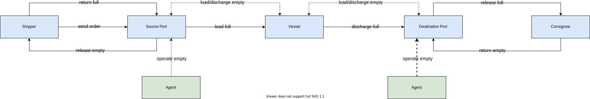
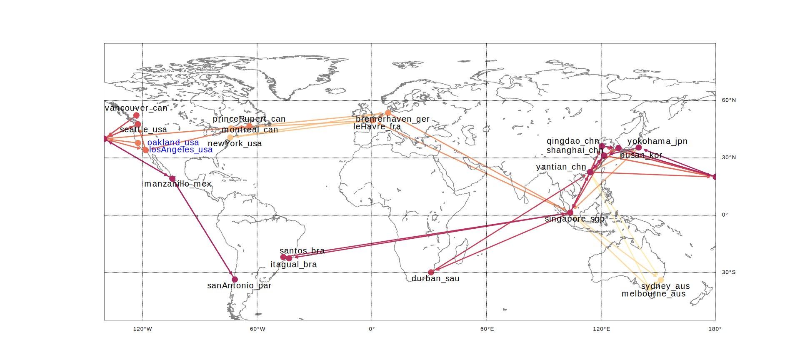

# Empty Container Repositioning (ECR)

The Empty Container Repositioning (ECR) scenario simulates a common problem of
container shipping in marine transportation. Imagine an international market:
The goods are packed in containers and shipped by vessels from the exporting
country to the importing country. As a result of the imbalanced global trade,
the volume of available containers in different ports may not match their needs.
In other words, some ports will have excess containers while some ports may be
in short. Therefore, We can use the excess capacity on vessels to reposition
empty containers to alleviate this imbalance.

## Resource Flow

In this scenario, the **container** is the central resource. Two events will
trigger the movement of the container:

- The first one is the order, which will lead to the transportation of goods from
the source port to the destination port.
- The second one is the repositioning operation. It is used to rebalance the
container distribution worldwide.



### Order

To simulate a real market, we assume that there will be a certain number of orders
from some ports to other ports every day. And the total order number of each day
is generated according to a predefined distribution. These orders are then allocated
to each export port in a relatively fixed proportion, and each export port will
have a relatively fixed number of import ports as customers. The order distribution
and the proportion of order allocation are specified in the topology and can be
customized based on different requirements.

An order will trigger a life cycle of a container, as shown in the figure above,
a life cycle is defined as follows:

- Once an order is generated, an empty container of the corresponding export port
(source port) will be released to the shipper.
- The shipper will fill the container with cargo which turns it into a laden and
then return it to the port after a few days.
- Loading occurs when the vessel arrives at this port.
- After several days of sailing, the vessel will finally arrive at the corresponding
import port (destination port) where the discharging of the laden happens.
- Then the laden will be released to the consignee, and the consignee will take
out the cargo in it, which turns it into an empty container again.
- Finally, the consignee returns it as an available container for the import port
in a few days.

### Container Repositioning

As mentioned above, to rebalance the container distribution, the agent in each
port will decide how to reposition the empty containers every time a vessel
arrives at the port. The decision consists of two parts:

- Whether to take a `discharge` operation or a `load` operation;
- The number of containers to discharge/load.

The export-oriented ports (e.g. the ports in China) show a clearly high demand
feature, and usually require additional supply of empty containers. These ports
will tend to discharge empty containers from the vessel if feasible. While the
import-oriented ports have a significant surplus feature, that usually receive
many empty container from the consignee. So the imported-oriented ports will tend
to load the surplus empty containers into the vessel if there is free capacity.

The specific quantity to operate for a `discharge` action is limited by the
remaining space in the port and the total number of empty containers in the vessel.
Similarly, a `load` action is limited by the remaining space in the vessel and
the total number of empty containers in the port. Of course, a good decision will
not only consider the self future supply and demand situation, but also the needs
and situation of the upstream and downstream ports.

## Topologies

To provide an exploration road map from easy to difficult, two kinds of topologies
are designed and provided in ECR scenario. Toy topologies provide simplified
environments for algorithm debugging and will show some typical relationships
between ports to users. We hope these will provide users with some insights to
know more and deeper about this scenario. While the global topologies are based
on the real-world data, and are bigger and more complicated to present the real
problem.

### Toy Topologies


*(In these topologies, the solid lines indicate the service route (voyage) among
ports, while the dashed lines indicate the container flow triggered by orders.)*

**toy.4p_ssdd_l0.D**: There are four ports in this topology. According to the orders,
D1 and D2 are simple demanders (the port requiring additional empty containers)
while S2 is a simple supplier (the port with surplus empty containers). Although
S1 is a simple destination port, it's at the intersection of two service routes,
which makes it a special port in this topology. To achieve the global optimum,
S1 must learn to distinguish the service routes and take service route specific
repositioning operations.

**toy.5p_ssddd_l0.D**: There are five ports in this topology. According to the orders,
D1 and D2 are simple demanders while S1 and S2 are simple suppliers. As a port
in the intersection of service routes, although the supply and demand of port T1
can reach a state of self-balancing, it still plays an important role for the
global optimum. The best repositioning policy for port T1 is to transfer the
surplus empty containers from the left service route to the right one. Also, the
port D1 and D2 should learn to discharge only the quantity they need and leave the
surplus ones to other ports.

**toy.6p_sssbdd_l0.D**: There are six ports in this topology. Similar to toy.5p_ssddd,
in this topology, there are simple demanders D1 and D2, simple suppliers S1 and
S2, and self-balancing ports T1 and T2. More difficult than in toy.5p_ssddd,
more transfers should be taken to reposition the surplus empty containers from
the left most service route to the right most one, which means a multi-steps
solution that involving more ports is required.

### Global Topologies

**global_trade.22p_l0.D**: This is a topology designed based on the real-world data.
The order generation model in this topology is built based on the trade data from
[WTO](https://data.wto.org/). According to the query results in WTO from January
2019 to October 2019, The ports with large trade volume are selected, and the
proportion of each port as the source of orders is directly proportional to the
export volume of the country it belongs to, while the proportion as the destination
is proportional to the import volume. While the service routes among the selected
ports in this topology are following the service routes provided by
[OOCL](https://www.oocl.com/eng/ourservices/serviceroutes/Pages/default.aspx).
In this scenario, there are much more ports, much more service routes. And most
ports no longer have a simple supply/demand feature. The cooperation among ports
is much more complex and it is difficult to find an efficient repositioning policy
manually.



*(To make it clearer, the figure above only shows the service routes among ports.)*

## Quick Start

### Data Preparation

To start a simulation in ECR scenario, no extra data processing is needed. You
can just specify the scenario and the topology when initialize an environment and
enjoy your exploration in this scenario.

### Environment Interface

Before starting interaction with the environment, we need to know the definition
of `DecisionEvent` and `Action` in ECR scenario first. Besides, you can query the
environment [snapshot list](../key_components/data_model.html#advanced-features)
to get more detailed information for the decision making.

#### DecisionEvent

Once the environment need the agent's response to promote the simulation, it will
throw an `DecisionEvent`. In the scenario of ECR, the information of each
`DecisionEvent` is listed as below:

- **tick** (int): The corresponding tick.
- **port_idx** (int): The id of the port/agent that needs to respond to the
environment.
- **vessel_idx** (int): The id of the vessel/operation object of the port/agent.
- **action_scope** (ActionScope): ActionScope has two attributes:
  - `load` indicates the maximum quantity that can be loaded from the port the
  vessel.
  - `discharge` indicates the maximum quantity that can be discharged from the
  vessel to the port.
- **early_discharge** (int): When the available capacity in the vessel is not
enough to load the ladens, some of the empty containers in the vessel will be
early discharged to free the space. The quantity of empty containers that have
been early discharged due to the laden loading is recorded in this field.

#### Action

Once we get a `DecisionEvent` from the environment, we should respond with an
`Action`. Valid `Action` could be:

- `None`, which means do nothing.
- A valid `Action` instance, including:
  - **vessel_idx** (int): The id of the vessel/operation object of the port/agent.
  - **port_idx** (int): The id of the port/agent that take this action.
  - **quantity** (int): The sign of this value denotes different meanings:
    - Positive quantity means discharging empty containers from vessel to port.
    - Negative quantity means loading empty containers from port to vessel.

### Example

Here we will show you a simple example of interaction with the environment in
random mode, we hope this could help you learn how to use the environment interfaces:

```python
from maro.simulator import Env
from maro.simulator.scenarios.ecr.common import Action, DecisionEvent

import random

# Initialize an environment of ECR scenario, with a specific topology.
# In ECR, 1 tick means 1 day, durations=100 here indicates a length of 100 days.
env = Env(scenario="ecr", topology="toy.5p_ssddd_l0.0", start_tick=0, durations=100)

# Query for the environment summary, the business instances and intra-instance attributes
# will be listed in the output for your reference.
print(env.summary)

metrics: object = None
decision_event: DecisionEvent = None
is_done: bool = False
action: Action = None

num_episode = 2
for ep in range(num_episode):
    # Gym-like step function.
    metrics, decision_event, is_done = env.step(None)

    while not is_done:
        past_week_ticks = [
            x for x in range(decision_event.tick - 7, decision_event.tick)
        ]
        decision_port_idx = decision_event.port_idx
        intr_port_infos = ["booking", "empty", "shortage"]

        # Query the snapshot list of this environment to get the information of
        # the booking, empty, shortage of the decision port in the past week.
        past_week_info = env.snapshot_list["ports"][
            past_week_ticks : decision_port_idx : intr_port_infos
        ]

        # Generate a random Action according to the action_scope in DecisionEvent.
        random_quantity = random.randint(
            -decision_event.action_scope.load,
            decision_event.action_scope.discharge
        )
        action = Action(
            vessel_idx=decision_event.vessel_idx,
            port_idx=decision_event.port_idx,
            quantity=random_quantity
        )

        # Drive the environment with the random action.
        metrics, decision_event, is_done = env.step(action)

    # Query for the environment business metrics at the end of each episode,
    # it is usually users' optimized object in ECR scenario (usually includes multi-target).
    print(f"ep: {ep}, environment metrics: {env.metrics}")
    env.reset()
```

Jump to [this notebook](https://github.com/microsoft/maro/blob/master/notebooks/empty_container_repositioning/interact_with_simulator.ipynb)
for a quick experience.

<!--
### Naive Baseline

Below are the final environment metrics of the method *no repositioning* and
*random repositioning* in different topologies. For each experiment, we setup
the environment and test for a duration of 1120 ticks (days).

#### No Repositioning

| Topology         | Total Requirement | Resource Shortage | Repositioning Cost|
| :--------------: | :---------------: | :---------------: | :---------------: |
| toy.4p_ssdd_l0.0 |       +/-         |       +/-         |       +/-         |
| toy.4p_ssdd_l0.1 |       +/-         |       +/-         |       +/-         |
| toy.4p_ssdd_l0.2 |       +/-         |       +/-         |       +/-         |
| toy.4p_ssdd_l0.3 |       +/-         |       +/-         |       +/-         |
| toy.4p_ssdd_l0.4 |       +/-         |       +/-         |       +/-         |
| toy.4p_ssdd_l0.5 |       +/-         |       +/-         |       +/-         |
| toy.4p_ssdd_l0.6 |       +/-         |       +/-         |       +/-         |
| toy.4p_ssdd_l0.7 |       +/-         |       +/-         |       +/-         |
| toy.4p_ssdd_l0.8 |       +/-         |       +/-         |       +/-         |

| Topology          | Total Requirement | Resource Shortage | Repositioning Cost|
| :---------------: | :---------------: | :---------------: | :---------------: |
| toy.5p_ssddd_l0.0 |       +/-         |       +/-         |       +/-         |
| toy.5p_ssddd_l0.1 |       +/-         |       +/-         |       +/-         |
| toy.5p_ssddd_l0.2 |       +/-         |       +/-         |       +/-         |
| toy.5p_ssddd_l0.3 |       +/-         |       +/-         |       +/-         |
| toy.5p_ssddd_l0.4 |       +/-         |       +/-         |       +/-         |
| toy.5p_ssddd_l0.5 |       +/-         |       +/-         |       +/-         |
| toy.5p_ssddd_l0.6 |       +/-         |       +/-         |       +/-         |
| toy.5p_ssddd_l0.7 |       +/-         |       +/-         |       +/-         |
| toy.5p_ssddd_l0.8 |       +/-         |       +/-         |       +/-         |

| Topology           | Total Requirement | Resource Shortage | Repositioning Cost|
| :----------------: | :---------------: | :---------------: | :---------------: |
| toy.6p_sssbdd_l0.0 |       +/-         |       +/-         |       +/-         |
| toy.6p_sssbdd_l0.1 |       +/-         |       +/-         |       +/-         |
| toy.6p_sssbdd_l0.2 |       +/-         |       +/-         |       +/-         |
| toy.6p_sssbdd_l0.3 |       +/-         |       +/-         |       +/-         |
| toy.6p_sssbdd_l0.4 |       +/-         |       +/-         |       +/-         |
| toy.6p_sssbdd_l0.5 |       +/-         |       +/-         |       +/-         |
| toy.6p_sssbdd_l0.6 |       +/-         |       +/-         |       +/-         |
| toy.6p_sssbdd_l0.7 |       +/-         |       +/-         |       +/-         |
| toy.6p_sssbdd_l0.8 |       +/-         |       +/-         |       +/-         |

| Topology              | Total Requirement | Resource Shortage | Repositioning Cost|
| :-------------------: | :---------------: | :---------------: | :---------------: |
| global_trade.22p_l0.0 |       +/-         |       +/-         |       +/-         |
| global_trade.22p_l0.1 |       +/-         |       +/-         |       +/-         |
| global_trade.22p_l0.2 |       +/-         |       +/-         |       +/-         |
| global_trade.22p_l0.3 |       +/-         |       +/-         |       +/-         |
| global_trade.22p_l0.4 |       +/-         |       +/-         |       +/-         |
| global_trade.22p_l0.5 |       +/-         |       +/-         |       +/-         |
| global_trade.22p_l0.6 |       +/-         |       +/-         |       +/-         |
| global_trade.22p_l0.7 |       +/-         |       +/-         |       +/-         |
| global_trade.22p_l0.8 |       +/-         |       +/-         |       +/-         |

#### Random Repositioning

| Topology         | Total Requirement | Resource Shortage | Repositioning Cost|
| :--------------: | :---------------: | :---------------: | :---------------: |
| toy.4p_ssdd_l0.0 |       +/-         |       +/-         |       +/-         |
| toy.4p_ssdd_l0.1 |       +/-         |       +/-         |       +/-         |
| toy.4p_ssdd_l0.2 |       +/-         |       +/-         |       +/-         |
| toy.4p_ssdd_l0.3 |       +/-         |       +/-         |       +/-         |
| toy.4p_ssdd_l0.4 |       +/-         |       +/-         |       +/-         |
| toy.4p_ssdd_l0.5 |       +/-         |       +/-         |       +/-         |
| toy.4p_ssdd_l0.6 |       +/-         |       +/-         |       +/-         |
| toy.4p_ssdd_l0.7 |       +/-         |       +/-         |       +/-         |
| toy.4p_ssdd_l0.8 |       +/-         |       +/-         |       +/-         |

| Topology          | Total Requirement | Resource Shortage | Repositioning Cost|
| :---------------: | :---------------: | :---------------: | :---------------: |
| toy.5p_ssddd_l0.0 |       +/-         |       +/-         |       +/-         |
| toy.5p_ssddd_l0.1 |       +/-         |       +/-         |       +/-         |
| toy.5p_ssddd_l0.2 |       +/-         |       +/-         |       +/-         |
| toy.5p_ssddd_l0.3 |       +/-         |       +/-         |       +/-         |
| toy.5p_ssddd_l0.4 |       +/-         |       +/-         |       +/-         |
| toy.5p_ssddd_l0.5 |       +/-         |       +/-         |       +/-         |
| toy.5p_ssddd_l0.6 |       +/-         |       +/-         |       +/-         |
| toy.5p_ssddd_l0.7 |       +/-         |       +/-         |       +/-         |
| toy.5p_ssddd_l0.8 |       +/-         |       +/-         |       +/-         |

| Topology           | Total Requirement | Resource Shortage | Repositioning Cost|
| :----------------: | :---------------: | :---------------: | :---------------: |
| toy.6p_sssbdd_l0.0 |       +/-         |       +/-         |       +/-         |
| toy.6p_sssbdd_l0.1 |       +/-         |       +/-         |       +/-         |
| toy.6p_sssbdd_l0.2 |       +/-         |       +/-         |       +/-         |
| toy.6p_sssbdd_l0.3 |       +/-         |       +/-         |       +/-         |
| toy.6p_sssbdd_l0.4 |       +/-         |       +/-         |       +/-         |
| toy.6p_sssbdd_l0.5 |       +/-         |       +/-         |       +/-         |
| toy.6p_sssbdd_l0.6 |       +/-         |       +/-         |       +/-         |
| toy.6p_sssbdd_l0.7 |       +/-         |       +/-         |       +/-         |
| toy.6p_sssbdd_l0.8 |       +/-         |       +/-         |       +/-         |

| Topology              | Total Requirement | Resource Shortage | Repositioning Cost|
| :-------------------: | :---------------: | :---------------: | :---------------: |
| global_trade.22p_l0.0 |       +/-         |       +/-         |       +/-         |
| global_trade.22p_l0.1 |       +/-         |       +/-         |       +/-         |
| global_trade.22p_l0.2 |       +/-         |       +/-         |       +/-         |
| global_trade.22p_l0.3 |       +/-         |       +/-         |       +/-         |
| global_trade.22p_l0.4 |       +/-         |       +/-         |       +/-         |
| global_trade.22p_l0.5 |       +/-         |       +/-         |       +/-         |
| global_trade.22p_l0.6 |       +/-         |       +/-         |       +/-         |
| global_trade.22p_l0.7 |       +/-         |       +/-         |       +/-         |
| global_trade.22p_l0.8 |       +/-         |       +/-         |       +/-         |
-->
