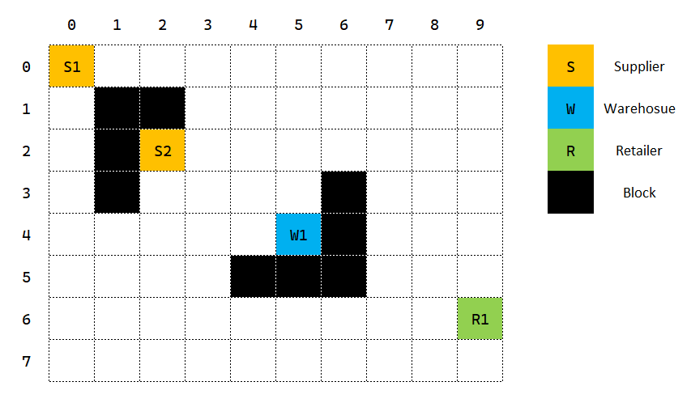

Supply Chain Management
=======================

The Supply Chain scenario simulates a common problem of products' manufacture, storage, and transportation. In this simulated system, products are produced by suppliers, transferred between and stored in warehouses/suppliers/retailers, and then sold by retailers. Multiple vehicles are running around the "world" to deliver products and materials. We need to design a strategy to control the production and transportation according to the dynamic market demand so that the entire system can operate efficiently and benignly.

Resource Flow
-------------

Let's first imagine a simple product production and sales scenario. Suppose there is a factory that can produce a type of product. After the production is done, the products will be temporarily stored in the factory's storage, and then being transported to other downstream. There are three types of potential downstream. First, the downstream could be a warehouse with larger storage, where the products will be stored for a longer time. Second, the downstream could be another factory, which takes these products as material to make the downstream factory's own production. Finally, the downstream might be a retailer, from which the customers could purchase these products. Transportation certainly cannot be completed in an instant. Instead, it is affected by many factors such as factory location, vehicle speed, and road conditions. 

The above example is an extremely simple abstraction of the world's supply chain system, and that's what we want to formulate in MARO. To achieve this, we will first introduce several important concepts, and then illustrate what a Supply Chain world in MARO looks like.

Stock Keeping Unit (SKU)
^^^^^^^^^^^^^^^^^^^^^^^^

In this scenario, the **Stock Keeping Unit (SKU)** is the core resource. An SKU corresponds to a specific type of product. When producing some SKUs, other SKUs may be needed as raw materials. It is possible that some SKUs can be produced without any materials, for example, iron ore dug from the mine. 

The lifecycle of a product can be described as follows:

* Produced by a **supplier** (might need other SKUs from other suppliers as raw materials), indicating the beginning of its lifecycle.
* Stored in the storage of the **supplier**.
* Transported to any other facilities that contain storage. The product may only be temporarily stored here as a transit, and it may be transported to other facilities as needed in the future. In most cases, we only use **warehouses** as transitions, but it is not strictly limited. **Suppliers** and **retailers** can also be used as temporary storage if necessary.
* If the product is stored in a **retailer**, it can be sold to customers. If the product is stored in a **supplier**, it can be consumed as the raw material for other SKUs. Either case will cause the product to leave the system, which means its lifecycle ends.

The fundamental basis that affects the production and transportation of products is the prediction of market demands in the future. MARO has a built-in demand simulator, which samples demands from a `Gamma distribution <https://en.wikipedia.org/wiki/Gamma_distribution/>`_. The hyper-parameters of this Gamma distribution can be set by users. MARO also provides an interface that accepts user-customized demand simulators, so that users could use their own demand prediction to guide the supply chain system.

Facility & Unit
^^^^^^^^^^^^^^^

As mentioned above, a facility is a place provided for a particular purpose. In this scenario, there are three types of facilities: 

* **Supplier**: produce products.
* **Warehouse**: temporarily store products.
* **Retailer**: sell products.

The function of a facility is defined by a set of **units** it contains. In this scenario, a unit can be considered as an indivisible object that describes an atomic functionality of facilities. For example, a ``StorageUnit`` describes the storage ability of the facility. Any facility that requires storage ability should have a ``StorageUnit`` in its corresponding configuration, and the details of the storage capability (e.g., storage size) should be specified by this ``StorageUnit``.

There are two types of units: **SKU-dependent units** and **SKU-independent units**. A unit is SKU-dependent means it correlates to a specific type of SKU. For example, a ``ManufactureUnit`` is SKU-dependent since it only describes the ability to produce one specific kind of SKU. On the other hand, a unit is SKU-independent means it does not correlate to any specific SKU. For example, a ``StorageUnit`` is SKU-independent because storage can be used to store any kind of product. 

Here are the units that supported by MARO for now:

* **SKU-dependent**
  
  * ``ManufactureUnit``: for producing certain products (products enter the system). 
  
  * ``ConsumerUnit``: for generating orders to purchase from upstream by action. 
  
  * ``SellerUnit``: for generating product consumption demand, and moving demand products from current storage (product leaves the system). 
  
  * ``ProductUnit``: for grouping units of one specific SKU, usually contains a ``ConsumerUnit``, a ``SellerUnit``, and a ``ManufactureUnit``.

* **SKU-independent**
  
  * ``VehicleUnit``: for moving production from source to destination by order.
  
  * ``StorageUnit``: for product storage.
  
  * ``DistributionUnit``: for receiving and executing orders for downstream facilities.

Typical unit combinations of each kind of facility:

.. list-table::
   :header-rows: 1

   * - 
     - Manufacture
     - Consumer
     - Seller
     - Product
     - Vehicle
     - Storage
     - Distribution
   * - **Supplier**
     - Y
     - Y
     - N
     - Y
     - Y
     - Y
     - Y
   * - **Warehouse**
     - N
     - Y
     - N
     - Y
     - Y
     - Y
     - Y
   * - **Retailer**
     - N
     - Y
     - Y
     - Y
     - N
     - Y
     - N

The last rule of facilities is each facility has a pre-defined set of upstream facilities. For example, theoretically, a warehouse could accept products from all other facilities. But in some cases, we could pre-define a set of upstream facilities, which means this warehouse could only accept products from these facilities, and deny products from other facilities.

World
^^^^^

Based on the concepts of SKU, facility, and unit, we can finally talk about what a world looks like. MARO uses a N*M grid as the abstraction of the world. Each facility occupies an entire cell in the world. Besides the three types of facilities, there might be some blocked cells on the grid that vehicles cannot pass through. If there are obstacles on the shortest path between two facilities, then vehicles must detour to arrive.

A toy world of size 8*10 is demonstrated below:

Beyond the aforementioned spatial topology, there are many other detailed settings that must be configured to build a complete world, including but not limited to:

* SKU configurations
  
  * Storage space occupied by a single product
  
  * Bill of materials

* Specific unit settings of each facility
  
  * Transportation cost & delay penalty
  
  * Storage capacity & cost
  
  * SKUs' selling prices

* Global settings
  
  * Reward discount
  
  * Initial balance

Topologies
----------

Toy Topology
^^^^^^^^^^^^^

In order to give users a more intuitive explanation of this scenario, MARO provides a toy topology, which can be called a "tiny supply chain world". The configuration file path is ``maro/simulator/scenarios/supply_chain/topologies/sample/config.yml``.

The world in this topology is a 20*20 grid. There are three types of SKUs, named ``sku1``, ``sku2``, and ``sku3``. ``sku1`` requires ``sku3`` as raw material, while ``sku2`` and ``sku3`` do not need any material as input.

Details of facilities:

* ``Supplier_001``: located at [0, 0]
  
  * Produces ``sku3``.
  
  * Has small storage, a consumer, and a distribution.

* ``Supplier_002``: located at [3, 3]
  
  * Produces ``sku1``, therefore need to consume ``sku3`` produced by other facilities as material.
  
  * Has small storage, a consumer,  and a distribution.

* ``Warehouse_001``: located at [6, 6]
  
  * Could store all kinds of SKUs.
  
  * Has huge storage, a consumer, and a distribution.

* ``Retailer_001``: located at [10, 18]
  
  * Could sell all kinds of SKUs.
  
  * Has medium storage and a consumer.

The upstream-downstream dependency of this topology is simple, ``Supplier_001`` performs an upstream of ``Supplier_002`` (provides ``sku3`` as material for ``Supplier_002`` to produce ``sku1``), and both ``Supplier_001`` and ``Supplier_002`` are upstream facilities of ``Warehouse_001`` and ``Retailer_001``.

Real Topologies ?
^^^^^^^^^^^^^^^^^

Naive Baseline
^^^^^^^^^^^^^^

TBD

Quick Start
-----------

To start a simulation in the Supply Chain scenario, no extra data processing is needed. You can just go through the topology's configuration to build a general idea of this scenario, and then initialize an environment and enjoy your exploration in this scenario.

Environment Interface
^^^^^^^^^^^^^^^^^^^^^

**Demand**

As introduced above, the fundamental basis that affects the operation of the entire system is the prediction of market demand in the future. From the system's perspective, the change in demand is determined by the outside and cannot be controlled by itself. MARO has a built-in demand predictor, which samples future demand from a Gamma distribution (``SellerUnit``). MARO also provides an interface that accepts user-customized demand simulators, so that users could use their own demand prediction to guide the supply chain system (``OuterSellerUnit``).

**System Status**

In order to get known of the system status, we could find the information we need from the following two interfaces:

* ``env.summary`` contains all static information about the system. For example, SKU list, unit settings, facilities settings, spatial distribution of facilities, etc..
* ``env.snapshot_list`` contains all dynamic information that describes the system's running status. For example, production progress, inventory status, vehicles' positions, demand shortage, etc..

**Action**

Actions in the Supply Chain scenario are simple. There are only two types of actions: ``ConsumerAction`` and ``ManufactureAction``.

``ConsumerAction`` refers to the action that one facility purchases some SKUs from its upstream facility. The information of each ``ConsumerAction`` is listed as below:

* **id** (int): The corresponding ID of the consumer. Because one facility may have multiple consumer units, **this ID is a unit ID** for unambiguity.
* **product_id** (int): The SKU id of the product.
* **source_id** (int): The corresponding ID of the product provider. **This ID is a facility ID rather than a unit ID**, because the consumer only cares about which facility the product is purchased from, and does not care which unit produces the product.
* **vlt** (int): The expected velocity of the transportation.
* **reward_discount** (int): Literal meaning.

``ManufactureAction`` refers to the instruction for the facility to start production. Its information is listed as below:

* **id** (int): The corresponding ID of the production unit. For one facility, each SKU has a corresponding production unit, so the ID here is a unit ID and it inherently contains the SKU id.
* **production_rate** (int): Speed of production.

The IDs used in these two actions can be found in ``env.summary``.

Once a ``ManufactureAction`` is issued, the facility/unit will **immediately** (within the same tick that the action is issued) try to start producing the product. However, the production process may be stalled due to insufficient raw materials, insufficient storage, etc.. Once a ``ConsumerAction`` is issued, the source facility will try to allocate vehicles to transport products **in the next tick**. The transportation process may also not proceed smoothly due to insufficient vehicles and insufficient destination storage, etc.. Therefore, the users need to read the static/dynamic status of the system and keep optimizing their strategy.

Example
^^^^^^^

Here we show a simple example of interaction with the environment. Jump to `this notebook <https://github.com/microsoft/maro/blob/master/notebooks/supply_chain/interact_with_environment.ipynb/>`_ for a quick experience.

Visualization
-------------

TBD
