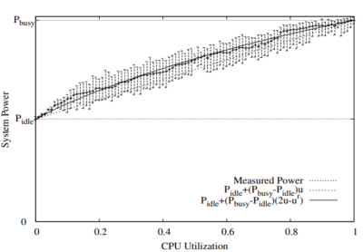

Virtual Machine Scheduling (VM Scheduling)
===========================================

In 21th century, the business needs of cloud computing are dramatically increasing.
During the cloud service, users request Virtual Machine (VM) with a certain amount of resources (eg. CPU, memory, etc).
The following important issue is how to allocate the physical resources for these VMs?
The VM Scheduling scenario aims to find a better solution of the VM scheduling problem
in cloud data centers.
Now, consider a specific time, the number of VM
requests and arrival pattern is fixed. Given a cluster of limited physical
machines(PM) with limited physical resources, different VM allocation strategies result in
different amount of
successful completion and different operating cost of the data center. For cloud providers, a
good VM allocation strategy can maximize the resource utilization and thus can increase the profit by
providing more VMs to users. For cloud users, a good VM allocation strategy can
minimize the VM response time and have a better using experience. We hope this scenario can meet
the real needs and provide you with a demand simulation that is closest to the real situation.

Resource Flow
--------------

In this scenario, the physical resources in each PM are the
central resource, which currently includes the physical cores and memory. A full
resource life cycle always contains the steps below:

- Coming VM requests ask for a certain amount of resources. Resource requirements are varied
  based on the different VM requests.
- Based on the scheduling agent's strategy, the VM will be allocated to and be created
  in a specified PM as long as that PM's remaining resources are enough.
- The VM's resource utilization changes dynamically and the PM's real-time energy consumption
  will be simulated in the runtime simulation.
- After a period of execution, the VM completes its tasks. The simulator will release the resources
  allocated to this VM and deallocate this VM from the PM.
  Finally, the resource is free and is ready to serve the next VM request.

VM Request
^^^^^^^^^^^

In the VM scheduling scenario, the VM requests are uniformly sampled from real
workloads. As long as the original dataset is large enough and the sample ratio
is not too small, the sampled VM requests can follow a similar distribution to the
original ones.

Given a fixed time interval, a VM request will arise according to the real VM workload data.
The request contains the VM information, such as the subscription id, the deployment id, and the
VM category, VM's required resources, including the required CPU cores and
the required memory, and the remaining buffer time.

* Whenever receive a VM request, the MARO simulator will first calculate the
  remaining resources of each PM, filtering out the valid PMs (valid PMs means that the remaining
  resources of PM are enough for the required resources of the VM).
* Then, the simulator delivers all valid PMs and the required resources of the awaiting VM
  to the VM scheduler (agent) for a decision.

We have two categories of VM. One is interactive, and the other one is
delay-insensitive.

* Interactive: The interactive VMs usually require low response time, so we set this kind of VMs can
  only be allocated to the non-oversubscribable PM server.
* Delay-insensitive: The delay-insensitive VMs usually serve for batch-tasks or development workload. This kind of VMs can
  be allocated to the over-subscribable PM server.

VM Allocation
^^^^^^^^^^^^^^

Based on the valid PM list, the historical information recorded by the simulator, and the detailed
required resources of the VM, the VM scheduler (decision agent) will make the decision according to its
allocation strategy.

There are two types of meaningful actions:

* Deliver a valid PM ID to the simulator.
* Postpone the VM request, which will leave this request to be handled later if
  the remaining buffer time is enough.

See the detailed attributes of `Action <#id1>`_.

Oversubscription
~~~~~~~~~~~~~~~~~~~~
To maximize each PM's utilization, cloud providers will oversubscribe the physical resource.
Considering the various service level, the physical machines are then divided into the over-subscribable ones and non-oversubscribable ones.
For the over-subscription, there are several parameters can be set in the config.yml.
In our scenario, there are two resources could be oversubscribed, CPU and memory, so we have two maximum oversubscription rate can be set.

* ``MAX_CPU_OVERSUBSCRIPTION_RATE``: The oversubscription rate of CPU. For example, the default setting
  is 1.15, that means each PM can be allocated at most 1.15 times of its resource capacity.
* ``MAX_MEM_OVERSUBSCRIPTION_RATE``: The oversubscription rate of memory. Similar to the CPU rate.

To protect the PM from the overloading, we need to consider the CPU utilization. The ``MAX_UTILIZATION_RATE``
is used as the security mechanism, that can be set in the config.yml.

* ``MAX_UTILIZATION_RATE``: The default setting is 1, which means that when filtering the valid PMs,
  the maximum allowed physical CPU utilization is 100%.

Runtime Simulation
^^^^^^^^^^^^^^^^^^^

Dynamic Utilization
~~~~~~~~~~~~~~~~~~~~

To make the simulated environment closest to the real situation. We also simulate the resource utilization
(currently only CPU utilization) of each VM. The CPU utilization of the VM varies every tick based on
the real VM workload readings. We will also regularly update the real-time resource utilization of
each PM based on the live VMs in it.

Real-time Energy Consumption
~~~~~~~~~~~~~~~~~~~~~~~~~~~~~

One of the most important characteristics that cloud providers concern is the energy consumption of the
data center. The different VM allocation can result in different energy consumption of the PM cluster,
we also simulate the energy usage based on the CPU utilization.

Energy Curve
*****************

As we mention before, the lower energy consumption of the PMs, the lower cost to maintain the physical
servers. In our simulation, we currently use a non-linear energy curve like the one in the above
`figure <https://dl.acm.org/doi/10.1145/1273440.1250665>`_ to
simulate the energy based on the CPU utilization.

Overload
~~~~~~~~~~~~~~~~~~~~~~~~~~~~~
Since the VM's CPU utilization varies along the time, when enabling the oversubscription, it might
happen that the sum of VM's CPU usage exceed the capacity of the physical resource. This situation called
overload.

Overloading may lead to VM's performance degradation or service level agreements (SLAs) violations
in real production (We will support these features in the future).
Currently, for the situation of overloading, we only support quiescing (killing) all VMs or just recording
the times of overloading, which can also be set in config.yml.

* ``KILL_ALL_VMS_IF_OVERLOAD``: If this action is enable,
  once overloading happens, all VMs located at the overloading PMs will be deallocated. To consider the
  effect of overloading, we will still count the energy consumed by the high utilization.
  The impact of the quiescing action on the PM's utilization will be reflected in the next tick.

No matter enable killing all VMs or not, we will calculate the number of overload PMs and the number
of overload VMs. These two metrics are cumulative values and will be recorded as the environment metrics.

VM Deallocation
^^^^^^^^^^^^^^^^

The MARO simulator regularly checks the finished VMs in every tick.
A finished VM means that it goes through a complete life cycle, is ready to be terminated, and
the resources it occupies will be available again in the end.
The simulator will then release the finished VM's resources, and finally remove the VM from the PM.

Topologies
-----------

Azure Topologies
^^^^^^^^^^^^^^^^^

The original data comes from `Azure public dataset <https://github.com/Azure/AzurePublicDataset>`_.
The dataset contains real Azure VM workloads, including the information of VMs and their
utilization readings in 2019 lasting for 30 days. Total number of VM recorded is 2,695,548.

In our scenario, we pre-processed the AzurePublicDatasetV2.
The detailed information of the data schema can be found
`here <https://github.com/Azure/AzurePublicDataset/blob/master/AzurePublicDatasetV2.md>`_.
After pre-processed, the data contains

* Renumbered VM ID
* VM cores and memory(GB) requirements
* Real VM creation and deletion time (converted to the tick, 1 tick means 5 minutes in real time)

As for the utilization readings part, we sort the renumbered VM ID and CPU utilization pairs by the timestamp (tick).

To provide system workloads from light to heavy, two kinds of simple topologies are designed and
provided in VM Scheduling scenario.

azure.2019.10k
~~~~~~~~~~~~~~~~

Uniformly random sample.

* Total number of VMs: 10,000
* Average number of concurrent VMs: 835.7
* Average number of CPU cores requested: 3.8
* Average memory requested: 15.9 GB
* Average CPU utilization: 15.7 %

PM setting (Given by the /[topologies]/config.yml):

* Amount: 100
* CPU Cores: 32
* Memory: 128 GB

azure.2019.336k
~~~~~~~~~~~~~~~~~

Uniformly random sample.

* Total number of VMs: 336,000
* Average number of concurrent VMs: 28,305.9
* Average number of CPU cores requested: 3.8
* Average memory requested: 16.1 GB
* Average CPU utilization: 15.6 %

PM setting (Given by the /[topologies]/config.yml):

* Amount: 880
* CPU Cores: 16
* Memory: 112 GB

Naive Baseline
^^^^^^^^^^^^^^^

Belows are the final environment metrics of the method **Random Allocation** and
**Best-Fit Allocation** in different topologies.
For each experiment, we setup the environment and test for a duration of 30 days.
Besides, we use several settings of PM capacity to test performance under different
initial resources.

Random Allocation
~~~~~~~~~~~~~~~~~~~~

Randomly allocate to a valid PM.

.. list-table::
   :header-rows: 1

   * - Topology
     - PM Setting
     - Total VM Requests
     - Total Energy Consumption
     - Successful Allocation
     - Successful completion
     - Failed Allocation
   * - Azure.2019.10k
     - 100 PMs, 32 Cores, 128 GB
     - 10,000
     - 2,430,651.6
     - 9,850
     - 9,030
     - 150
   * -
     - 100 PMs, 16 Cores, 112 GB
     - 10,000
     - 2,978,445.0
     - 8,011
     - 7,411
     - 1,989
   * - Azure.2019.336k
     - 880 PMs, 32 Cores, 128 GB
     - 335,985
     - 26,681,249.7
     - 176,468
     - 165,715
     - 159,517
   * -
     - 880 PMs, 16 Cores, 112 GB
     - 335,985
     - 26,367,238.7
     - 92,885
     - 87,153
     - 243,100

Best-Fit Allocation
~~~~~~~~~~~~~~~~~~~~

Choose the valid PM with the least remaining resources (only consider CPU cores here).

.. list-table::
   :header-rows: 1

   * - Topology
     - PM Setting
     - Total VM Requests
     - Total Energy Consumption
     - Successful Allocation
     - Successful completion
     - Failed Allocation
   * - Azure.2019.10k
     - 100 PMs, 32 Cores, 128 GB
     - 10,000
     - 2,395,328.7
     - 10,000
     - 9,180
     - 0
   * -
     - 100 PMs, 16 Cores, 112 GB
     - 10,000
     - 2,987,086.6
     - 7,917
     - 7,313
     - 2,083
   * - Azure.2019.336k
     - 880 PMs, 32 Cores, 128 GB
     - 335,985
     - 26,695,470.8
     - 171,044
     - 160,495
     - 164,941
   * -
     - 880 PMs, 16 Cores, 112 GB
     - 335,985
     - 26,390,972.9
     - 92,263
     - 86,600
     - 243,722

Quick Start
------------

Data Preparation
^^^^^^^^^^^^^^^^^

When the environment is first created, the system will automatically trigger the pipeline to download
and process the data files. Afterwards, if you want to run multiple simulations, the system will detect
whether the processed data files exist or not. If not, it will then trigger the pipeline again. Otherwise,
the system will reuse the processed data files.

Customize Dataset
~~~~~~~~~~~~~~~~~~~~

If you want to use your own dataset, you need to prepare two csv files, ``vm_table`` and ``cpu_readings_file``.
Below is the data schema and the format that you need to follow.

* ``vm_table``:

  * vm_id: int. The id number of VMs.
  * sub_id: int. The subscription id of VMs.
  * deploy_id: int. The deployment id of VMs.
  * timestamp: int. The timestamp of VM's creation time.
  * vm_lifetime: int. The lifetime of VMs. Lifetime equals the deletion time - creation time (timestamp) + 1.
  * vm_deleted: int. The timestamp of VM's deletion time.
  * vm_category: int. The category of VMs. Currently, we have three categories of VM:

    * ``Delay-Insensitive``: The VMs workload that could be delayed, such as batch tasks or test workload.
      This kind of VMs could be allocated to the over-subscribable PM. Store as ``0``.
    * ``Interactive``: The VMs workload that are interactive, which need user response in time. This kind
      of VMs could only allocated to the non-oversubscribable PMs. Store as ``1``.
    * ``Unknown``. Unknown types. To avoid the overloading, this kind of VMs are treated as the interactive ones,
      which could only allocated to the non-oversubscribable PMs. Store as ``2``.
  * vm_cpu_cores: int. The CPU cores of VMs.
  * vm_memory: int. The memory of VMs.

* ``cpu_readings_file``:

  * timestamp: int. The timestamp. Should be matched with the timestamp in ``vm_table``.
  * vm_id: int. The id number of VMs. Should be matched with the ids in ``vm_table``.
  * cpu_utilization: float. The utilization of VM CPU. Store in the unit of percentage (%).

Build Command
~~~~~~~~~~~~~~~~

After preparing two files as the above formats. You need to convert them to binary files.
We provide the ``build`` command to build your own CSV dataset to binary files
that the MARO simulator can use. Currently, there are three required arguments for the data ``build`` command:

* ``--meta``: required, used to specify the path of the meta file. In default, the meta files are under

  .. code-block:: sh

     ~/.maro/data/vm_scheduling/meta/

  The source columns that to be converted and
  the data type of each columns should be specified in the meta file.
* ``--file``: required, used to specify the path of the source CSV data file(s). If multiple source CSV data files are needed,
  you can list all the full paths of the source files in a specific file and use a ``@`` symbol to specify it.
* ``--output``: required, used to specify the path of the target binary file.

.. code-block:: sh

   maro data build --meta $PATH_TO_META_FILE --file $PATH_TO_CSV_FILE  --output $PATH_TO_OUTPUT_FILE

For example,

.. code-block:: sh

    maro data build --meta ~/.maro/data/vm_scheduling/meta/vmtable.yml  --file ~/.maro/data/vm_scheduling/.build/azure.2019.10k/vmtable.bin --output $PWD/vmtable.bin

After building the binary files. Specify the direct path of ``VM_TABLE`` and ``CPU_READINGS``
in the config.yml under the topologies directories. Then you can use your own dataset to run the simulation.

Environment Interface
^^^^^^^^^^^^^^^^^^^^^^

Before starting interaction with the environment, we need to know the definition of ``DecisionPayload`` and
``Action`` in VM Scheduling scenario first. Besides, you can query the environment
`snapshot list <../key_components/data_model.html#advanced-features>`_ to get more
detailed information for the decision making.

DecisionPayload
~~~~~~~~~~~~~~~

Once the environment need the agent's response to promote the simulation, it will throw an ``PendingDecision``
event with the ``DecisionPayload``. In the scenario of VM Scheduling, the information of ``DecisionPayload`` is
listed as below:

* **valid_pms** (List[int]): The list of the PM ID that is considered as valid (Its CPU and memory resource is enough for the incoming VM request).
* **vm_id** (int): The VM ID of the incoming VM request (VM request that is waiting for the allocation).
* **vm_cpu_cores_requirement** (int): The CPU cores that is requested by the incoming VM request.
* **vm_memory_requirement** (int): The memory resource that is requested by the incoming VM request.
* **remaining_buffer_time** (int): The remaining buffer time for the VM allocation. The VM request will be treated as failed when the remaining_buffer_time is spent. The initial buffer time budget can be set in the config.yml.

Action
~~~~~~~

Once get a ``PendingDecision`` event from the environment, the agent should respond with an Action. Valid
``Action`` includes:

* **None**. It means do nothing but ignore this VM request.
* ``AllocateAction``: If the MARO simulator receives the ``AllocateAction``, the VM's creation time will be
  fixed at the tick it receives. Besides, the simulator will update the workloads (the workloads include
  CPU cores, the memory, and the energy consumption) of the target PM.
  The ``AllocateAction`` includes:

  * vm_id (int): The ID of the VM that is waiting for the allocation.
  * pm_id (int): The ID of the PM where the VM is scheduled to allocate to.
* ``PostponeAction``: If the MARO simulator receives the ``PostponeAction``, it will calculate the
  remaining buffer time.

  * If the time is still enough, the simulator will re-generate a new request
    event and insert it to the corresponding tick (based on the ``Postpone Step`` and ``DELAY_DURATION``).
    The ``DecisionPayload`` of the new requirement event only differs in the remaining buffer time from the
    old ones.
  * If the time is exhausted, the simulator will note it as a failed allocation.

  The ``PostponeAction`` includes:

  * vm_id (int): The ID of the VM that is waiting for the allocation.
  * postpone_step (int): The number of times that the allocation to be postponed. The unit
    is ``DELAY_DURATION``. 1 means delay 1 ``DELAY_DURATION``, which can be set in the config.yml.

Example
^^^^^^^^

Here we will show you a simple example of interaction with the environment in random mode, we
hope this could help you learn how to use the environment interfaces:

.. code-block:: python

  import random

  from maro.simulator import Env
  from maro.simulator.scenarios.vm_scheduling import AllocateAction, DecisionPayload, PostponeAction

  # Initialize an Env for vm_scheduling scenario
  env = Env(
    scenario="vm_scheduling",
    topology="azure.2019.10k",
    start_tick=0,
    durations=8638,
    snapshot_resolution=1
  )

  metrics: object = None
  decision_event: DecisionPayload = None
  is_done: bool = False
  action: AllocateAction = None

  # Start the env with a None Action
  metrics, decision_event, is_done = env.step(None)

  while not is_done:
      valid_pm_num: int = len(decision_event.valid_pms)
      if valid_pm_num <= 0:
          # No valid PM now, postpone.
          action: PostponeAction = PostponeAction(
              vm_id=decision_event.vm_id,
              postpone_step=1
          )
      else:
          # Randomly choose an available PM.
          random_idx = random.randint(0, valid_pm_num - 1)
          pm_id = decision_event.valid_pms[random_idx]
          action: AllocateAction = AllocateAction(
              vm_id=decision_event.vm_id,
              pm_id=pm_id
          )
      metrics, decision_event, is_done = env.step(action)

  print(f"[Random] Topology: azure.2019.10k. Total ticks: 8638. Start tick: 0")
  print(metrics)

Jump to `this notebook <https://github.com/microsoft/maro/tree/master/notebooks/vm_scheduling/interact_with_environment.ipynb>`_ for a quick experience.
