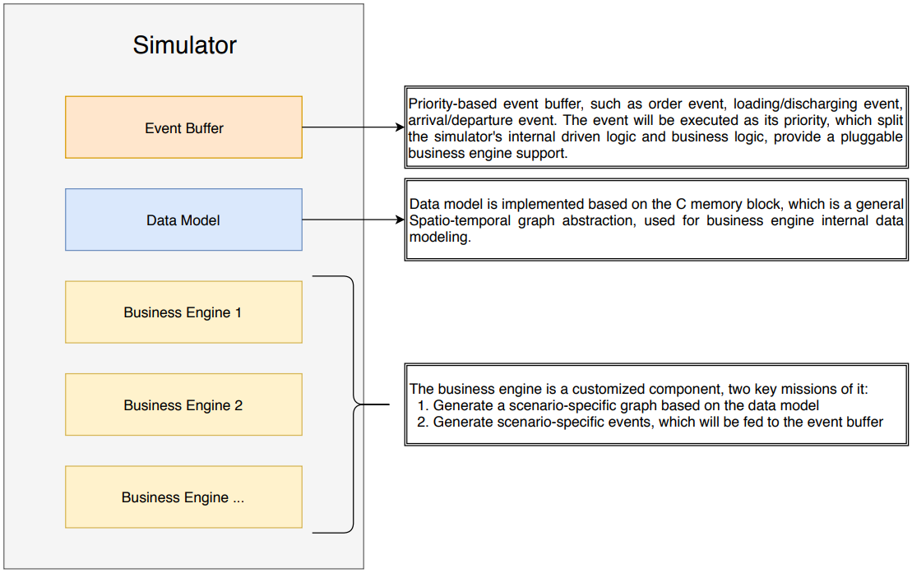
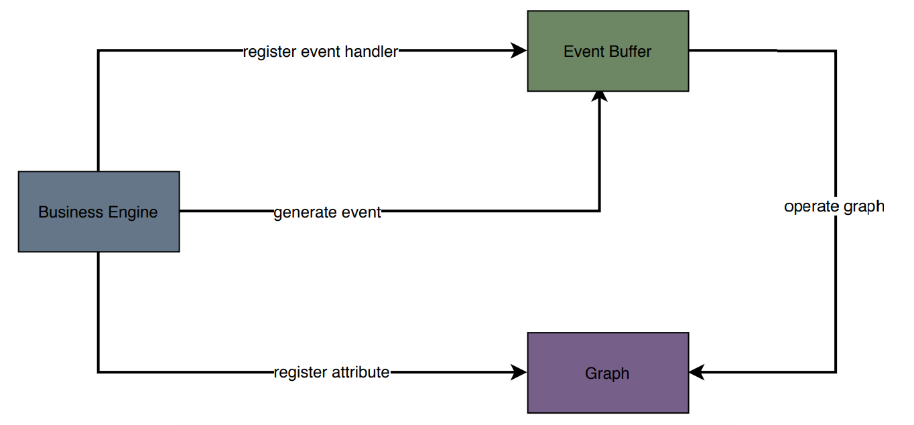

Architecture
===============
Our simulator is the driver and data manager of Multi-Agent Resource Optimization environments.
It contains a core module and 3 sub modules: graph (data module), event buffer and business engine.

Compared with other simulators, the difference is that we abstract and format all the scenarios into event-driven state machines,
and use unified event buffer and data module to support them.
The workflow of an environment, which we would call as "business logic" in the following documents,
is decomposed into different events generated by the corresponding business engine.
Under this design, users can focus more on the business logic itself
when customizing new scenarios.

As shown in the figure above, each scenario has its own customized business engine supported by event buffer and graph
in event management and data storage, respectively. We currently only offer an ECR business engine,
please communicate with and contribute to us if you have implemented more scenarios.

Mechanism
---------

All changes in the environment occur through events stored in an event buffer.
Those events related to business logic are generated by the business engine with user-defined callback functions.
The graph module stores the states of the whole environment and speed up by C-based data operations.

Usages
------
The core module is the administrator and supervisor of the whole environment,
it integrates all modules above and docks with other parts of MARO
and provides the only exposed interface of environment.
Therefore, we actually operate on the core module when we call the environment from outside.

.. code-block:: python

    env: Env = Env(scenario, topology, max_tick)
    # Instantiate a new env object based on the given scenario, topology and max tick number of each episode.
    env.reset()
    # Reset all state of the environment. Usually called at the beginning of each episode.
    env.step(action)
    # Let the environment run a tick using given action. Note: tick number is not needed here.
    pending_events: list = env.get_pending_events()
    # Fetch pending events in the event buffer.
    finished_events: list = env.get_finished_events()
    # Fetch all finished events since the beginning of current episode.

