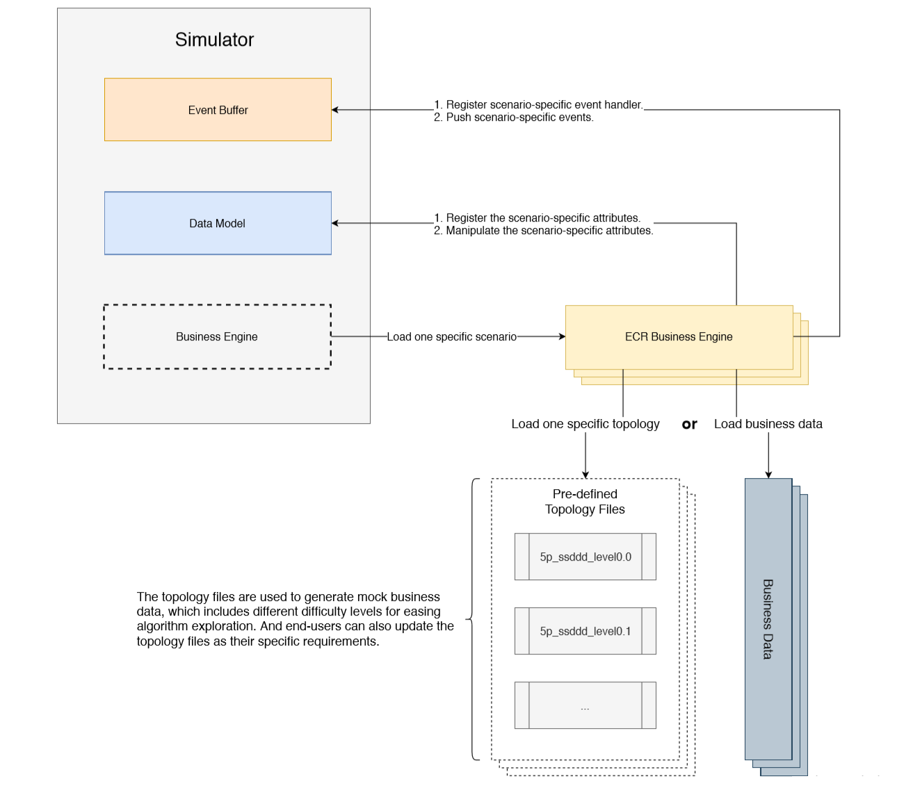

Business Engine
================

Business Engine is a plug-in module who carries business logic.
Supported by graph (data model) and event buffer, specified
business scenario can be created based on events.

With callback functions (i.e. what to do at each event) defined,
the business engine realizes business logic by generating specific events at specific time.

Structure
---------

Each scenario has its own business engine, for example, `ecr/business_engine.py` works for ECR scenario.
To solve problems in more different scenarios, business engines can be also user-defined following `abs_business_engines.py`.

To start with, the business engine initialize the scenario based on specified config.
A specialized data generator (optional) may be helpful to generate necessary data according to certain rules.
Generally, a business engine should make use of our C-based data module to store most of the data in the environment.

In each episode, the environment core (`core.py`) would call business engine at each tick sequentially.
According to time and environmental status, specified events can be generated and inserted into event buffer.
As each event is executed, its callback function can accomplish part of business logic and may generate other events based on payload data.
All callback functions should be registered to event buffer at instantiation of business engine.

General Functions
-----------------

A legal business engine can be utilized by following common exposed methods:

.. code-block:: python

    business_engine: AbsBusinessEngine = BusinessEngine(event_buffer, topology_path)
    # We initialize a business engine by given event buffer and topology.
    business_engine.step(tick)
    # The business engine can drive the business logic according to global tick.
    business_engine.post_step()
    # Specified process at the end of each step can be defined in this method.
    business_engine.reset()
    # Reset business engine at the start of each episode.
    action_scope: ActionScope = business_engine.action_scope()
    rewards: float = business_engine.rewards(actions: list(Action))
    # If necessary, the business engine can calculate action scopes and rewards.

ECR Business Engine
-------------------

Specially, we wrote a business engine to simulate the ECR scenario.
Cooperating with other parts of our simulator, the ECR business engine can drive the workflow based on specified business logic.

