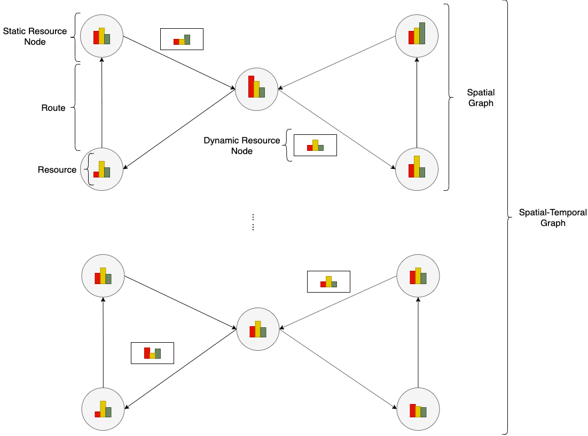

Data Model
===========

We use the spatial-temporal graph as the underlying data model abstraction for all resource optimization scenarios.

Static Resource Node
----------------------

It's the abstraction for resource repository, which usually doesn't change the location in the real world.
Such as container depot of the terminal, parking station of sharing bicycles.

For the flexible concern, we use dictionary structure for recording the different states of various resources.

Dynamic Resource Node
----------------------

It's the abstraction for resource container, which usually change the location in the real world.
Such as the vessel, truck.

 
Graph
------

Internally, we use an matrix to organize the static and dynamic resource nodes, respectively.
Dynamic resource nodes are not must for all scenarios.

For the scenarios, which includes dynamic resource node:

:math:`G_{ik}^s`-> The value of :math:`k` th attribute on the :math:`i` th static node stored in the static part of graph.

:math:`G_{jk}^d`-> The value of :math:`k` th attribute on the :math:`j` th dynamic node stored in the dynamic part of graph.

Graph is a light wrapper for static resource nodes and dynamic resource nodes.

.. code-block:: python

    graph = Graph(static_resource_node_num, dynamic_resource_node_num)
    # Instantiate a graph object according to node umber
    graph.setup()
    # Setup the graph
    value = graph.get_attribute(node_type, node_index, attribute_type, tick)
    # Get the value of an attribute on a specified node at specified tick
    graph.set_attribute(node_type, node_index, attribute_type, tick, value)
    # Set the value of an attribute on a specified node at specified tick

Snapshot List
-------------

Snapshot list is an abstraction of spatial-temporal graphs, which includes all spatial graph between two optimization events.
One snapshot is a past tick spatial graph backup and can be refreshed at each tick.

.. image:: ../images/snapshot.png

For outside user, snapshot lists can be fetched from the environment.
As complete description of graphs, the information of dynamic and static nodes can be obtained from corresponding parts respectively.

.. code-block:: python

    snap_shot_list = env.snapshot_list
    # Current snapshot list can be fetched as a property of the environment.
    attribute_list = env.snapshot_list.attributes
    # Get all supported attributes list
    value = snapshot_list.static_nodes[[tick]: [node_id]: ([attribute_name], [attribute_slot])]
    # Get information about static nodes from snapshot list
    value = snapshot_list.dynamic_nodes[[tick]: [node_id]: ([attribute_name], [attribute_slot])]
    # Get information about dynamic nodes from snapshot list

