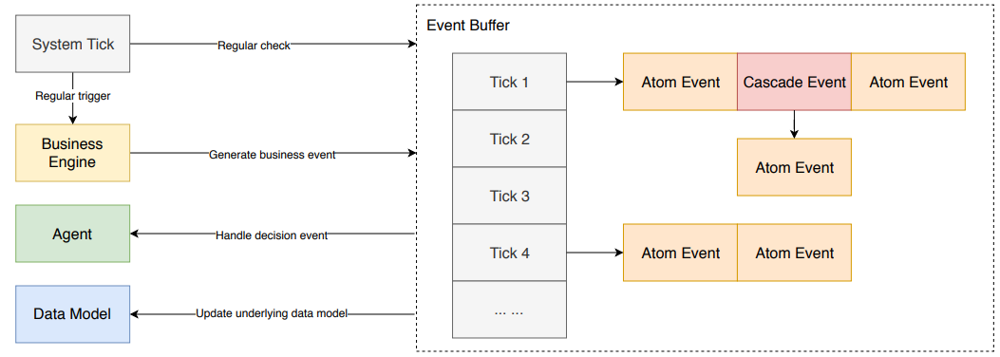
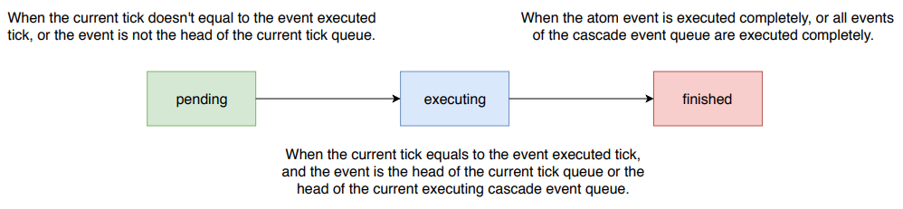

Event Buffer
============

Single-Thread Event Buffer
----------------------------
The different components (i.e. different parts of business logic, actions of agents, etc) co-operation are based on the internal event buffer,
which supports both atom event and cascade event. In general, the events will be executed based on the event executed tick.
Cascade event is a special case, which is designed for a group of events which need to be executed one by one in a
simulator time slot but may be generated at different ticks.

.. code-block:: python

    event_buffer: EventBuffer = EventBuffer()
    # Instantiate an empty event buffer
    event_buffer.insert_event(event)
    # Insert an event into event buffer
    executed_events = event_buffer.execute(tick)
    # Execute all events at specified tick orderly and pop out as a list

Structurally, our event buffer is a hash map that stores events to be executed at different ticks.
Once an event is generated, it will be appended to the rear of event list at its executing tick
or to the rear of children event list of specified cascade event.
Except the executing one, all events in the buffer is at PENDING state.

Event
-----
Events are the basic ingredients of our environment's workflow.
Generally, we can define specified handler functions for every event types.
For example, here's a piece of code that uses the event mechanism for Euler's sieve method:

.. code-block:: python

    def sieve(event: Event):
        # Firstly, we define a function that sieves out all prime numbers that smaller than payload of the input event
        max_num = event.payload
        is_prime = [True for _ in range(max_num)]
        primes = []
        for i in range(2, max_num):
            if is_prime[i]:
                primes.append(i)
                print(i)
            for prime in primes:
                if i * prime >= max_num:
                    break
                is_prime[i * prime] = False
                if i % prime == 0:
                    break

    event_buffer.register_handler(0, sieve)
    # Then register this function as handler for events of type 0
    event: Event = event_buffer.gen_atom_event(tick=5, event_type=0, payload=50)
    # Generate an atom event with payload 50 (as the max number of sieve) of type 0 to be executed at tick 5
    event_buffer.insert_event(event)
    # Insert it into event buffer
    event_buffer.execute(5)
    # Execute it to get the answer

Event Format
^^^^^^^^^^^^

The event format is designed for general purpose, which supports both IPC and RPC.

An legal event generally contains following properties:

- **tick** (int): Tick that this event will be executed.
- **event_type** (int): Type of this event, this is a customize field, there is one predefined event type is 0 (PREDEFINE_EVENT_ACTION).
- **payload** (Object): Payload that stores sufficient information for execution.
- **tag** (EventTag): Tag mark of this event (ATOM or CASCADE).
- **source** (str): The event generator id / code (not implemented yet).
- **target** (str): The event receiver id / code (not implemented yet).
- **immediate_event_list** (list): List of children events of a cascade event.
- **state** (EventState): State of this event (PENDING, EXECUTING, or FINISHED).

Event State Machine
^^^^^^^^^^^^^^^^^^^

Generally, an event will go through following stages:

