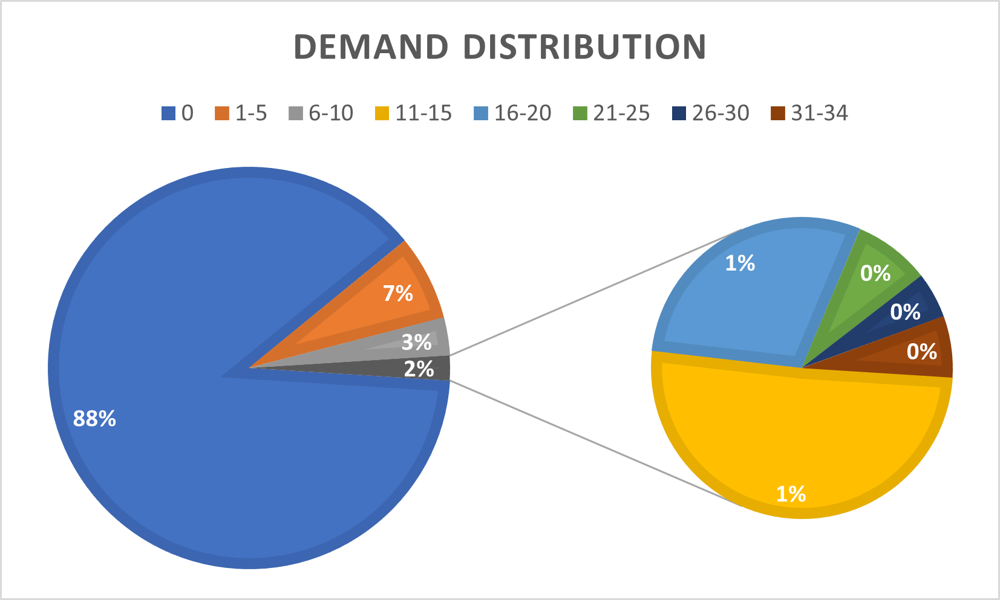
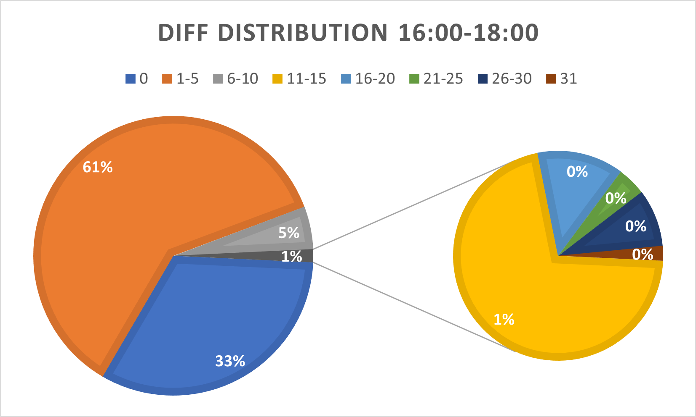
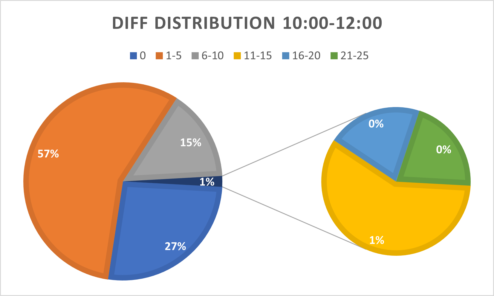

# Performance

## Solver Used

To get stable problem solution, the experiments are made with **GLPK solver**.
To use GLPK solver, you need to first install the GLPK package in your platform
accordingly. Then replace the *PULP_CBC_CMD* solver with GLPK in the code.

```python
from pulp import GLPK

class CitiBikeILP():

  def _formulate_and_solve(...):
    ...
    problem.solve(GLPK(msg=0))
```

## Configuration

Below are the final environment metrics of the onlineLP in different topologies.
For each experiment, we setup the environment and test for a duration of 1 week
with environment random seed 0, 128, 1024.  Besides the parameter listed in the
table, the experiment is configured with the default parameter value in the file
`examples/citi_bike/online_lp/config.yml`

## Future Demand and Supply from BE

For the experiments below, we imitate the way of reading log data in BE and peep
the future demand and supply of bikes for each station from the trip reader
directly. These demand and supply data are then be used in the LP formulation.

Topology  | #Requirements | #Shortage     | #Repositioning
----------|--------------:|--------------:|----------------:
toy.3s_4t |  15,070       |  8,250 +/- 16 |     156 +/-   6
toy.4s_4t |  10,128       |  4,055 +/-  6 |   1,634 +/-   9
toy.5s_6t |  15,983       |  6,589 +/- 24 |   2,469 +/-  25
ny.201908 | 371,969       | 14,541 +/- 91 | 118,906 +/- 243
ny.201910 | 351,855       | 11,509 +/- 65 | 102,554 +/- 207
ny.202001 | 169,304       |  1,968 +/- 25 |  69,468 +/- 201
ny.202004 |  91,810       |    169 +/-  8 |  18,976 +/- 159
ny.202006 | 197,833       |  1,908 +/- 27 |  36,301 +/- 117

## Future Demand and Supply by One-Step Fixed-Window Moving Average

For the experiments below, we use a simple fixed-window moving average to predict
the future demand and supply of bikes for each station.

Topology  | #Requirements | #Shortage      | #Repositioning
----------|--------------:|---------------:|------------------:
toy.3s_4t |  15,070       |  8,252 +/-   0 |       0 +/-     0
toy.4s_4t |  10,128       |  3,788 +/- 119 |   3,364 +/-    63
toy.5s_6t |  15,983       |  6,860 +/-  15 |   3,422 +/-    35
ny.201908 | 371,969       | 12,526 +/- 122 | 267,344 +/-   337
ny.201910 | 351,855       |  9,082 +/-  53 | 287,308 +/- 1,132
ny.202001 | 169,304       |  1,746 +/-  33 | 168,379 +/-   338
ny.202004 |  91,810       |    104 +/-   8 | 114,145 +/-   831
ny.202006 | 197,833       |  1,071 +/-  42 | 185,101 +/- 1,860

## Comparison of These Two Strategy and Analysis of the Forecasting Results

As shown in the tables above, there is no big difference between directly using
trip log data and using MA forecasting results. To find out why forecasting demand
and supply by such a simple method can contribute to the *not bad* result, we
select the topology *ny.201910* and compare the forecasting results to the data
extracted from the trip log data. Since the gap between future actual supply is
determined not only by the future trip requirements, but also by the future bike
inventory and trip fulfillment, we only compare the future demand from the log
data and the forecasting demand values here.

### Topology: ny.201910

 Time | Tick | Non-0 in Log | Max in Log | Diff to Log | Max Diff | Diff > 5
:----:|:----:|-------------:|-----------:|------------:|---------:|---------:
00:00 | 1440 |  1.18%       |          4 | 55.00%      |       8  |   1.54%
02:00 | 1560 |  0.78%       |          2 | 28.69%      |       4  |   0.00%
04:00 | 1680 |  5.52%       |         15 |  8.20%      |      15  |   0.20%
06:00 | 1800 | 11.99%       |         21 | 14.41%      |      21  |   3.14%
08:00 | 1920 | 10.39%       |         25 | 50.72%      |      24  |   2.06%
10:00 | 2040 |  9.44%       |         15 | 73.46%      |      25  |  16.76%
12:00 | 2160 |  9.71%       |         14 | 71.76%      |      16  |  14.15%
14:00 | 2280 | 10.03%       |         13 | 63.82%      |       9  |   2.97%
16:00 | 2400 | 11.93%       |         34 | 67.65%      |      31  |   4.54%
18:00 | 2520 |  9.54%       |         16 | 68.17%      |      15  |  13.40%
20:00 | 2640 |  8.63%       |         14 | 67.16%      |      18  |  15.55%
22:00 | 2760 |  4.84%       |          4 | 63.73%      |      10  |   2.94%

- *Non-0 in Log: The percentage of Non-0 data points in the future demand extracted from trip log data.*
- *Max in Log: The maximum data point in the future demand extracted from trip log data.*
- *Diff to Log: The percentage of forecasting data points that is different to the one extracted from trip log data.*
- *Max Diff: The maximum difference between the forecasting data point and the corresponding future demand
extracted from the trip log data.*
- *Diff > 5: The percentage of the difference that is more than 5 between the
forecasting data point and the corresponding future demand extracted from the trip log data.*

According to the log data, much more than 88% future temporal-spatial demand is
**0**. Besides, during the observation window listed above, although the maximum
demand is 34 (at a specific station, during a time interval of 20 minutes), the
corresponding demand distribution shows that demand exceeding 10 bikes per time
interval (20 minutes) is only 2%.



Besides, we can also find that the percentage of forecasting results that differ
to the data extracted from trip log is not low. To dive deeper in the practical
influence the difference may make, we further count the percentage of difference
larger than 5 bikes. As shown in the table above, in most of the time intervals,
the difference is very small. We select two time intervals to more intuitively
show the distribution of the forecasting difference to the trip log. One for the
interval with the *Max Diff* (16:00-18:00), one for the interval with the highest
percentage of *Diff > 5* (10:00-12:00).





Maybe due to the *sparse* and *small* trip demand, and the *small* difference
between the forecasting results and data extracted from the trip log data, the
precision of the forecasting methods contributes less to the final repositioning
performance.
