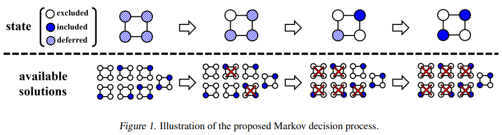
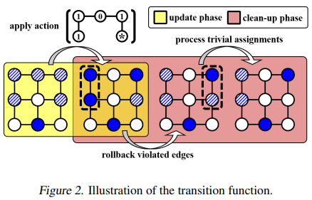
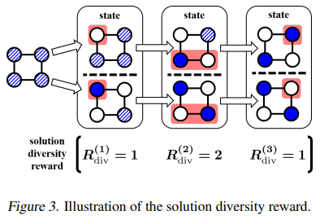

# LWD: Learning What to Defer for Maximum Independent Sets

It is the application of the [LwD](http://proceedings.mlr.press/v119/ahn20a.html) method (published in ICML 2020).
Some code are referred from the original GitHub [repository](https://github.com/sungsoo-ahn/learning_what_to_defer)
held by the authors.

## Algorithm Introduction

### Deferred Markov Decision Process

<div style="text-align: center;">

  

</div>

#### State

Each state of the MDP is represented as a *vertex-state* vector:

<div style="text-align: center;">

$s = [s_i: i \in V] \in \{0, 1, *\}^V$

</div>

where *0, 1, \** indicates vertex *i* is *excluded*, *included*,
and *the determination is deferred and expected to be made in later iterations* respectively.
The MDP is *initialized* with the deferred vertex-states, i.e., $s_i = *, \forall i \in V$,
while *terminated* when (a) there is no deferred vertex-state left or (b) time limit is reached.

#### Action

Actions correspond to new assignments for the next state of vertices, defined only on the deferred vertices here:

<div style="text-align: center;">

$a_* = [a_i: i \in V_*] \in \{0, 1, *\}^{V_*}$

</div>

where $V_* = \{i: i \in V, x_i = *\}$.

#### Transition

The transition $P_{a_*}(s, s')$ consists of two deterministic phases:

- *update phase*: takes the action $a_*$ to get an intermediate vertex-state $\hat{s}$,
i.e., $\hat{s_i} = a_i$ if $i \in V_*$ and $\hat{s_i} = s_i$ otherwise.
- *clean-up phase*: modifies $\hat{s}$ to yield a valid vertex-state $s'$.

  - Whenever there exists a pair of included vertices adjacent to each other,
  they are both mapped back to the deferred vertex-state.
  - Excludes any deferred vertex neighboring with an included vertex.

Here is an illustration of the transition fucntion:

<div style="text-align: center;">



</div>

#### Reward

A *cardinality reward* is defined here:

<div style="text-align: center;">

$R(s, s') = \sum_{i \in V_* \setminus V_*'}{s_i'}$

</div>

where $V_*$ and $V_*'$ are the set of vertices with deferred vertex-state with respect to $s$ and $s'$ respectively.
By doing so, the overall reward of the MDP corresonds to the cardinality of the independent set returned.

### Diversification Reward

Couple two copies of MDPs defined on an indentical graph $G$ into a new MDP.
Then the new MDP is associated with a pair of distinct vertex-state vectors $(s, \bar{s})$,
and let the resulting solutions be $(x, \bar{x})$.
We directly reward the deviation between the coupled solutions in terms of $l_1$-norm, i.e., $||x-\bar{x}||_1$.
To be specific, the deviation is decomposed into rewards in each iteration of the MDP defined by:

<div style="text-align: center;">

$R_{div}(s, s', \bar{s}, \bar{s}') = \sum_{i \in \hat{V}}|s_i'-\bar{s}_i'|$, where $\hat{V}=(V_* \setminus V_*')\cup(\bar{V}_* \setminus \bar{V}_*')$

</div>

Here is an example of the diversity reward:

<div style="text-align: center;">



</div>

*The Entropy Regularization plays a similar role to the diversity reward introduced above.
But note that, the entropy regularition only attempts to generate diverse trajectories of the same MDP,
which does not necessarily lead to diverse solutions at last,
since there existing many trajectories resulting in the same solution.*

### Design of the Neural Network

The policy network $\pi(a|s)$ and the value network $V(s)$ is designed to follow the
[GraphSAGE](https://proceedings.neurips.cc/paper/2017/hash/5dd9db5e033da9c6fb5ba83c7a7ebea9-Abstract.html) architecture,
which is a general inductive framework that leverages node feature information
to efficiently generate node embeddings by sampling and aggregating features from a node's local neighborhood.
Each network consists of multiple layers $h^{(n)}$ with $n = 1, ..., N$
where the $n$-layer with weights $W_1^{(n)}$ and $W_2^{(n)}$ performs the following transformation on input $H$:

<div style="text-align: center;">

$h^{(n)} = ReLU(HW_1^{(n)}+D^{-\frac{1}{2}}BD^{-\frac{1}{2}}HW_2^{(N)})$.

</div>

Here $B$ and $D$ corresponds to adjacency and degree matrix of the graph $G$, respectively. At the final layer,
the policy and value networks apply softmax function and graph readout function with sum pooling instead of ReLU
to generate actions and value estimates, respectively.

### Input of the Neural Network

- The subgraph that is induced on the deferred vertices $V_*$ as the input of the networks
since the determined part of the graph no longer affects the future rewards of the MDP.
- Input features:

  - Vertex degrees;
  - The current iteration-index of the MDP, normalized by the maximum number of iterations.

### Training Algorithm

The Proximal Policy Optimization (PPO) is used in this solution.

## Quick Start

Please make sure the environment is correctly set up, refer to
[MARO](https://github.com/microsoft/maro#install-maro-from-source) for more installation guidance.
To try the example code, you can simply run:

```sh
python examples/rl/run.py examples/mis/lwd/config.yml
```

The default log path is set to *examples/mis/lwd/log/test*, the recorded metrics and training curves can be found here.

To adjust the configurations of the training workflow, go to file: *examples/mis/lwd/config.yml*,
To adjust the problem formulation, network setting and some other detailed configurations,
go to file *examples/mis/lwd/config.py*.
