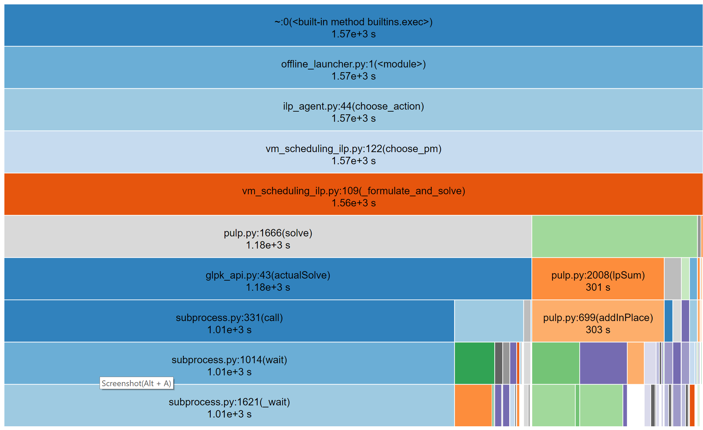

# Offline Integer Linear Programming (ILP) For VM Scheduling

## Efficiency

Below is the time consumption for solving 10 VM-request-ILP-formulation.
From the time distribution we can find that most time is used to call the ILP solver.
It is determined by the big problem size that tens of thousands of VMs are involved
in a single ILP formulation if the default config in the file
`examples/vm_scheduling/offline_lp/config.yml` is used.

More detailed, we've run the `examples/vm_scheduling/offline_lp/offline_launcher.py`
for two times and recorded the time spent for the first ten problem.
Since the random seeds kept the same, the VM-PM mapping kept the same.
While the time spent varied but they were a low:

VM Id  | PM Index | Time Spent (s) | Time Spent (s)
-------|---------:|---------------:|----------------:
138963 | 81       | 236.92         | 260.02
3435   | 0        | 311.59         | 335.67
153961 | 80       | 223.42         | 247.58
143298 | 0        | 41.15          | 67.74
56107  | 0        | 41.56          | 69.05
218889 | 0        | 41.75          | 69.03
170447 | 0        | 42.21          | 67.81
37194  | 0        | 41.78          | 67.85
185211 | 0        | 41.59          | 67.84
75064  | 0        | 286.44         | 312.54

The time cost is extremely high just as we expected, and we have not yet run a complete experiment.
