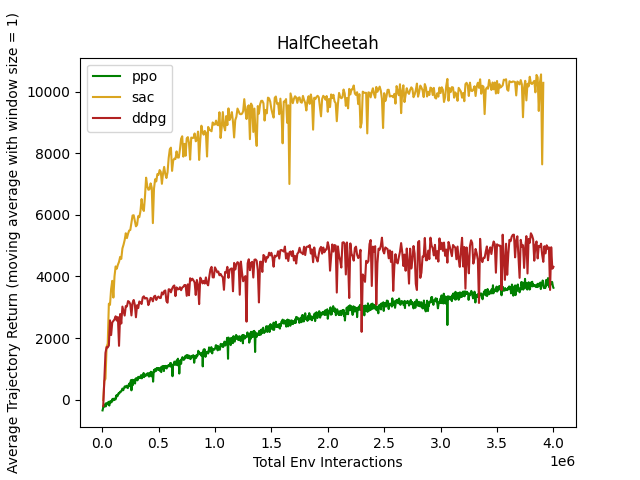
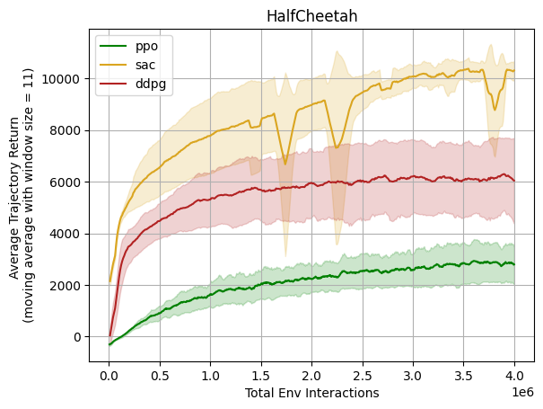
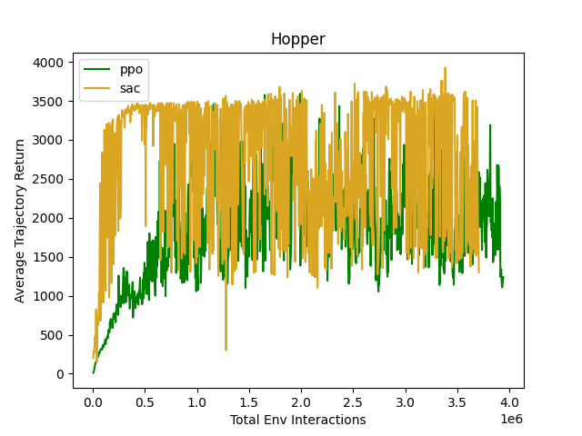
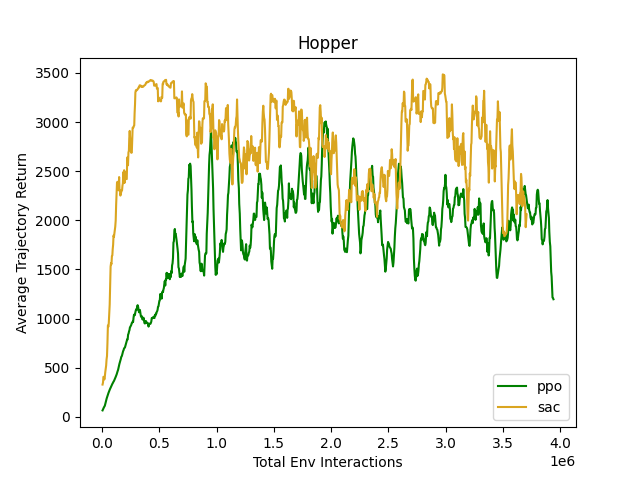
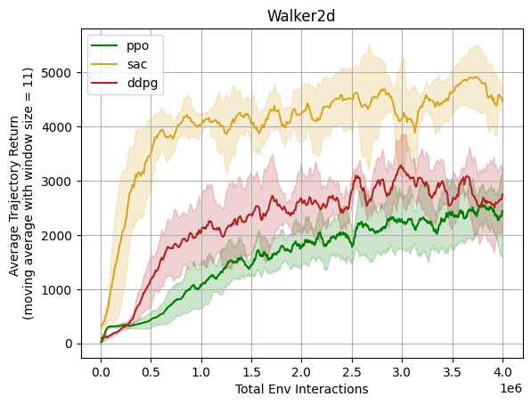
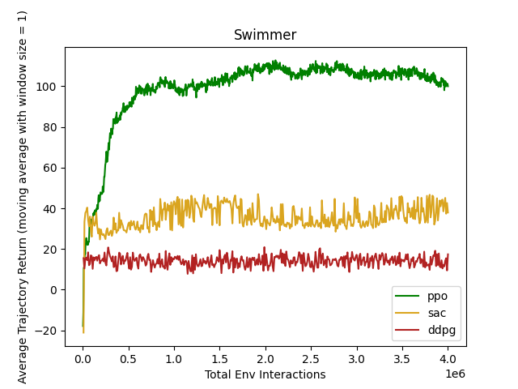
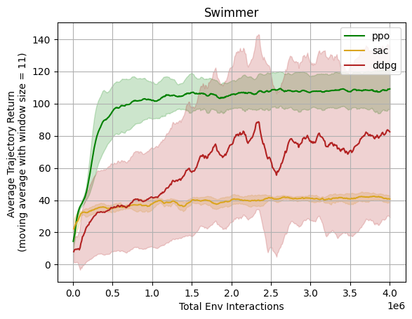
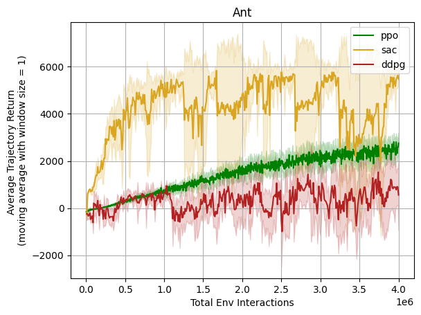
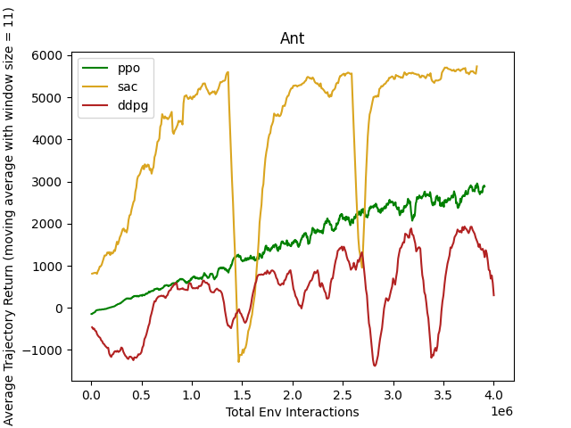

# Performance for Gym Task Suite

We benchmarked the MARO RL Toolkit implementation in Gym task suite. Some are compared to the benchmarks in
[OpenAI Spinning Up](https://spinningup.openai.com/en/latest/spinningup/bench.html#) and [RL Baseline Zoo](https://github.com/DLR-RM/rl-baselines3-zoo/blob/master/benchmark.md). We've tried to align the
hyper-parameters for these benchmarks , but limited by the environment version difference, there may be some gaps
between the performance here and that in Spinning Up benchmarks. Generally speaking, the performance is comparable.

## Compare with OpenAI Spinning Up

We compare the performance of PPO, SAC, and DDPG in MARO with [OpenAI Spinning Up](https://spinningup.openai.com/en/latest/spinningup/bench.html#).

### Experimental Setting

The hyper-parameters are set to align with those used in
[Spinning Up](https://spinningup.openai.com/en/latest/spinningup/bench.html#experiment-details):

**Batch Size**:

- For on-policy algorithms: 4000 steps of interaction per batch update;
- For off-policy algorithms: size 100 for each gradient descent step;

**Network**:

- For on-policy algorithms: size (64, 32) with tanh units for both policy and value function;
- For off-policy algorithms: size (256, 256) with relu units;

**Performance metric**:

- For on-policy algorithms: measured as the average trajectory return across the batch collected at each epoch;
- For off-policy algorithms: measured once every 10,000 steps by running the deterministic policy (or, in the case of SAC, the mean policy) without action noise for ten trajectories, and reporting the average return over those test trajectories;

**Total timesteps**: set to 4M for all task suites and algorithms.

More details about the parameters can be found in *tests/rl/tasks/*.

### Performance

Five environments from the MuJoCo Gym task suite are reported in Spinning Up, they are: HalfCheetah, Hopper, Walker2d,
Swimmer, and Ant. The commit id of the code used to conduct the experiments for MARO RL benchmarks is ee25ce1e97.
The commands used are:

```sh
# Step 1: Set up the MuJoCo Environment in file tests/rl/gym_wrapper/common.py

# Step 2: Use the command below to run experiment with ALGORITHM (ddpg, ppo, sac) and random seed SEED.
python tests/rl/run.py tests/rl/tasks/ALGORITHM/config.yml --seed SEED

# Step 3: Plot performance curves by environment with specific smooth window size WINDOWSIZE.
python tests/rl/plot.py --smooth WINDOWSIZE
```

|     **Env**     | **Spinning Up** | **MARO RL w/o Smooth** | **MARO RL w/ Smooth** |
|:---------------:|:---------------:|:----------------------:|:---------------------:|
| [**HalfCheetah**](https://gymnasium.farama.org/environments/mujoco/half_cheetah/) |  |  |  |
| [**Hopper**](https://gymnasium.farama.org/environments/mujoco/hopper/) |  |  |  |
| [**Walker2d**](https://gymnasium.farama.org/environments/mujoco/walker2d/) |  |  |  |
| [**Swimmer**](https://gymnasium.farama.org/environments/mujoco/swimmer/) |  |  |  |
| [**Ant**](https://gymnasium.farama.org/environments/mujoco/ant/) |  |  |  |

## Compare with RL Baseline Zoo

[RL Baseline Zoo](https://github.com/DLR-RM/rl-baselines3-zoo/blob/master/benchmark.md) provides a comprehensive set of benchmarks for multiple algorithms and environments.
However, unlike OpenAI Spinning Up, it does not provide the complete learning curve. Instead, we can only find the final metrics in it.
We therefore leave the comparison with RL Baseline Zoo as a minor addition.

We compare the performance of DQN with RL Baseline Zoo.

### Experimental Setting

- Batch size: size 64 for each gradient descent step;
- Network: size (256) with relu units;
- Performance metric: measured as the average trajectory return across the batch collected at 10 epochs;
- Total timesteps: 150,000.

### Performance

More details about the parameters can be found in *tests/rl/tasks/*.

|  algo  |            env_id             |mean_reward|
|--------|-------------------------------|----------:|
|DQN     |CartPole-v1                    |    500.00 |
|DQN     |MountainCar-v0                 |   -116.90 |
