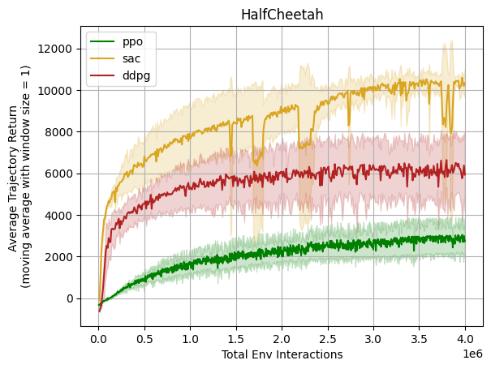
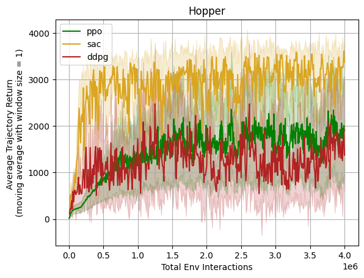
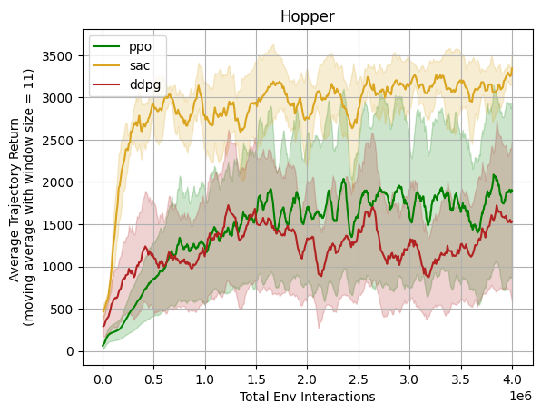
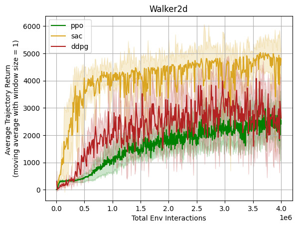
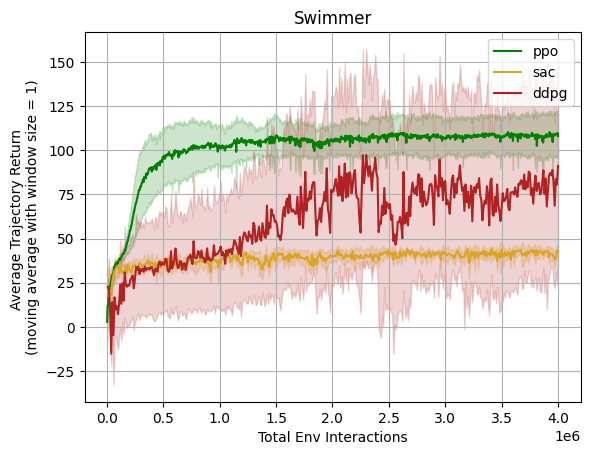
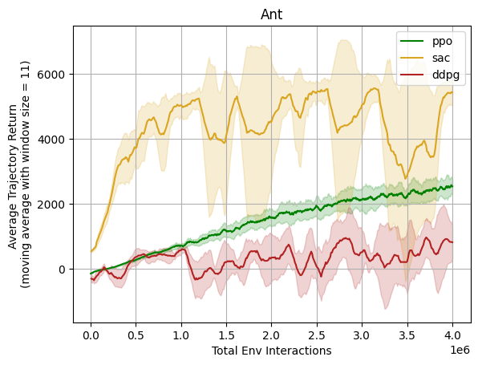

# Performance for Gym Task Suite

We benchmarked the MARO RL Toolkit implementation in Gym task suite.
Some are compared to the benchmarks in [OpenAI Spinning Up](https://spinningup.openai.com/en/latest/spinningup/bench.html#).
Limited by the environment version difference<!-- and some others?-->,
there may be some gaps between the performance here and that in Spinning Up benchmarks.

## Experimental Setting

The hyper-parameters are set to align with those used in [Spinning Up](https://spinningup.openai.com/en/latest/spinningup/bench.html#experiment-details):

**Batch Size**:

- For on-policy algorithms: 4000 steps of interaction per batch update;
- For off-policy algorithms: size 100 for each gradient descent step;

**Network**:

- For on-policy algorithms: size (64, 32) with tanh units for both policy and value function;
- For off-policy algorithms: size (256, 256) with relu units;

**Performance metric**:

- For on-policy algorithms: measured as the average trajectory return across the batch collected at each epoch;
- For off-policy algorithms: measured once every 10,000 steps by running the deterministic policy (or, in the case of SAC, the mean policy) without action noise for ten trajectories, and reporting the average return over those test trajectories;

**Total timesteps**: set to 3M for all task suites and algorithms.

Other parameters are set to the values in *tests/rl/tasks/*.

## Performance Comparison

Five environments from the MuJoCo Gym task suite are reported in Spinning Up, they are: HalfCheetah, Hopper, Walker2d, Swimmer, and Ant.

|     **Env**     | **Spinning Up** | **MARO RL w/o Smooth** | **MARO RL w/ Smooth** |
|:---------------:|:---------------:|:----------------------:|:---------------------:|
| [**HalfCheetah**](https://gymnasium.farama.org/environments/mujoco/half_cheetah/) |  |  |  |
| [**Hopper**](https://gymnasium.farama.org/environments/mujoco/hopper/) |  |  |  |
| [**Walker2d**](https://gymnasium.farama.org/environments/mujoco/walker2d/) |  |  |  |
| [**Swimmer**](https://gymnasium.farama.org/environments/mujoco/swimmer/) |  |  |  |
| [**Ant**](https://gymnasium.farama.org/environments/mujoco/ant/) |  |  |  |
